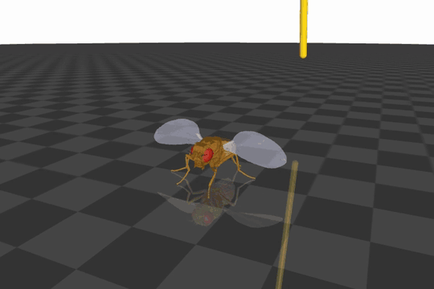
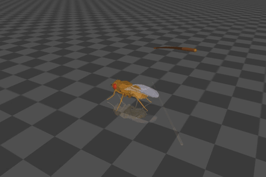
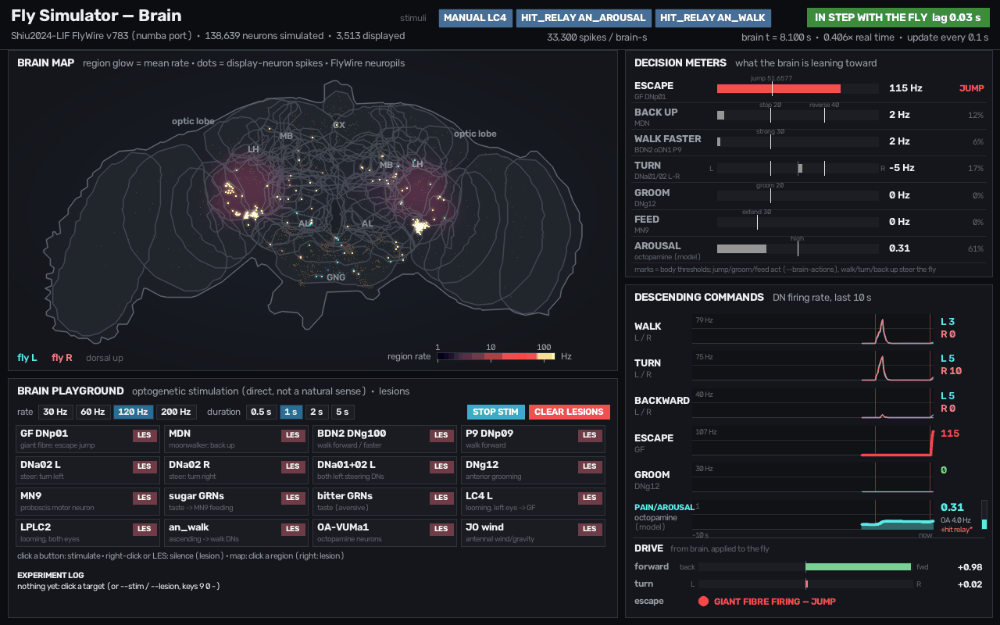
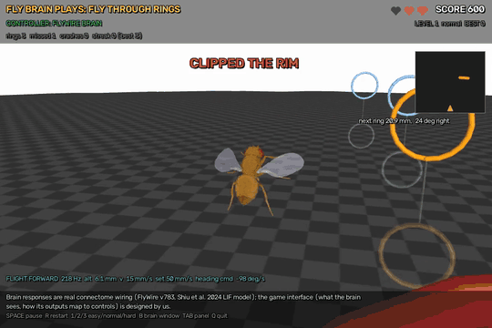
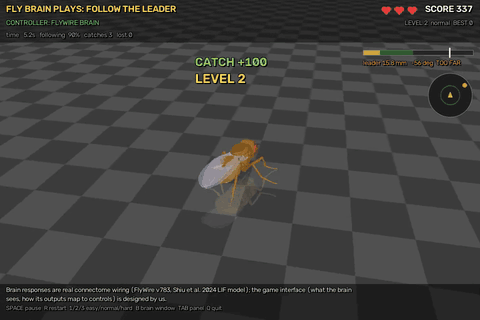
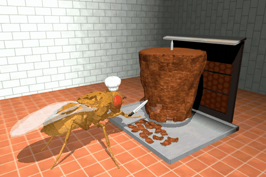
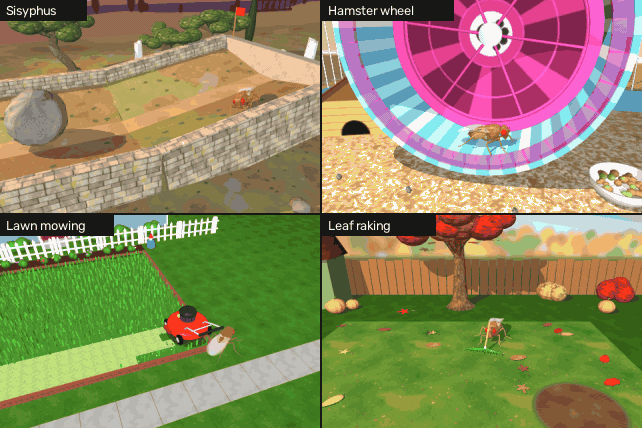
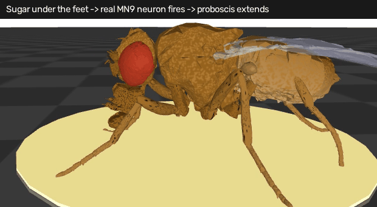
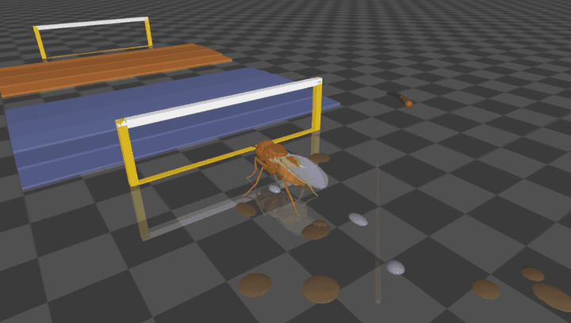

# Fly Simulator

**A physically simulated fruit fly with a whole connectome brain running live: whip it, swat at it, and watch its real brain wiring decide what to do.**

[](https://github.com/NewYorkImperialist/fly-simulator/actions/workflows/tests.yml)
[](LICENSE)
[](https://www.python.org/downloads/)



*A lazy swat from behind. The FlyWire brain's giant fibre fires and the fly takes off
on flapping wings; the paddle lands where it was. 3x slow motion, no scripted
escape force.*

## Play in 2 minutes

The fun parts are the **jobs** (a fly doing an absurd job forever) and the **games**
(the real fly brain plays them). Setup, once:

```bash
git clone https://github.com/NewYorkImperialist/fly-simulator.git && cd fly-simulator
uv venv --python 3.12 .venv && uv pip install --python .venv/bin/python -e ".[dev,brain]"
.venv/bin/python scripts/fetch_brain_data.py     # the fly brain, ~150 MB (needed for games)
```

**Jobs** — pick one and watch it work forever:

```bash
.venv/bin/python scripts/run_job.py --job kebab            # doner kebab chef
.venv/bin/python scripts/run_job.py --job sisyphus         # boulder up a hill
.venv/bin/python scripts/run_job.py --job mowing           # mowing the lawn
.venv/bin/python scripts/run_job.py --job raking           # raking leaves
.venv/bin/python scripts/run_job.py --job hamster_wheel    # hamster wheel
.venv/bin/python scripts/run_job.py --job dead_hang        # dead hang over a Venus flytrap (T: trap twitch)
.venv/bin/python scripts/run_job.py --job bowling          # league night, every night
.venv/bin/python scripts/run_job.py --rotate               # all of them, forever
.venv/bin/python scripts/run_job.py --job kebab --brain --stress   # + live brain; S startles the chef
```

Keys: **C** camera · **P** pause · **TAB** show stats · **I** screenshot · **Q** quit.

**Games** — the fly's real connectome steers:

```bash
.venv/bin/python scripts/play.py --game rings --brain --window       # flies through hoops
.venv/bin/python scripts/play.py --game chase --brain --window       # chases a leader fly
.venv/bin/python scripts/play.py --game asteroids --brain --window   # dodges rolling rocks
```

Keys: **SPACE** pause · **R** restart · **1/2/3** easy/normal/hard · **B** brain window ·
**TAB** brain panel · **Q** quit. Add `--control mirror` to swap its eyes and watch it fail.

**Poke the fly yourself:** `.venv/bin/python scripts/run_sim.py --flight --brain-actions --swatter`
(V swats, SPACE whips, L takes off, ? shows every key).

## What is this?

Fly Simulator puts the [NeuroMechFly](https://github.com/NeLy-EPFL/flygym) body
(FlyGym 2.1 on MuJoCo) on endless procedural terrain and runs the
[Shiu et al. 2024](https://github.com/philshiu/Drosophila_brain_model)
leaky integrate-and-fire model of the whole FlyWire v783 central brain (138,639
neurons, 15 M connections) next to it, in real time. Hits, looming objects, tastes
and odours become spikes in identified sensory neurons, and the rates of real
descending neurons (the giant fibre, MDN, DNa01/02, MN9, ...) trigger jumps, turns,
backing up, feeding and escape flight.

What the brain does **not** do: the legs are driven by FlyGym's CPG walking
controller, and the mappings from descending-neuron rates to the body (gains,
thresholds) are ours. There is no ventral nerve cord in the model. The jobs, courses
and games put engineered task logic or interfaces around the fly. Everything that
is a stand-in or a phenomenological layer is labelled in the docs and the HUD.

## Feature tour

Commands assume the [quickstart](#quickstart) below. Anything with `--brain*`,
`--stress`, `--swatter` escape or `play.py` needs the brain data.

### The whip and pain

A physical whip: a chain of 12 capsules whose lash hits the fly only through MuJoCo
contacts. Arrows / SPACE crack it from a side, 1-4 set the strength.
`--stress` adds an octopamine arousal layer: hits drive the brain's OA neurons and
the fly speeds up, then calms down. [WHIP.md](docs/WHIP.md), [STRESS.md](docs/STRESS.md)



```bash
.venv/bin/python scripts/run_sim.py --stress --brain-steer      # then press the arrow keys
```

### Swatter escape with real flight

The paddle is a looming object for the compound eyes: LC4 / LPLC2 → giant fibre
(DNp01) → escape jump. With `--flight` the jump starts the wings, and lift and thrust
come from MuJoCo's fluid model on the flapping wings (the GIF at the top).
[SWATTER.md](docs/SWATTER.md), [FLIGHT.md](docs/FLIGHT.md)

```bash
.venv/bin/python scripts/run_sim.py --flight --brain-actions --swatter   # press V to swat
```

### Brain window and playground

A second window shows the live brain: neuropil map, descending-neuron traces and
decision meters. Click a neuron group to stimulate it (virtual optogenetics) or
right-click to lesion it: lesion the giant fibre and the looming jump is gone.
[BRAIN_WINDOW.md](docs/BRAIN_WINDOW.md), [PLAYGROUND.md](docs/PLAYGROUND.md), [BRAIN.md](docs/BRAIN.md)



```bash
.venv/bin/python scripts/run_sim.py --brain-actions            # O = looming shadow, T = sugar
```

### Brain games

Games played by the unmodified connectome. In *Fly Through Rings* the next ring drives
the pursuit neurons LC10a → DNa01/02, which steer real flapping flight: 15 of 16 rings
flown through, 0 of 16 with the eyes mirrored or the brain disconnected. *Follow the
Leader* uses the same channel on foot; *Asteroid Dodge* uses the looming channel to
turn away. The game interface is designed by us. [GAMES.md](docs/GAMES.md)

| Fly Through Rings | Follow the Leader |
|---|---|
|  |  |

```bash
.venv/bin/python scripts/play.py --game rings --brain --window
.venv/bin/python scripts/play.py --game chase --brain --window
```

### Eternal jobs

The internet genre of "a fly doing an absurd job forever": Sisyphus, a hamster wheel,
lawn mowing, leaf raking and a doner kebab chef who carves with a recorded grooming
stroke. The task logic is scripted; the fly still walks and pushes through physics.
[JOBS.md](docs/JOBS.md)

| Doner kebab | Sisyphus, wheel, mowing, raking |
|---|---|
|  |  |

```bash
.venv/bin/python scripts/run_sim.py --job kebab
.venv/bin/python scripts/run_job.py --rotate          # all jobs in turn, forever
```

### Taste

Sugar and bitter spots on the ground, tasted with the legs. Sugar drives the real
proboscis motor neuron MN9, and the fly stops and feeds; bitter mixed in suppresses
it. Labellar taste neurons stand in for the leg ones. [TASTE.md](docs/TASTE.md)



```bash
.venv/bin/python scripts/run_sim.py --taste-patches --brain-actions
```

### Obstacle courses

Hand-designed, timed courses with gates, stairs, gaps, ramps, tunnels and a whip
gauntlet, plus a leaderboard. [COURSE.md](docs/COURSE.md)



```bash
.venv/bin/python scripts/run_sim.py --course gauntlet
```

### Real vision

The fly looks at the rendered scene through FlyGym's compound eyes; the flyvis
connectome-constrained optic-lobe model (Lappalainen et al. 2024) turns that into
LC4 / LPLC2 looming activity for the brain. Nothing is told what the objects are.
Slow, and needs the `vision` extra. [VISION.md](docs/VISION.md)


```bash
.venv/bin/python scripts/run_sim.py --real-vision --swatter --brain-actions
```

### More

* **Habituation**: repeated harmless looms stop triggering escape jumps after about 3
  trials and recover after rest (phenomenological synaptic depression on the giant
  fibre's inputs). `--habituation --brain-actions`, press O every 2 s.
  [HABITUATION.md](docs/HABITUATION.md)
* **Fear learning**: whip the fly inside an odour zone and dopamine-gated plasticity
  in the mushroom body weakens its response to that odour. An honest negative
  result: learning in the brain, but no avoidance behaviour. `--learning --brain-steer`,
  key 8 spawns an odour zone. [FEAR_LEARNING.md](docs/FEAR_LEARNING.md)
* **Brain replay**: `--brain-record` saves the brain activity of a run;
  `scripts/brain_replay.py runs/<run>` plays it back or renders it to MP4.
  [BRAIN_REPLAY.md](docs/BRAIN_REPLAY.md)
* **Actions** (jump, freeze, groom, back away, turn, wings, proboscis),
  **residual RL** and a **sensory screen** of the brain model:
  [ACTIONS.md](docs/ACTIONS.md), [RL.md](docs/RL.md), [SENSORY_SCREEN.md](docs/SENSORY_SCREEN.md).

## Quickstart

**Requirements**: Python 3.12 and [uv](https://docs.astral.sh/uv/). Developed on macOS
(Apple Silicon); the test suite also runs in CI on Ubuntu (headless: set
`MUJOCO_GL=egl`). Interactive windows have only been used on macOS.

```bash
git clone https://github.com/NewYorkImperialist/fly-simulator.git
cd fly-simulator
uv venv --python 3.12 .venv
uv pip install --python .venv/bin/python -e ".[dev,brain]"
# optional real vision (~230 MB, torch included):
#   uv pip install --python .venv/bin/python -e ".[vision]"
#   .venv/bin/flyvis download-pretrained --skip_large_files
```

**Brain data.** The connectome is not in the repository. This downloads ~153 MB of
FlyWire v783 data into `data/brain/` (pinned URLs, SHA-256 checked):

```bash
.venv/bin/python scripts/fetch_brain_data.py
```

FlyWire data is licensed [CC BY-NC 4.0](https://creativecommons.org/licenses/by-nc/4.0/):
non-commercial use only, and cite the FlyWire papers if you publish (see
[NOTICE.md](NOTICE.md)). Without the data, the walking, whip, jobs and courses still
work; `--brain` flags exit with the fetch command.

**Run.**

```bash
.venv/bin/python scripts/run_sim.py                                     # walk + whip, no brain
.venv/bin/python scripts/run_sim.py --brain-actions                     # + live brain window
.venv/bin/python scripts/run_sim.py --flight --brain-actions --swatter  # swat it (V)
```

Every run writes a log folder under `runs/`. Add `--headless --max-seconds 10 --record
out.mp4` to render a video without a window. All flags, run options and outputs:
[docs/USAGE.md](docs/USAGE.md).

## Keys

Press **?** in the window for the full key help, and **TAB** to show the stats / controls
box (off by default; TAB again for compact, then off). The complete table is in
[docs/USAGE.md](docs/USAGE.md#keys-window-focused).

| key | action |
|---|---|
| SPACE, arrows, U | crack the whip (random side, from left / right / front / rear, overhead) |
| 1 2 3 4 | hit strength (also the swat speed) |
| A | automatic random hits on / off |
| V / Shift+V | swat from behind / a random side (`--swatter`) |
| L | take off / land (`--flight`); arrows steer while flying |
| O / T | brain: looming shadow / sugar taste |
| J Z Y E | actions: jump, freeze, groom, back away |
| R B S G D | spawn a rock, bump, slope, gap or dip ahead |
| [ / ] | terrain easier / harder |
| C | camera view |
| I / M | screenshot / start-stop MP4 recording |
| P / X | pause / reset the fly |
| Q / ESC | quit |

## What's real and what's modelled

* **Physics is real.** The fly moves only through MuJoCo actuators, contacts and
  documented forces. The whip and swatter hit through contacts; flight lift comes from
  the fluid model on flapping wings. ([WHIP.md](docs/WHIP.md), [FLIGHT.md](docs/FLIGHT.md))
* **The brain is real wiring, unmodified.** Shiu et al.'s equations and parameters on
  FlyWire v783, checked spike for spike against Brian2. Nothing was trained or tuned
  for a task. ([BRAIN.md](docs/BRAIN.md))
* **Walking is not from the brain.** FlyGym's CPG controller moves the legs;
  descending neurons only modulate it, through a mapping we chose.
* **There is no VNC.** Body touch reaches the brain through a few ascending afferents;
  some inputs use labelled stand-ins (leg taste, the pain relay, PPL1 punishment).
  ([SENSORY_SCREEN.md](docs/SENSORY_SCREEN.md), [TASTE.md](docs/TASTE.md))
* **Some layers are phenomenological**: octopamine arousal, habituation and the
  learning rule are models on top of the connectome. ([STRESS.md](docs/STRESS.md),
  [HABITUATION.md](docs/HABITUATION.md), [FEAR_LEARNING.md](docs/FEAR_LEARNING.md))
* **Vision**: the swatter and whip use a geometric looming sense by default; only
  `--real-vision` computes it from pixels. ([VISION.md](docs/VISION.md))
* **Negative results are reported**, for example fear learning without avoidance and
  brain grooming that never reaches threshold. ([ACTIONS.md](docs/ACTIONS.md))

## Documentation

Start at [docs/README.md](docs/README.md): one line per document, covering features,
the brain, science notes and development notes.

## Contributing

Bug reports, fixes, new scenes and better biology are welcome. See
[CONTRIBUTING.md](CONTRIBUTING.md) for setup, tests (`.venv/bin/python -m pytest -q`)
and the honesty rule: don't fake physics or brain.

## Citing and credits

If you use Fly Simulator, cite it with [CITATION.cff](CITATION.cff) (GitHub's "Cite
this repository" button). If you use the brain model, also cite the FlyWire papers
(Dorkenwald et al. 2024; Schlegel et al. 2024) and Shiu et al. 2024, and for the body
NeuroMechFly v2 (Wang-Chen et al. 2024). Full credits and references:
[NOTICE.md](NOTICE.md).

## License

* Code: [MIT](LICENSE).
* Files derived from FlyWire data (the neuropil atlas, brain-window images, sensory
  screen CSVs): [CC BY-NC 4.0](https://creativecommons.org/licenses/by-nc/4.0/).
* The recorded grooming clip (`fly_simulator/actions/data/grooming_front_legs.npz`,
  from NeuroMechFly v1): Apache-2.0.

Details for each file: [NOTICE.md](NOTICE.md).
