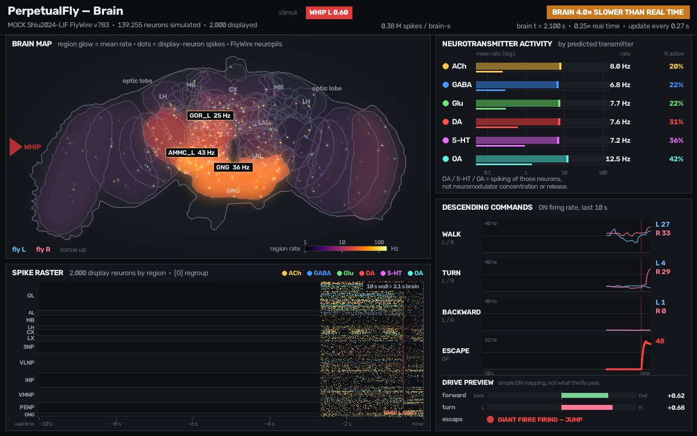

# Brain window

A second live window, next to the fly, that shows what the connectome model
(`perpetualfly/brain/`, Shiu et al. 2024 LIF on FlyWire) is doing. Code:
`perpetualfly/brain_viz/`. It only consumes the messages in
`perpetualfly/brain/schema.py` (`BrainLayout` once, then `BrainState`s, optionally
`StimulusEvent`s), so it runs against the real engine or the built-in mock.



## Panels

```
+---------------------------------------------------------------------------------+
| PerpetualFly — Brain   model · neurons   stimuli [WHIP L 0.80]  [BRAIN 4× SLOWER] |
+--------------------------------------------+------------------------------------+
| BRAIN MAP                                  | NEUROTRANSMITTER ACTIVITY          |
|  FlyWire neuropil outlines, regions glow   |  ACh GABA Glu DA 5-HT OA:          |
|  by mean rate, display neurons flash when  |  log rate bar + % active bar       |
|  they spike (NT colours), hot-spot tags    +------------------------------------+
+--------------------------------------------+ DESCENDING COMMANDS (last 10 s)    |
| SPIKE RASTER (last 10 s wall clock)        |  WALK / TURN / BACKWARD (L,R) / GF |
|  rows = display neurons grouped by region  |  DRIVE PREVIEW fwd / turn / escape |
|  (or transmitter, key G), stimulus markers |                                    |
+--------------------------------------------+------------------------------------+
```

* **Header** — model name, neurons simulated / displayed, brain time (playhead),
  realtime factor and update interval, total spike rate, the last stimuli as chips
  (`WHIP L 0.80`, fading after a few s) and a badge: `REAL TIME` (green), `BRAIN
  4.0× SLOWER THAN REAL TIME` (amber; red when ≥ 10×), `NO BRAIN DATA FOR 7 s`,
  `WAITING FOR BRAIN…`.
* **Brain map** — the 78 standard neuropils (Ito et al. 2014) in FlyWire space,
  projected down the anterior–posterior axis, drawn from real meshes (see *Atlas*).
  The fly's **left is on the image left**, dorsal up (labels "fly L / fly R").
  Each region glows with the `inferno` heat map of its `rate_by_region` on a log
  scale (1–150 Hz, colour bar bottom right); baseline activity is a dim haze, a
  burst is orange→white with a bloom. Display neurons are faint dots in their
  transmitter colour that flash white-hot when they spike. The ≤ 4 hottest regions
  (> 12 Hz) get a `GNG 136 Hz` tag, and a fading arrow at the map edge marks the
  side that was just hit.
* **Neurotransmitter activity** — per predicted transmitter (Eckstein et al. 2024):
  mean rate (log bar, 0.05–150 Hz) and fraction of neurons active in the window
  (thin bar, %). Footnote: *DA / 5-HT / OA = spiking of those neurons, not
  neuromodulator concentration or release.* The same six colours are used for dots,
  raster and legend everywhere:
  ACh amber, GABA blue, Glu green, DA red, 5-HT magenta, OA cyan, unknown grey.
* **Descending commands** — scrolling traces (last 10 s wall clock) of
  `DESCENDING_GROUPS`: walk, turn, backward (L light-blue, R rose) and escape
  (giant fibre, red), auto-scaled per row with a floor, current values on the right,
  stimulus markers as vertical lines. Below: **DRIVE PREVIEW** — a simple mapping
  (`forward = tanh((walk − 1.5·backward)/40 Hz)`, `turn = tanh((turn_L − turn_R)/30 Hz)`,
  `escape = GF/60 Hz`), explicitly labelled "not what the fly uses". If a state
  carries a `drive` dict (not in the schema yet) it is shown instead, titled DRIVE.
* **Spike raster** — every spike of the display neurons, x = the wall-clock time it
  was replayed (last 10 s), rows grouped by super-region (OL, AL, MB, LH, CX, LX,
  SNP, VLNP, INP, VMNP, PENP, GNG, OCG) or by transmitter (key **G**). The overlay
  `10 s wall = 2.5 s brain` tells how much brain time the visible span covers.

### Smooth animation with a slow brain

A `BrainState` covers `window_s` of brain time and may arrive only ~1/s. The
renderer keeps a brain-time *playhead* that moves at the pace needed to reach the
newest `brain_time` just when the next state is expected (EMA of arrival gaps), so
the spikes of each window are replayed progressively at 30 fps (dots flash, raster
scrolls) rather than dumped at once. Region / transmitter / DN values ease toward
the newest state (τ ≈ 0.35 × update interval). If the playhead falls > 3 windows
behind it jumps. Everything shown is therefore up to one update interval behind the
engine; the badge states the slowdown explicitly.

## Running

```bash
# live window on the mock brain (keys: l/r whip left/right, f shove front, x fall,
# g regroup raster, q/Esc quit); random stimuli every few s unless --no-auto
.venv/bin/python -m perpetualfly.brain_viz
.venv/bin/python scripts/demo_brain_window.py --mock --rtf 0.05 --publish-hz 1   # slow brain
.venv/bin/python scripts/demo_brain_window.py --mock --process   # window in a child process
# headless
.venv/bin/python -m perpetualfly.brain_viz --record /tmp/brain.mp4 --seconds 12
.venv/bin/python -m perpetualfly.brain_viz --record /tmp/brain.png --seconds 3
```

`--size WxH` changes the render size (default 1280×800). On macOS the frame is
upscaled for display (OpenCV's Cocoa backend shows 1 image px per *physical* pixel,
so on Retina a 1280×800 frame would be 640×400 pt with 6-pt text); the scale is
auto-detected (≈1.6 on a 1440×900-pt MacBook screen → ~1040×650 pt window).
Override with `PERPETUALFLY_BRAIN_SCALE=1.0`. (The fly window is currently shown at
half size on Retina for the same reason.) The OS window title is ASCII
(`PerpetualFly - Brain`) because Cocoa mangles the em dash.

## API

```python
from perpetualfly.brain_viz import (render_frame, render_timeline, BrainRenderer,
                                    BrainWindow, run_window, BrainWindowProcess, MockBrain)

img = render_frame(layout, state_or_list_of_states)      # BGR uint8 (H, W, 3), headless
for frame in render_timeline(layout, [(t_wall, item), ...], seconds=10, fps=30): ...

r = BrainRenderer(layout, size=(1280, 800))   # no GUI; r.ingest(item, wall); r.render(wall)
w = BrainWindow(layout)                       # OpenCV window, main thread: w.feed(x); w.tick()

# multiprocessing target (spawn; cv2 GUI on the child's main thread)
run_window(queue, layout=None, *, title=..., size=..., fps=30, max_seconds=None,
           parent_pid=None, display_scale=None)
```

`run_window` drains the queue without blocking; items may be `BrainState`,
`StimulusEvent` (instant chip + marker), a new `BrainLayout` (re-layout), or `None`
(quit). With `layout=None` it shows "waiting for brain layout…" until a
`BrainLayout` arrives. It exits on `None`, q/Esc, the window's close button,
`max_seconds`, or when the parent process dies (checked every 0.5 s); it ignores
SIGINT (Ctrl-C belongs to the parent).

`BrainWindowProcess` is the parent-side handle: spawn context, bounded queue
(`maxsize=64`, `cancel_join_thread` so exit never hangs), daemon child.
`send(item)` never blocks and returns `False` (drops) when the window is closed or
behind, so closing the brain window cannot affect the fly app.

## Wiring into the app (integration step)

```python
from perpetualfly.brain_viz import BrainWindowProcess

brain_win = None
# once the brain process has published its BrainLayout:
brain_win = BrainWindowProcess(layout).start()
# every BrainState the app receives from the brain process:
if brain_win: brain_win.send(state)
# optionally, every StimulusEvent the app sends to the brain (instant feedback;
# the window de-duplicates it against state.recent_stimuli):
if brain_win: brain_win.send(event)
# (optional) re-open on a key if it was closed: if not brain_win.is_alive(): ...start()
# at exit:
brain_win.close()
```

Notes: create it from code reached under `if __name__ == "__main__"` (spawn
re-imports the main module). The app keeps its own `cv2` window on its main thread;
the brain window lives in its own process, so the two event loops never interact.
Alternatively the brain engine process can own the `BrainWindowProcess` and send
states directly, saving one pickle hop; either works because the window only sees
schema messages.

## Atlas asset (`perpetualfly/brain_viz/assets/flywire_neuropils_frontal.json`, 33 KB)

Generated once by `python -m perpetualfly.brain_viz.build_atlas --fafbseg-whl ...
--flybrains-whl ...` from `fafbseg`'s `JFRC2NP.surf.fw` (78 neuropil meshes already
transformed into FlyWire space) and `flybrains`' `FLYWIRE_whole_brain.ply` — the two
wheels are only downloaded and unzipped (no navis/trimesh install). Each mesh is
projected to (x, y), rasterised at 2 µm/px and traced into polygons.

```json
{"format": "perpetualfly-neuropil-atlas-v1",
 "units": "micrometres, FlyWire/FAFB14.1 space (nm / 1000)",
 "projection": "along z: u = x_nm/1000, v = y_nm/1000 (*_L on image left, ventral down)",
 "bounds": [u_min, v_min, u_max, v_max],
 "brain_outline": [[[u, v], ...]],
 "regions": {"AL_L": {"centroid": [468.4, 238.3], "depth": 58.9, "area_um2": 8260,
                       "group": "AL", "outline": [[[u, v], ...]]}, ...}}
```

The engine may reuse it: `atlas_region_xy(names)` returns centroids for its region
names (FlyWire synapse-table neuropil names match directly; `normalize_region_name`
handles variants such as `SEZ`, `MB CA (L)`). Neuron positions in FlyWire nm project
the same way (`x/1000, y/1000`).

The window does not require that: if ≥ 3 layout regions match atlas names it
least-squares-fits a per-axis affine map (with optional axis swap / flips, so nm,
µm, voxels or a mirrored y all work) from `region_xy` onto the atlas and applies it
to `display_neuron_xy` too. If names match but no usable positions are given, atlas
centroids are used and neurons are scattered inside their region's silhouette.
With unknown names it falls back to the layout's own coordinates fitted to the
canvas (outlines from `region_outline_xy` if given, otherwise circles).

## Performance (M1, 1280×800, 2000 display neurons, 78 regions)

| step | time |
|---|---|
| `BrainRenderer.draw` | ~7 ms / frame (map composite ~5 ms) |
| `step` (ingest/replay) | < 0.1 ms |
| display upscale ×1.62 (Retina) | ~2 ms |
| `imshow` + `waitKeyEx` | ~15 ms (×1.0) – 23 ms (×1.62) |
| live loop | 30 fps (the configured cap), one core of the window process |
| headless MP4 | ~10 ms / frame |
| renderer init (geometry, masks) | ~45 ms |

## Mock brain

`MockBrain` (`perpetualfly/brain_viz/mock.py`) is phenomenological, not a
simulation: 78 atlas neuropils; ~2000 display neurons scattered inside their
silhouettes with region-specific transmitter mixes; OU-drifting baselines (optic
lobes hotter, CX rhythmic, DN walk tonic); stimuli launch a delayed ripple — e.g. a
left whip: AMMC_L/SAD → GNG, WED_L → IPS/SPS/VES_L → LAL → CX, giant fibre for
strong hits, turn-away (turn_R), a walking burst, and an OA/DA "arousal" wave.
`mock_scenario("quiet" | "whip" | "high")` gives canned sequences for tests.

## Wanted schema changes (not made; worked around)

1. `BrainState.drive: dict | None` — the command actually applied to the body
   (forward / turn / escape), so the DN panel can show it instead of a preview
   (already read via `getattr(state, "drive", None)`).
2. `recent_stimuli` as structured `StimulusEvent`s (or a documented string format).
   Now parsed heuristically (`"whip_hit left 0.6"` → `WHIP L 0.60`).
3. `BrainLayout.coord_frame: str` (e.g. `"flywire_um"`), so the window can skip the
   registration fit when the engine uses atlas coordinates.
4. `BrainState.seq: int` to detect dropped states.
5. `BrainLayout.n_neurons_by_nt` for context in the transmitter panel.

## Limitations

* Region glow is the region's mean rate from the engine; overlapping projections
  (e.g. MB lobes over SMP) show the maximum. Depth is not rendered.
* The raster shows only the display subset; spikes are placed at replay time, so
  the x axis is wall-clock, not brain time (the overlay gives the conversion).
* Drive preview is a fixed heuristic, not the walking controller.
* OpenCV/Hershey fallback fonts are used if OpenCV < 5 (no `cv2.FontFace`).
* The live GUI needs a display; `render_frame` / `render_timeline` do not.
