# Eternal jobs (`fly_simulator/jobs/`)

This is the internet genre of "a fly doing an absurd job for eternity". Each job is a
scene with props (compiled into the MuJoCo model), task logic that steers the
walking fly, a work counter, and an "eternal stream" HUD. It runs forever: when the
fly falls it gets an explicit, counted reset, the props regenerate, and memory stays
constant.

| job | what happens | counter |
|---|---|---|
| `sisyphus` | pushes a 4 mm boulder up a 10° hill to a summit curb; lets go; the boulder rolls back into the valley; walks down, gets behind it, pushes again | summits, metres pushed |
| `hamster_wheel` | runs inside a 14 mm wheel (hinge joint) that turns only because its feet push the slats | revolutions, distance, top speed |
| `kebab` | stands at a turning doner spit in a chef hat and carves it with a knife on its right front leg, using the real recorded grooming stroke; shavings fall onto the drip tray, the meat regrows | shavings carved, kebabs completed, µg served, rate |
| `mowing` | pushes a red push mower up and down a lawn in rows, leaving light / dark mowing stripes; the grass grows back | m² mowed, rows mowed, lawns completed |
| `raking` | leaves fall from an autumn tree; the fly sweeps them into a pile with a rake; when the pile is done, the wind blows it away | leaves raked, piles completed, gusts survived |
| `dead_hang` | dead-hangs by its front legs from a pull-up bar over a Venus flytrap; its grip tires, it re-grips and slips; when it falls, the trap snaps shut, and the fly respawns on the bar | time on the bar, hang streak (best), re-grips, slips, chomps, survival rate |
| `bowling` | pushes a 3 mm ball over the ramp at the head of the lane; it rolls down and scatters 10 free-body pins; a kinematic pinsetter clears / resets them; standard ten-pin scoring | pins knocked down, games, best / average game, strikes, spares, gutters, fouls |
| `broccoli_toss` | in a streamer's room the host fly brings a plate of broccoli to the viewer fly in the gaming chair; the viewer ponders it for 0.75–1 s, flicks the whole plate over its shoulder without looking, and everything behind it explodes (cartoon blast, props fly with real physics); the room rebuilds | plates yeeted, explosions, stream viewers, vegetables eaten: 0 |
| `taste_tester` | a quality-control fly at a conveyor belt taps each sample (sugar / bitter / mixed / water drops) with a front leg; the taste goes to the brain and, with `--brain`, the real connectome's MN9 decides: APPROVED (proboscis extends, green stamp, green bin) or REJECTED (the leg pushes the dish away, red stamp, red bin) | samples tasted, approved, rejected, accuracy vs the label, MN9 per sample type |
| `pizza_chef` | in a fly-scale pizzeria the fly kneads a dough ball flat with IK leg presses, tosses it (a spinning free body, real flight), sauces and tastes it (with `--brain` the connectome's MN9), toppings rain from the bowls (pooled free bodies), the peel slides it into the brick oven, it bakes, a cutter wheel makes 8 slices, it is boxed and served | pizzas served, dough tosses, perfect tosses, slices, tips |
| `trampoline` | bounces on a backyard trampoline forever: the real Jump action, timed to the rebound of a mat held up by 48 tendon springs, pumps the height up to ~5 mm; now and then a backflip (real, boosted asymmetric push), crash landings and falls off are counted and reset | bounces, best height (mm, body lengths), streak, backflips, crash landings, falls off |
| `delivery_pilot` | on the **real flight fly** (flapping wings, air, dt 5e-5 s) it picks up a parcel at the depot, takes off with the jump → wings, flies to a numbered house, lands on its roof terrace, drops the parcel on the doormat (DELIVERED, *ding-dong*), flies back, forever | parcels delivered, flight time, distance flown, on-time %, missed / crash landings |
| `fry_cook` | works a fast-food fry station: a basket on an auto-lift dumps fried fries (pooled free bodies) into the heated bin, the fly takes a carton, scoops fries into it with a scoop on its right front leg (they drop into the carton with real physics), the carton slides onto the tray at the pass window, *ding*, ORDER UP; now and then a fry spills and the fly sneaks it (with `--brain` the connectome's MN9) | orders served, cartons filled, fries per carton, spilled, sneaked, batches, salt level |
| `snow_shovel` | shovels a driveway in front of a little house: pushes a snow shovel (planar prop, like the mower) across it lane by lane, the blade scrapes the snow cover, the load is dumped onto the snowbank as pooled clumps (real free bodies); it keeps snowing, so the driveway is never done | m of path cleared, clumps shoveled, bank height, days of winter |
| `mini_golf` | plays a 4-hole mini golf course (windmill, ramp, tunnel, bumpers): walks behind the ball and head-butts it (the putt speed / aim come from a labelled skill model), the ball rolls with real physics and drops into a real cup; the fly carries it on its back to the next tee | holes played, scorecard vs par, holes-in-one, rounds |
| `jump_rope` | skips rope forever in a schoolyard: two driven crank posts turn a long rope (a kinematic curve of capsules that really collides with the fly); the fly clears it every turn with the real short-mode Jump, fired from the rope's phase; the rope speeds up with the streak; a rope that catches a leg is a real contact (a trip) | skips, streak (best), trips, recoveries, rope rpm |
| `dj` | DJs forever in a club: a beat clock drives everything; a front leg (IK) scratches a motor-driven record by real contact and friction (scratches counted from the record's own rotation), the drop (a leg in the air, strobing floor, jumping crowd), the other leg slides the crossfader into the next track | tracks mixed, scratches, drops, crowd hype, BPM |
| `dishwasher` | washes dishes forever at a kitchen sink under a window: the left front leg fetches the top plate of the dirty stack, the right front leg scrubs it with a sponge (the grime fades only while the leg really touches the plate), the plate is rinsed under the running faucet and racked; a full rack is carted off, a new dirty stack comes on the conveyor | plates washed, grime removed %, strokes, sponge wear, sponges, rack loads, stacks |
| `barista` | makes coffee forever at "THE COMPOUND EYE" café: grinds, tamps the grounds with a tamper on its left front leg (real contact), presses SHOT / STEAM (real contact), the shot runs into a paper cup with the customer's name, steams the milk, holds the jug with its right front leg and pours latte art (heart / tulip / rosetta, drawn as it pours), rings the bell, the cup slides to the pickup counter; orders queue on the ticket rail | drinks served, shots pulled, latte-art score, orders in queue, tamps, spills |

```bash
python scripts/run_job.py --job sisyphus                   # window; Q quit, C camera, P pause, X reset, I screenshot, TAB HUD
python scripts/run_job.py --job hamster_wheel --headless --max-seconds 300
python scripts/run_job.py --job sisyphus --headless --record runs/jobs/sis --segment-s 60 --keep 3 --timelapse 5
python scripts/run_job.py --rotate --rotate-minutes 10     # all jobs in turn, forever
python scripts/run_job.py --list
```

Options: `--job-config '{"slope_deg": 8}'` (job config overrides), `--width/--height`,
`--fps` (recording, default 15), `--log` (write `runs/<ts>/`, off by default), and
`--whip` / `--brain` to add the physical whip or the connectome brain (off by default).
`--rotate` builds a new Session for every job, because props are compiled into the model.

## Framework API (for new jobs: lawn mowing, leaf raking, doner kebab ...)

```python
from fly_simulator.jobs import (EternalJob, JobConfig, CameraPreset, register_job,
                               create_job_session, install_job, make_job, JobRunner)
from fly_simulator.jobs.geometry import (add_box, add_slope, add_plane_box, contact_kwargs,
                                        slippery_body_contact, exclude_fly_legs, PROP_BIT)
```

### Lifecycle

1. `job = make_job(name, cfg_or_dict)` (or `get_job(name)(cfg)`).
2. `job.configure_app(app_cfg)`: called once before the Session is built. The base
   version sets flat terrain, turns automatic hits off, turns off the app's own auto
   reset (the job does its own) and turns floor reflections off. Override it to
   change e.g. `app_cfg.fly.spawn_height` (the hamster wheel spawns the fly on the
   inside bottom of the wheel), and call `super()`.
3. `job.extension(world)`: a world extension that adds props to `world.mjcf_root`
   before `add_fly`. Don't set MuJoCo globals such as `spec.visual.map.znear` here:
   the fly's globals are merged into the spec *after* the extension and overwrite them
   (znear ends up at FlyGym's 5e-4). Use the class attributes `znear` / `zfar`
   instead (default None = leave the compiled value); `attach` writes them into the
   compiled model (`apply_visual_globals`) before `on_attach`.
4. `Session(cfg, world_extensions=[job.extension, ...])`, then `install_job(session, job)`.
   `install_job` checks that `job.required_names` exist in the model and calls
   `job.attach(session)`. It also chains `job.after_physics` onto
   `session.after_physics` and sets `session.job`. `create_job_session(name, app_cfg,
   job_cfg)` does steps 1–4 and returns `(session, job)`.
5. Run it: `JobRunner(session, job, headless=True, record_dir=..., timelapse_every_s=...)
   .run(max_seconds)`. You can also use the app's own loop: call `sim.step(n)` then
   `session.after_physics()`.

### What `attach` wires up

* **`update()`**: a post-step hook that runs every `cfg.update_every_steps` physics
  steps (default 10 = 1 ms). This is where the job logic lives: steering, counters,
  prop checks, triggering actions. It runs inside `sim.step`, so it must not reset the sim.
* **`on_reset()` + `reset_props()`**: run after every sim reset. FlyGym's keyframe
  reset has already put every prop body back at its spec pose (the fly respawns at the
  origin facing +x). Use `reset_props()` to re-randomise (seeded) so an eternal run
  doesn't repeat the same failure forever.
* **`ground_height(x, y)`**: the walkable surface height. It goes into the fall
  detector and the logger, so a fly on a hill or inside a wheel isn't read as
  "airborne". Implement it.
* **`progress_xy(x, y)`** (optional): for treadmill-like jobs. It returns the thorax
  position in the frame the fly walks in (the wheel adds the surface travel), so the
  detector's stall / no-progress rules don't flag running on the spot as stuck.
* **`self.steering`** (`Steering`, installed as the controller's `signal_filter` and
  chained in front of the brain's if one is set):
  `steering.set(heading_rad, speed)`, `steering.aim_at((x, y), speed)`. Heading error
  drives `[1+d, 1-d]` with d = clip(2.5·err, ±0.8), the fly slows down in sharp turns,
  and above 50° of error it turns on the spot. `speed` scales the CPG amplitude
  (0 = stand still). `ActionManager` actions still override it.
* **Fall listeners** count `n_falls` and `n_self_righted`.

### Eternal operation (base class, `after_physics`, outside `sim.step`)

* The fly has been down (FALLEN / RECOVERING) for `cfg.recover_after_s` (2.5 s) →
  `job.recover("fell")`: `session.reset("auto")`. This is logged as `job_recovery` and
  `auto_reset`, and counted in `RunMetrics.n_resets`, `job.n_auto_recoveries` and
  `job.recovery_reasons`. It is never a hidden teleport of the fly.
* No `add_work()` for `cfg.stuck_timeout_s` (120 s) → `recover("stuck")`.
* `JobRunner` catches `SimulationInstabilityError` (NaN / blow-up) →
  `recover("instability")`.
* `job.unstick()`: if the fly hasn't moved 0.5 mm in 1.5 s (wedged against a wall or a
  prop), it triggers the `back_away` action (counted in `n_unstuck`).
* Constant memory: jobs keep counters, not per-event lists. The fly track is a
  fixed-size deque and `ActionManager.history` is trimmed to `cfg.history_keep`. Props
  that come and go (grass blades, leaves, kebab slices) must be a fixed pool of bodies
  compiled once and recycled (move them with `qpos` / mocap; never grow the model).

### Helpers for jobs

`add_work(n)` (the main counter; also resets the stuck timer), `run_time()` (monotonic
across resets), `fly_xy()`, `fly_down()`, `fly_moved(window_s)`, `say(msg)`.

### HUD / camera / stats

* `hud_lines()` returns: title + tagline, `Day N HH:MM:SS sim (wall …)`,
  `<work_label>: <work>`, then `job_hud_lines()` (your per-job stats), then falls /
  self-righted / auto-recoveries / state. Set `title`, `tagline`, `work_label` and
  `work_format`.
* `camera_target()` (a world point) and `camera_preset()` (`CameraPreset(azimuth,
  elevation, distance, tau_s)`; `azimuth=None` follows the fly's heading plus
  `azimuth_offset`). `JobCamera` adds a "job" mode to the app's `SmoothFollowCamera`,
  and C cycles job / follow / side / top.
* `stats()` merges the base counters with `job_stats()` (printed by the runner,
  returned by `JobRunner.run`).
* Optional **edit effects** (label them as such in the job's docs / HUD):
  `post_process(frame_rgb, t) -> frame_rgb` is a screen-space post-process of every
  rendered job frame, before the HUD (`install_post_process` wires it into the
  `FrameRenderer`, so the window, M recordings, rolling recordings, timelapses and
  screenshots of both `run_job.py` and `run_sim.py --job` get it; the default is
  identity and is not even called). `time_scale(present_dt) -> float` is a
  hit-stop / slow-motion request in presentation time: `install_job` gives the
  session a `PresentationClock` (`session.edit_clock`) that runs only that fraction
  of each chunk's physics steps (0 = the frame is held) and keeps
  `session.present_time()` (run time + the held time), which recordings are paced by;
  in a window a held chunk still takes its time on screen. The physics step sequence
  is unchanged (same results), only fewer steps per displayed frame.

### Props and contacts (`jobs/geometry.py`)

Contact bits: `FLY_BIT` = 8 and `TERRAIN_BIT` = 16 (docs/dev/API_NOTES.md §14), plus
`PROP_BIT` = 32 for jobs.

| `collide=` | contype | conaffinity | touches |
|---|---|---|---|
| `"static"` | TERRAIN | FLY | fly, dynamic props (terrain-like) |
| `"dynamic"` | PROP | FLY, TERRAIN, PROP | fly, ground plane, static props, other dynamic props |
| `"fly"` | 0 | FLY | only the fly |
| `"visual"` | 0 | 0 | nothing |

Every colliding geom gets `priority=1` plus FlyGym's stiff contact parameters. Always
give bodies an explicit mass. Static world-body geoms must never move at runtime (BVH
gotcha, API_NOTES §8); geoms on jointed or mocap bodies can move freely.

Lessons from tuning (they apply to any prop the fly pushes):

* **Sticky tarsi climb light props and walls.** Adhesion lets the legs walk up a free
  body or a vertical wall, and the fly flips over backward.
  `slippery_body_contact(spec, body, geom, fly_name, friction=0.05)` lets only head,
  thorax and abdomen touch a prop, through explicit low-friction `<pair>`s, and
  excludes the legs. Give walls `friction≈0.1`, and keep waypoints away from walls.
* **A rolling prop drags the head up.** At friction 1 the rolling boulder's surface
  lifted the fly's head by ~1 body weight and flipped it. Low head friction fixes this.
* **Pushing a heavy prop at head height pitches the fly nose-up.** Keep push forces
  ≲ 0.3 body weight (10 µN ≈ 1 BW). The boulder is 0.3 mg.
* **Rolling resistance:** free-joint `damping` behaves very nonlinearly on a rolling
  sphere, so avoid it. Use condim-6 rolling friction instead, per surface: the
  contact takes the higher-priority geom's value. `contype=TERRAIN, conaffinity=0`
  makes a surface that only props touch (sisyphus's valley "mud").
* **Troughs beat walls.** Banks sloping 12° toward the centre line (`add_plane_box`)
  bring the boulder back to the centre, which made the push loop robust.
* Keep props out of the fly's spawn volume (thorax ~2.1 mm up at t=0).

### Skeleton of a new job

```python
@dataclass
class MowConfig(JobConfig):
    n_blades: int = 200

@register_job
class LawnMowerJob(EternalJob):
    name, title, tagline, work_label = "lawn_mower", "LAWN MOWER FLY", "…", "m² mowed"
    config_cls = MowConfig
    required_names = ("mow/mower",)

    def extension(self, world): ...          # mower body + a pool of grass blades
    def on_attach(self): ...                 # ids by name
    def update(self):                        # steer a boustrophedon path, cut blades
        self.steering.aim_at(next_wp); ...; self.add_work(area)
    def reset_props(self): ...               # regrow the lawn (recycle the pool)
    def job_hud_lines(self): return [...]
```

Then import the module in `registry._load_builtin` so `available_jobs()` finds it.
The app can integrate jobs without further framework changes:
`job = make_job(name); job.configure_app(cfg); Session(cfg,
world_extensions=[job.extension]); install_job(session, job)`, then draw
`session.job.hud_lines()` and use `JobCamera(cfg.camera, job)` as the renderer's camera.

## The jobs

### sisyphus

The world runs along +x (uphill). The valley floor has a 12° banked trough (flat
centre band ±1 mm, walls at ±7 mm, slippery), the ramp is 14 mm long at 10° (2.5 mm
high), and a stone summit curb with a red flag is at x = 19 mm, with a counter-slope
behind the valley. The boulder is a free sphere, R = 2 mm, 0.3 mg, friction 1 with the
ground. Its rolling friction is 0.28 on the hill (just under tan 10° · R, so it
starts rolling back slowly and reaches ~70 mm/s) and 0.3 on the valley "mud", where
it stops. The fly touches it only with head, thorax and abdomen, at friction 0.05.

State machine: **approach** (orbit round the boulder at a clearance, remembering
the direction it chose; from behind, pure pursuit onto the goal line) → **align**
(turn on the spot to face it) → **push** (heading = φ + 0.5·(φ − ψ), clipped ±25°, at
speed 0.7) → the boulder reaches the curb = **summit** → **release** (turn 110° aside
for 0.6 s) → **descend** (walk down in a lane beside its path until it rests) →
approach … If it loses the boulder halfway, the boulder rolls back down and the fly
goes after it (Sisyphean by design). A boulder that leaves the arena (or goes NaN)
is replaced by a new one dropped from the sky in front of the fly (`boulders_lost`).

**Looks (`jobs/sisyphus_assets.py`, visual only).** A Greek hillside at sunset. The
ramp and the valley floor band are a trodden earth path, the banks and the ground a
dry Mediterranean hillside (bleached grass, ochre earth, rock, thyme). The trough walls
are dry-stone and the summit curb is marble: those colliders are hidden (render group
3, transparent; contacts unchanged) under textured box meshes of the same size and pose,
because MuJoCo maps a 2D texture well only onto a box primitive's +z face. The boulder's
colliding sphere is transparent under a slightly lumpy (±4.5 %) mossy-granite shell
with cracks, so the roll shows. Behind the summit stands a ruined temple (a
stylobate, fluted Doric columns, two still carrying a lintel, a fallen drum), with
broken columns, drums and rocks along the trough, gnarled olive trees and cypresses,
and a sunset backdrop (sky gradient, the low sun, far mountains, a wine-dark sea,
cypress hills and a temple). Lights: a low warm sun with shadows from behind on the
left (`shadows: false` turns the shadow map off), a cool fill from the camera side,
and a dimmer headlight. Camera: azimuth 68°, elevation −26°, distance 19 mm, aimed at
0.45 fly + 0.35 boulder + 0.2 hill.

### hamster_wheel

The wheel has an inner radius of 7 mm and a 5 mm running width. It is 60 box slats
(glossy aqua rungs in two tones, a white marker every 10th slat, so the rotation is
visible) with slippery candy-pink lips (the near one translucent so the camera sees the
fly). It weighs 4 mg, has hinge damping 2 µN·mm·s/rad, and only the fly
touches it. The fly spawns on the inside bottom (`spawn_height = 1.8`). Steering is a
heading hold along +x (the tangent) with a correction of −0.35 rad per mm of lateral
offset. The job counts revolutions, distance (surface travel) and top speed (max over
1 s windows).

**Looks (`jobs/hamster_wheel_assets.py`, visual only).** A pet cage. On the wheel's far
side: a textured back disc (vent slots, ribs, a paw-print badge on the hub; it turns
with the wheel), raised spokes with a ring, the outer rim and a chrome hub, on a chrome
A-frame stand. The floor is wood-shaving bedding in a teal plastic tray with wire bars
on three sides (the camera side is open). There is a water bottle hanging on the back
bars (a clear shell, the water, a green cap and a steel spout), a ceramic food bowl
of pellets, a wooden hideout with a pitched roof, sunflower seeds, and a soft-focus
room behind the cage. Lights: a warm lamp with shadows (`shadows: false` turns it off)
and a cool fill. Camera: azimuth 102°, elevation −18°, distance 16 mm, aimed below the
axle (0.6 R), so the fly on the running surface fills more of the frame.

### kebab

`fly_simulator/jobs/kebab.py`, tests in `tests/test_jobs_kebab.py`.

**Scene.** A vertical spit (hinge about z, driven by a velocity actuator at 12 rpm)
stands 1.7 mm in front of the carving station. Its meat is an inverted cone 2.5 mm
tall (r 0.9 mm at the bottom, 1.25 mm at the top): 10 layers, 199 curved meat slabs
(visual mesh geoms on the spit body) over an inner core, under a browned crown with
the skewer tip poking out. Behind it is a burner with glowing ceramic tiles and a
warm light on the meat; below it a steel drip plate, motor housing and drip tray.
The shop has terracotta floor tiles and tiled walls. The fly wears a pleated chef's
toque. The props are fly-scale: the doner is about as tall as the fly is long.

**Looks (`jobs/kebab_assets.py`, visual only).** All meshes, textures and materials
are generated in code (numpy, OpenCV resizes) and passed to MjSpec directly; nothing
is written to disk. The slabs follow the cone (smooth surface noise shared by all of
them, a slight dome, rounded top / bottom edges and a wavy rim per layer, so the
cone reads as pressed, stacked layers), with meat textures (layered grain, fat
streaks, crispy dark and golden shreds). A cut slab is hidden and sinks into the
core; while it regrows it pushes back out and swaps texture raw (pink, white fat) →
seared → cooked. The carving test and the shaving launch use the former box
chunks' centres and frames (`chunk_centres()`), not the meshes, and the chunk
layout uses the same random draws as before, so carving is unchanged (15 s headless:
90 shavings before and after). Shavings are curled slice meshes; their physics is
still the hidden 3 µg ellipsoid. Lights: a key spot with shadows (`shadows=False`
turns the shadow map off; it costs ~6 ms per 960×640 frame), a cool rim light, the
warm burner light and a dimmer headlight. `znear` is raised to 0.05 (× extent 1 mm;
the `EternalJob.znear` class attribute) so the spot-light shadow map has enough depth
precision.

**Knife.** A chef's knife sits on the right front `rf_tarsus1`: a tapered 0.8 mm
blade mesh (spine, primary grind, bevelled edge, belly curving up to the point) in
polished steel (fake environment-reflection texture, high specular), a steel
bolster, and a black handle with three steel rivets. They are visual-only geoms with
no mass and no contacts, added to the fly spec just before `add_fly` (the extension
wraps `world.add_fly` once). They cannot change the dynamics: the fly still weighs
1.02 mg and no contact pair involves them. The cut test reads a hidden box
(`kebab_blade`, alpha 0, group 3) along the blade. I chose the knife's direction by
searching over the recorded stroke. With it, the tip is more than 1.6 mm ahead of
the thorax 58 % of the time and never goes below the floor.

**Stroke.** `CarveStroke` is a `Groom` subclass. It loops the recorded NeuroMechFly
front-leg grooming clip, with the mid legs extended and the mid / hind legs planted
and adhering. It advances the clip with a phase accumulator, so its speed can change
while it runs. It registers itself as a stationary action
(`session.STATIONARY_ACTIONS`), so standing still to carve is not flagged as
`no_progress`. The steering speed is 0. Found while building it: `Groom` picks the
clip with `self.source`, but `ActionManager.trigger(..., source=...)` overwrites
that attribute with the trigger source ("key" / "api" / "brain"). So a triggered
`Groom()` has actually been running the **synthetic** sweep, not the recording.
`CarveStroke` works around this, and a test checks that its targets match the
recorded clip. `Groom` itself is not changed here.

**Cut, shaving and regrowth.** Every 1 ms the job checks three blade points
(mid-blade to tip) against the ripe chunks. A point within 0.2 mm of a chunk centre,
with the tip moving faster than 12 mm/s, cuts that chunk. There is at most one cut
per 0.12 s. The blade and meat do not collide physically: the cut is a geometric
test. When a chunk is cut, it is hidden (alpha, and sunk into the core), and a shaving from a pool
of 18 free bodies (3 µg ellipsoids drawn as curled slices, recycled oldest first) is launched from the
chunk's pose with the spit's surface speed plus an outward kick. It falls onto the
tray with real physics. Shavings touch only the tray, the floor and each other, not
the fly. A shaving that goes NaN or leaves the arena is put back on the tray
(`shavings_lost`). A cut chunk regrows over 18 s, from raw pink to browned, and can
be cut again from 85 % of its size. A reset brings back a whole kebab.

**Counters.** Shavings (the work counter), kebabs completed (every 60 shavings), and
µg served (3.5 µg per slice), also shown as a human-scale mass: × (1.75 m / 2.5 mm)³,
so a 3.5 µg slice is ~1.2 kg. There is also a rate per minute (last 60 s). The HUD
states that the knife stroke is a real recorded fly grooming bout.

**Station keeping.** If the thorax drifts more than 0.45 mm or 25° from its station,
the fly stops carving, backs off or walks back, and resumes. This never triggered in
the runs below.

**Brain reactions (`--brain`, off by default).** The job turns on the full body
(proboscis joints). The proboscis follows the brain's MN9 rate: fully extended at
60 Hz, smoothed with τ 0.15 s. The job drives the proboscis itself, because the
brain-trigger path never interrupts a running action, and the carve action always
runs. Everything the brain gets is event driven (there is no food timer any more):

* **A blip per slice (touch).** Every cut sends a 40 ms pulse at 150 Hz to the
  **right-side `body_mech` set** (302 sensory-ascending mechanosensory afferents,
  sub-classes SA_DMT_*, SA_DLV, SA_MDA, SA_VTV_*; the set a whip hit on the right
  drives), labelled `KNIFE TOUCH (body_mech R)`. This is a stand-in: touch on the
  carving leg enters the VNC, which the model lacks. The brain's own leg afferents
  (`leg_sa`, SA_VTV_pro_meso_meta) are 74 of 86 gustatory, and only 2 `body_mech`
  neurons ride the prothoracic (front-leg segment) nerve. docs/SENSORY_SCREEN.md
  found that `body_mech` reaches no behaviour DN, so the touch only lights the brain
  up; it does not change behaviour. That is expected.
* **Taste on events.** A launched shaving is tracked until it lands on the tray.
  If it lands within `taste_radius` (1.5 mm) of the proboscis (the haustellum geom),
  or if the proboscis comes within `mouth_reach` (0.4 mm) of a ripe chunk or any
  shaving, the job sends a taste pulse: kind `taste`, sugar, for 0.5 s. The sugar set
  is Shiu et al.'s left labellar LB3 set, the same stand-in the taste patches use
  (docs/TASTE.md). The rate is `sugar_max_hz · hunger` (150 Hz when starving, at
  least 50 Hz). There is a 1.2 s refractory period between pulse onsets. In practice
  only landings trigger it: shavings land 1.3–2.3 mm from the proboscis (median 1.66
  mm, measured over 5 s of carving), and the proboscis never gets near the meat
  (≥ 1.6 mm). So a "taste" is "food landed within reach", not a contact. The fly
  can't reach the tray, and shavings don't collide with the fly. MN9, and with it
  the proboscis, follows these events. The food response is the connectome's.
  "Kebab" is only a label on sugar input.
* **Hunger / satiety (our phenomenological model, not connectome).** Satiety S
  (0–1, starts at 0.2) rises by 0.07 per taste pulse (a bite). It decays as
  `exp(−dt / 45 s)`, so hunger returns.
  Hunger `1 − S` scales the sugar rate, and carving speed is multiplied by
  `1 − 0.4 S`. Once S reaches 0.8 the fly is **sated**: taste events are ignored (no
  pulse, counted as `tastes_ignored_sated`) until S falls below 0.3. This
  hysteresis makes carving and feeding cycle (hungry → feeding → sated → hungry).
  Flies do lose sugar responsiveness when fed (e.g. Inagaki et al. 2012), but the
  numbers here are ours. The time constants are compressed for the show: a real fly
  takes hours to get hungry again. The HUD line reads, for example,
  `HUNGER 0.61 (model) feeding   carve x0.85   tastes 4   touches 41` (SATED while
  food is ignored).

The job trims `BrainLink.stim_log` to keep memory constant.

**Stress and startle (`--stress`).** `run_job.py --job kebab --brain --stress`
(`--stress` implies `--brain`) sets `cfg.stress.enabled`, and the Session installs
the stress layer (docs/STRESS.md). Carve speed is multiplied by
`1 + gain · (freq_mult − 1)` (gain 1: ×1.5 at arousal level 1), on top of the
satiety factor. Jobs have no whip, so **key S** (forwarded by `run_job.py` to
`job.handle_key`) **startles the chef**: `startle()` sends a `shove` on the thorax
(intensity 0.6, 0.2 s, label `STARTLE (poke)`). With stress on, the brain worker adds
the nociceptive relay (`an_walk` + `an_arousal` ascending neurons, a labelled VNC
stand-in). The relay recruits the OA neurons, the octopamine level rises, and the
carving speeds up, then calms down with the level's decay (τ 30 s). Without
`--stress` a poke only drives the right/left body afferents (no speed-up).
`startle_every_s > 0` pokes the chef automatically (headless demos).

**Verified with the real brain** (headless, 2026-09-26, FlyWire v783, 138,639
neurons, brain window off; frames rendered with `render_brain_frame` from the
captured states and checked by eye):

* *Blip per slice:* 180 s of carving gave 832 cuts and 832 touch pulses. Brain
  windows (0.1 s) containing a touch averaged **1551 spikes** against **363** for
  windows with no stimulus. The regions that rose were GNG (0.5 → 2.3 Hz mean),
  FLA_R, SAD and PRW. The raster shows a GNG burst per cut. No behaviour DN
  responded (walk / turn / MDN / GF stayed at 0), as the sensory screen predicts.
  The brain-window chips read `MANUAL BODY_MECH R`, because the window labels with
  the mapper label, not `details["label"]`.
* *MN9 follows shavings:* 35 taste pulses in 180 s, all triggered by landings.
  MN9 was 0 Hz in the 0.5 s before every pulse and peaked at **55–80 Hz** within
  0.6 s when hungry. It fell to 25–45 Hz near satiety, because the sugar rate
  scales with hunger. The proboscis extended to 40–80 %.
* *Satiety cycle* (default constants): feeding 0–33 s (S 0.2 → 0.81), sated
  33–78 s (S decays to 0.30, 138 food events ignored over the run), feeding
  78–99 s, sated 99–143 s, feeding 143–159 s, sated again. That is 3 sated bouts in
  180 s, a period of about 65 s. Carve speed ran between ×0.68 (full) and ×0.88
  (hungry). **Shaving yield hardly changes** (40–51 per 10 s): above speed 1 the
  yield is limited by the regrowth of the reachable band. Brain-off check, 15 s
  after a 5 s warm-up: speed 0.7 / 1.0 / 1.5 gave 62 / 78 / 76 shavings. What
  cycles visibly is the stroke tempo and the feeding.
* *Stress* (`--stress`, satiety speed factor off for isolation, pokes at 20, 22 and
  24 s): the arousal level was 0.12 before the pokes. It had crept up from 0
  during 20 s of touch and taste pulses: a little OA recruitment. After the pokes
  it went 0.45 → 0.74. Carve ×1.06 → **×1.37**, and the clip phase advanced at 1.34
  s/s instead of 1.05. Then it calmed down: level 0.43 and ×1.21 at 60 s (τ 30 s).
  The brain window showed walk / turn DN bursts at each poke and the PAIN/AROUSAL
  row at 0.74 with `+hit relay*`. Yield: 22 → 29 shavings per 5 s for 5 s, then
  back to 21–24 (regrowth-limited). RTF was 0.24 without stress and 0.10 with
  stress.

### mowing

`fly_simulator/jobs/mowing.py`, tests in `tests/test_jobs_lawn.py`.

**Lawn.** 20 × 17.2 mm, 6 rows along x, 2.8 mm apart, starting at the fly's spawn
row (y = 0). The grass is a fixed pool of 1,968 thin blade boxes (0.5 ± 0.15 mm
tall, jittered 0.42 mm grid) plus 525 flat 0.8 mm "stripe tiles" on the soil. All
are `collide="visual"`, so they can't trip the fly, and resizing / recolouring them
needs no BVH refit (API_NOTES §8). They only need `geom_size`, `geom_pos`,
`geom_aabb`, `geom_rbound` and `geom_rgba`. The soil box's top is 50 µm above the
ground plane: a box face flush with the plane z-fights with the checker at a camera
distance of 25–30 mm (this showed up as big dark squares on the lawn).

**Mower.** It sits on planar joints: slide x, slide y and a yaw hinge, at a fixed
height. So it can't tip, climb or be lost, and the slide ranges keep it within 3 mm
of the lawn. The slide damping (0.3 µN per mm/s) stands in for the wheels' rolling
resistance: pushing at 5 mm/s takes ~0.15 body weight. The only colliding part is a
round deck (R 1.6 mm, z 0.47–1.23 mm, 0.3 mg; hidden in render group 3 under a domed
red deck shell mesh). The fly touches it with head, thorax
and abdomen only, at friction 0.05 (`slippery_body_contact`, legs excluded). The
engine (finned block, shroud, pull-start, air filter, fuel cap), a side chute, tyres
with tread and hubcaps and a bent tube handle (cross brace, bail bar) whose grip sits
just above the fly's head are visual meshes.
The job turns the yaw hinge (rate-limited to 2.5 rad/s) so the mower faces the way
it is pushed and the handle trails toward the fly. The deck is round, so turning it
pushes nothing.

**Behaviour.** `PushPilot` is the sisyphus push loop, generalised and shared with
raking: approach (orbit round the prop to its back relative to the goal), then align,
then push with over-steer. The goal is a pure-pursuit point 3 mm ahead on the
current row's centre line. At a row end, the next row's goal is behind the mower, so
the fly walks round it and the mower comes about in a U-turn onto the next row. Rows
run as a serpentine, 0→5 and then back 5→0. A row counts when the mower centre gets
within 0.2 mm of the row end and within 1 mm of the row line. Blades under the deck
are cut to 0.12 mm and painted light (rows mown along +x) or dark (along −x), the
classic stripes. They grow back linearly in 45 s, about 1.5 lawn passes, and their
colour fades back to long grass. After each lawn the fly grooms for 2 s (wipes its
brow).

**Counters.** Area mowed: m² of full-height grass cut. Partly regrown grass counts pro
rata, and the area is the work counter, so the stuck timer only runs when nothing is
cut. Also rows mowed and lawns completed (every 6 rows). The HUD shows the current
row and direction and the share of the lawn that is short. Two `PushPilot` details
matter for any job:

* The align state's lateral tolerance must be larger than `align_radius`. Otherwise
  approach and align hand the fly back and forth every update and it freezes (found
  with a small prop).
* When the target heading is almost straight behind (|error| > 150°), the pilot
  commits to one turning direction. The error's sign otherwise flips between updates,
  and a fly turning on the spot freezes.

**Looks (`jobs/mowing_assets.py`, visual only).** A suburban front yard: the soil box
is a thatch-textured mesh, the lawn has red brick edging, the stripe tiles carry a grey
grass-detail texture under their run-time stripe colour, and the blades a waxy
material and a fixed per-blade tone (±15 %, applied in `_write_grass`), so the lawn is
not one flat green. Around it: rougher yard grass, a concrete sidewalk and a mailbox on
the camera side, and across the lawn a mulch flower bed, a white picket fence, a garden
gnome, and the house (lap-siding facade with shuttered windows, flower boxes and a red
door, a shingled gable roof, porch steps, shrubs). Lights: a sun spot and a cool fill.
`shadows` is **off** by default here: the shadow pass redraws the ~2,500 grass geoms
and cost ~15 ms per 960×640 frame, so a soft blob shadow sits under the mower instead.
Camera: azimuth 70°, elevation −40°, distance 21 mm, aimed at 0.35 fly + 0.35 mower +
0.3 lawn centre.

### raking

`fly_simulator/jobs/raking.py`, tests in `tests/test_jobs_lawn.py`.

**Yard.** 22 × 16 mm, with a bare-earth pile spot (R 2 mm) at (13, −3.5). A tree
stands beyond the far edge, its canopy of leaf clusters overhanging the yard at
z ≈ 8 mm. All of it is visual.

**Leaves are kinematic.** A fixed pool of 40 mocap bodies, each a thin leaf plate
(maple, oak or elm outline, ~1.1 × 0.7 mm, with a vein texture) plus a stem, in 6 autumn
colours, all visual-only. The job moves them
through these states:

* **tree**: inside the canopy.
* **falling**: one leaf every 1.6 s, 2–3.5 s down with a side-to-side flutter and a
  rocking roll.
* **ground**
* **pile**: heaped on a dome whose height grows with the count.
* **gust**: an arc up and across the yard.

No leaf physics means no instabilities, and 40 leaves cost nothing. The model never
grows: leaves blown out of the yard go back into the canopy and fall again.

**Rake.** A mocap body (visual) that the job puts at the thorax pose every update,
like a rake welded to the thorax front. A wooden handle runs from above the fly's
head down to a steel ferrule and a green fan of 15 tines with bent tips and a cross
wire, whose front edge (3 mm wide) is 2.1 mm in front of the thorax. The
rake moves leaves like this: every update, a ground leaf in the 1 mm strip behind the
comb's front face (within the comb width) is moved onto the face and marked
*raked*. Leaves in front of the comb go wherever the fly walks, and slide off the
comb ends when it turns. A ground leaf inside the pile circle joins the heap. It is
counted only if it was raked (leaves that fall straight onto the pile don't count).

**Behaviour.** The target is the ground leaf that minimises distance to fly + 0.5 ×
distance to pile, with 30 % hysteresis and a re-check every 2.5 s while
approaching. That leaf is the "prop" of a `PushPilot` (radius 1 mm): the fly goes
round it to the staging point 2.9 mm behind it (relative to the pile), faces it, and
then "pushes" it to the pile with the comb, exactly like the boulder. The raking
pilot has `unstick=False`, because nothing blocks the fly here. With no leaves on
the ground, it leans on its rake beside the pile.

**Wind.** A pile of 18 leaves is complete (the fly grooms for 1.5 s). A gust comes
3 s later, and also every 75 s regardless, sometimes flattening a pile that is
nearly done. It blows the whole pile plus 30 % of the ground leaves up and across the
yard. 35 % of them fly out of the yard and return to the canopy. The HUD flashes
`~~~ WIND GUST! ~~~`.

**Looks (`jobs/raking_assets.py`, visual only).** An autumn backyard: a yellowing
lawn texture with stray leaf bits, a raked-earth pile spot, the tree (a tapered,
root-flared bark trunk, branches and twigs, and a canopy of foliage-textured leaf
clusters in four tones), a green garden shed with a shingled roof, a cedar board fence,
pumpkins, red and gold shrubs, and a sky with a hazy autumn treeline behind. Lights: a
warm afternoon sun with shadows (`shadows: false` turns it off) and a cool fill.
Camera: azimuth 90°, elevation −22°, distance 18 mm, aimed at 0.65 fly + 0.35 yard.

### dead_hang

`fly_simulator/jobs/dead_hang.py` (+ `dead_hang_assets.py`), tests in
`tests/test_jobs_dead_hang.py`. "The fly dead-hangs for its life, forever, from a
pull-up bar over a Venus flytrap."

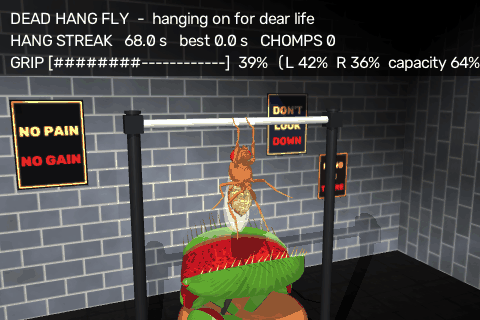

The GIF is the end of a natural hang (default config, seed 0, nothing forced, real
time, 10 fps, 480×320, HUD cut to three lines): 68–77.6 s of sim. The fly has been on
the bar for 68 s (5 re-grips, 2 slips) and clings at 35–40 % grip, the right hand
slips, the fly hangs one-armed with the mid legs braced, re-grabs at 31 %, and drops
straight into the trap: CHOMP, then the explicit respawn with the trap reopening.

**Scene.** A fly-scale gym: a chrome pull-up bar (static capsule along x, R 0.15 mm,
8 mm long, at z = 11 mm) on black powder-coated posts, with chalk marks where the
hands go. Below it is a potted Venus flytrap (terracotta pot, peat with moss, a
rosette of small traps, a winged petiole). The main trap has two procedural lobes,
red inside with a green margin, green outside, and marginal teeth. The floor is a
black rubber gym mat, and there is a brick wall with posters ("NO PAIN / NO GAIN",
"DON'T LOOK DOWN", "HANG IN THERE"). The job camera frames the bar and the trap.

**How it hangs (physics, no welds).** The fly faces the camera, its body pitched
80° nose up, and holds on with its two front legs. The tarsi come up on the
camera side of the bar and reach over the top. The spawn / respawn pose is solved
by IK (`LegIK`: damped least squares on the 7 actuated DoFs of one leg, on a
scratch `MjData`). Targets: tarsus1 in front of the bar, tarsus5 on top. The pose
is then settled for 1 s on a scratch `MjData` (grip targets and adhesion held) and
written into FlyGym's "neutral" keyframe (free joint + leg angles, as the course
respawn does). `sim.warmup_s` is 0, so the standing warm-up never runs. The
posture is an `ActionManager` action (`HangGrip`, name `dead_hang`) that writes all
42 leg targets and the 6 adhesion commands every step. Grip = FlyGym's own tarsal
adhesion actuators (MuJoCo `adhesion` on tarsus5, gain 40: 40 µN per leg at ctrl 1 =
4 body weights; the fly weighs 10.05 µN) plus friction 1. The bar's contacts use
condim 4 (sliding + torsional friction 0.02 mm: a tarsal pad is a small patch, not a
point, so it resists spinning about the contact normal; FlyGym's condim-3 point
contacts let a one-armed fly pivot freely). Measured with this posture (both legs,
10 s trials, condim 3; with condim 4, 4 s trials, 0.15 falls after 0.18 s and 0.2
holds):

| adhesion ctrl per front leg | force per leg | result |
|---|---|---|
| 0 | 0 | the tarsi slide off, falls after 0.3 s |
| 0.05 / 0.10 | 2 / 4 µN | falls after 0.3 / 0.4 s |
| 0.15 / 0.3 / 1.0 | 6 / 12 / 40 µN | hangs the full 10 s |

So the hang needs roughly 1–2 body weights of total adhesion. With full adhesion it
hangs indefinitely (thorax 1.42 mm below the bar axis, sway < 0.02 mm). The walking
fall detector is paused for this job (it would read a vertical fly as fallen). The
job's own rule: no leg on the bar for 0.12 s and the thorax 2.4 mm below it (or
3.6 mm regardless) = a fall.

**One-armed moments (2026-09-27 rework).** The first version fell mostly by twisting
off while one arm was off the bar, at 70–90 % grip: with one point contact the body
swung (a ~0.08 s pendulum under the holding hand) and spun about it, and a re-gripped
or re-grabbed leg came back to a bar that had moved relative to the body (joint-space
replay from a displaced body puts the tarsus below the bar top, and closed-loop IK
chased the swinging bar into contortions). What the fly does now:

* **Mid-leg brace.** While a front leg is (about to be) off the bar, the mid legs swing
  up and press their tarsi against the front of the bar (IK pose from the settled
  hang, re-aimed from the current body pose when a brace starts; tarsus5 target 0.62 mm
  either side of the hands, 0.02 mm into the bar face, 0.05 mm below the axis; blend-in
  ~0.12 s, out ~0.4 s) with a little adhesion (ctrl 0.25 = 10 µN, about one body weight,
  ramped with the blend) and stop kicking. That damps the swing and the spin.
* **Weight shift.** A re-grip first ramps the leg's adhesion off over 0.2 s with the
  tarsus still on the bar (the body settles under the other hand without a pendulum
  kick), then lifts 0.15 mm (0.12 s) and puts it back (0.18 s). A slip is no longer
  instantaneous either: the slipping tarsus loses its adhesion over 0.15 s, then drops.
* **Aiming.** Reaches aim at where the tarsi really rested after the spawn settle,
  relative to the bar (not the nominal IK targets), at the other hand's measured x ±
  the spawn hand spacing (re-grabs also try 75 / 50 / 25 % of it if the bar is out of
  reach). The leg follows the spawn lift / grip poses in joint space, each corrected by
  a small IK step for where the body hangs now (at most 0.5 rad per joint, pulled
  toward the spawn pose in the null space). With both hands on the bar the arms ease
  back to the spawn grip pose (tau 0.3 s), so the body re-centres.

Measured (strength set, the other front leg slipped, 3 s on one arm with the flail
and kicks, fatigue off, 2 trials each): at 0.9 / 0.6 / 0.35 it holds, at 0.3 once in
two, at 0.2 it falls within 0.2 s. Without the brace it still holds at 0.6 and falls
at 0.35. So one arm is safe while the fly is fresh and fatal once it is tired. Six
alternating re-grips at 90 %: 6 / 6 back on the bar, body yaw < 8°, thorax moved
< 0.15 mm (before: the second one spun the fly 180° and it fell). Six alternating
slips at 90 %: 6 / 6 re-grabbed on the first try, yaw < 9°; at 60 %: 3 of 4 on the
first try, the fourth kept missing for 6 s.

**Grip fatigue (phenomenological, ours).** Each front leg has a strength s (0–1).
The adhesion command *is* s, so the force is 40 µN × s. s drains by 0.011/s while
the leg carries load (× 2.5 when it holds alone; × (1 + stress level) with
`--stress`), capped by a capacity that decays by 0.002/s. When s drops 0.12 (± 0.04)
below the capacity (and below 0.9) the fly **re-grips** the tired leg (weight shift,
lift, put back, 0.5 s; the other leg holds alone meanwhile, the mid legs brace) — but
only while the other leg has > 0.6: a tired fly no longer dares to let go and just
clings. A re-grip restores 60 % of (capacity − s) and costs 0.045 capacity (1.2 s
cooldown). Random **slips** (hazard 0.045/s × ((1 − s)/0.5)², × (1 + 2 × stress))
drop the weaker leg. A gripping leg whose distal tarsi leave the bar for 0.4 s has
physically slid off, which also counts as a slip. The slipped leg hangs below the bar
and flails, the holding leg pulls up (femur–tibia +0.3 rad), the hind legs kick, the
mid legs brace. After 0.8–1.8 s it **re-grabs** (see above). A miss means it kicks
and tries again. So a hang goes: a few re-grips while the capacity drops, then the fly
clings while s drains, slips get likelier, and a slip at low s (one arm below ~0.35)
or both arms below ~0.15 ends it. Whether it falls is decided by the contacts.
`stats()` counts falls by situation (`fall_causes`: one-arm / two-arm) and the mean
grip of the hand(s) still on the bar when it fell (`mean_fall_grip`).

**The trap.** A trap head on a slide joint (the "lunge") carries two lobes on hinge
joints about the midrib, all driven by position servos (lobes: 12 Hz, critically
damped; props only, `gravcomp` on). Open = 55° from vertical. When the falling fly
enters the mouth, the trap **SNAPS** shut (counted CHOMP), holds 2 s, and the fly is
explicitly respawned on the bar (`job.recover("chomped")`, logged and counted). The
trap starts that respawn closed and reopens over 6 s. A fall that misses the mouth
lands on the soil or the floor ("missed the trap", an escape) and respawns after
1.5 s. Survival rate = escapes / falls. **Engineered and labelled:** the lobes are
visual meshes. The falling fly lands on an invisible static catch pad on the
midrib, and the lobes close around it without touching it (lobes that squeeze the
fly would need a multi-geom contact model and risk blow-ups). Legs and head can
stick out of the closed trap.

**Twitches and the brain (`--brain`, off by default).** Every ~14 s (random 0.6–1.4
×; key **T**) the trap **twitches**: it lunges 1.6 mm up and snaps 22° toward
closed in 70 ms, then relaxes. With a brain the trap is a `LoomingVision` source
(the lobes as spheres, the swatter's response curve for large slow objects), so the
twitch drives LC4 / LPLC2 through the looming machinery. Measured without a brain
(events captured): a twitch gives LC4 97–119 Hz and LPLC2 up to 28 Hz on both eyes
(θ up to 50°, dθ/dt ~1300 °/s); nothing is sent at rest. **Rule:** on the bar a jump
is suicide, so the giant fibre (DNp01 > 60 Hz, the jump rule's threshold) makes the
fly **FLINCH** instead: 0.35 s of full adhesion (clench), femur–tibia flexion (a
little pull-up) and hind-leg kicks, costing 0.02 strength, with a 1 s refractory
period. With `--brain-actions` (now also a `run_job.py` flag) the job replaces the
trigger's giant-fibre check (`_check_gf`, also used by the fast path), so no jump is
ever started.

**Efference copy (phenomenological, ours).** While hanging, the looming source sees
the trap as if the body were at its resting hang (the lobe spheres are moved with the
body's displacement from the settled pose), so only the trap's own motion looms. Without
it, the fly's own swings, re-grips and flinches swept the big, close trap across the
eyes' field of view (LC4 up to 200 Hz, dθ/dt up to 5500 °/s with the trap at rest),
the GF fired without a twitch (75–110 Hz), and the flinches fed back into more
self-motion: in one 40 s run a flinch cascade knocked the fly off at 86 % grip. Real
flies cancel self-generated visual motion with efference copies (Kim, Fitzgerald &
Maimon 2015, *Nat. Neurosci.*); this is a perfect one, not a model of it.

**Real FlyWire brain (2026-09-27, headless, `--brain-actions`, 138,639 neurons,
twitches every ~5 s instead of ~14 s, 40 s sim, 85 s wall, one brain process).**
9 / 9 twitches drove LC4 119 Hz and LPLC2 119 Hz on both eyes (θ 40°), the giant
fibre peaked at 90–165 Hz and every one gave a FLINCH; 0 jumps. Between twitches:
0 loom events and 0 GF readouts above 20 Hz (brain lag median 0.02 s). 21 GF bursts > 60 Hz in total (the rest fell in the 1.35 s refractory
period). The fly did 5 re-grips and 3 slips (the grip slid off at 57–73 % shortly
after flinches), all re-grabbed, 0 falls. **Habituation** (`--habituation`, twitches every ~2.5 s, 40 s):
15 / 15 twitches still flinched, GF peaks 80–145 Hz with no downward trend. The
twitch is a short drive (LC4 / LPLC2 ~119 Hz for ~0.2 s) compared with the loom the
depression was calibrated on (LC4 200 Hz for 1 s every 2 s, which stops jumping after
~3 trials, docs/HABITUATION.md); with U = 0.006 and tau_rec 20 s it does not depress
the LC4 / LPLC2 → GF synapses enough to keep the GF below 60 Hz. So with the
current parameters the fly does not learn to ignore the twitches (not tuned: making
the twitch loom longer or stronger would also make every flinch bigger). That run
ended in one fall at 50 % grip on one arm after 15 flinches (each costs 0.02).

**HUD.** `DEAD HANG FLY - hanging on for dear life`, the hang streak and best,
CHOMPS, a grip bar (`GRIP [######----] 62 %`, L / R, capacity), re-grips / slips /
re-grabs / survival rate, and (with a brain) twitches / GF bursts / FLINCHES. A
banner flashes `*** CHOMP! ***`, `SLIP!`, `AAAAAAAAAH!`, `FLINCH!`.

### bowling

`fly_simulator/jobs/bowling.py` (scene, behaviour, camera, `BowlingGame` scoring),
`fly_simulator/jobs/bowling_assets.py` (procedural meshes / textures), tests in
`tests/test_jobs_bowling.py`. HUD (TAB): `BOWLING FLY - league night, every night`.

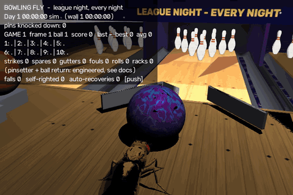

**Scene.** A raised lane bed (1.6 mm) with a maple / pine board texture, the black
foul line, 7 target arrows, guide and approach dots and pin spots, all drawn in one
procedural texture. The fly walks on the approach, a plateau 5.6 mm above the floor
(x −16 … 9 mm) that ends in the bowling ramp (below). Semicircular gutters on both
sides are real channels (7 static facets each) that a stray ball drops into;
kickbacks flank the deck; the pit behind has a high-rolling-friction floor and a
back cushion. A masking unit ("FLY LANES / LEAGUE NIGHT - EVERY NIGHT") hides the
pinsetter housing; two neighbouring lanes (with their plateaus and ramps) with full
racks, a ball-return hood and house balls are decoration. Cosmic carpet on the
floor. Scale: the ball is 3 mm (R 1.5, 0.3 mg); pins, spacing (4.2 mm) and lane width
use the same scale as the ball (8.5 in → 3 mm), but the lane is compressed ~11×
(22 mm from foul line to head pin instead of 250 mm).

**Pins.** 10 free bodies in the standard triangle (numbering 1 … 10, 7 on the
left). Collision: a flat foot cylinder, belly capsule, neck capsule, head sphere
(COM ~0.37 of the height); visual: a lathe mesh through the regulation USBC pin
profile, white with two red neck stripes. Mass 0.067 mg, the regulation ball / pin
ratio (~4.5). They touch the lane, the ball and each other, never the fly. Tuning
found: (1) with default max-mixing the ball's friction 1 and its spin pinned the
light pin to the deck and the ball stopped dead against it, so pin geoms have
priority 2 and friction 0.25 (lacquered pins); (2) FlyGym's stiff 0.2 ms contact
time constant blew up on fast pin-pin hits, so pins use 1 ms; (3) condim-6 contacts
between ball and pin (with the noslip solver) welded them together, so the ball
itself is condim 3 and its rolling friction comes from ball-only surfaces
(contype bit 64: the oiled lane 1e-4 mm, the dry approach 0.02 mm, the pit 0.25 mm);
(4) MuJoCo's critically damped contacts made the pins clay-like; real pins bounce
(restitution ~0.6), so pin contacts use damping ratio 0.3 (`pin_dampratio`).
A pin is **down** if it tilts more than 35° or is off the deck.

**The ramp (engineered, labelled).** A ball pushed at walking speed (~10 mm/s, ~100×
slower than a Froude-scaled real delivery) only nudges the head pin: measured, the
pin leaned on the ball and the ball stopped dead. So the approach ends in a bowling
ramp (the device kids and adaptive bowlers use): a 4 mm drop over 10 mm onto the
lane at the foul line. The fly pushes the ball over the top edge and the ball rolls
down, reaching ~236 mm/s (sqrt(10/7 g h); measured 225–235); from then on it is real
rolling and contact physics. The first version (a 0.35 mm drop, 70 mm/s) left the
pins tottering. Placed-ball sweeps (1.5 s, lines y −2.4 … 0 mm): 70 mm/s 3.8 pins
on average, 150 mm/s 6.0, 200 mm/s 7.0, 236 mm/s 8.2 (strikes at y −1.0 and −0.7),
320 mm/s 8.2.

**The ramp guide (engineered, labelled).** Real kids' ramps have rails and a helper
aims them. Here two low chrome rails (1.4 mm high) run down the ramp with a funnel
on the plateau; they touch only the ball (contype bit 64), and a mocap body moves
them sideways to each roll's release line while the ball is away. Without it the
fly's head bumps sent the ball over the edge 1–2 mm off line and drifting sideways
at up to 13 mm/s: 2–3 mm (sd) off at the pins and 3.7 pins per roll. With it the ball
meets the rack within 0.5–0.8 mm (sd) of the aim.

**Behaviour.** `PushPilot` (the mowing job's push loop) walks round the ball on the
approach and pushes it along the roll's line into the guide's funnel (the waypoints
are clamped behind the ramp; a gentle 0.5 run-up speed over the last 5 mm). The
release is decided by the ball: once its centre is 0.3 mm past the top edge, gravity
has it and the fly stops (**engineered stop rule**: steering speed 0 and a `freeze`)
behind the foul line and watches; a thorax past the foul line within 3 s of the
release is a **foul** (the ball scores 0). (The first version also released when
the *fly* reached a stop line: a ball that lagged 0.1 mm behind the edge then sat on
the dry approach, the fly frozen behind it, for the whole 15 s roll timeout. That
was the "it just stops at the rails" report: the first roll of every session did
it. A ball that stays on the ramp for 2 s after a release is now pushed again
(`no_roll`, 0 in the verification runs).) The roll is over when the ball is in the
pit, in a gutter beside the deck, stalled (< 0.8 mm/s for 1.2 s: a dead ball) or
after 15 s. The job then waits until the upright pins on the deck are still
(< 2 mm/s for 0.5 s, max 5 s) and scores the roll. Then the fly walks back to its
waiting spot (grooming first after a strike) and freezes until the ball comes back;
an edge guard turns it back from the plateau's edges. **Aim model** (the helper
aiming the guide; documented "skill", default 0.9): roll 1 aims at the pocket
(y = −0.85 mm, between pins 1 and 3), roll 2 at the standing pins (weighted to the
front ones); aim error at the pins ~ N(0, 0.4 + 2 (1 − skill) mm), plus a wild throw
(+N(0, 5 mm), which can go into a gutter) with probability 0.5 (1 − skill).

**Camera and slow motion.** The job camera cuts like a TV broadcast: the fly and the
ball on the approach (the rack in the background); after the release it rides along
behind the ball down the lane; before the ball reaches the rack it cuts to the pin
deck (low enough to see the back row under the masking unit) for the pin action and
the pinsetter; then it cuts back to the fly. The roll and the first 0.45 s of the pin
action run in **slow motion ×0.25, an edit effect** (`EternalJob.time_scale`: fewer
physics steps per displayed frame, the step sequence unchanged), labelled on screen
`SLOW MOTION x0.25 (edit, not physics)`; it eases back to real time over 0.5 s.
(At 236 mm/s the ball crosses the lane in ~0.1 s: one frame at 10 fps.) `slowmo: 1`
turns it off. The HUD is off by default (TAB): strikes, spares, gutters, fouls and
the 7-10 split are printed to the terminal as events (`*** STRIKE! ***  frame 3
ball 1: 10 pins STRIKE  score 12  (aim y -1.3 mm, ball at the rack -0.7)`), and
every roll prints its aim and where the ball met the rack.

**Pinsetter (kinematic, labelled; every cycle counted).** After roll 1 the table
lifts the standing pins 2.6 mm, the sweep bar (mocap, visual) comes down in front of
the deck and sweeps back to the pit; every knocked pin it passes vanishes into the
housing (a teleport; stored pins are held there kinematically), and the standing
pins are put back down where they stood, upright. After a frame (or a strike, or a
10th-frame mark) it clears everything and lowers a fresh rack of 10 from the housing
onto the spots (`rack_resets`). **Ball return (labelled):** the ball is taken out of
the pit into the ball-return hood (a teleport) and pops out at the approach return
spot (x 1 mm, y ±1.5 mm) once the fly has walked clear. A reset during a roll voids
the roll (`voided`) and puts the rack back as it was before it.

**Scoring.** `BowlingGame`: standard ten-pin rules (strike = 10 + next two balls,
spare = 10 + next ball, the 10th frame's bonus balls with a fresh rack after a mark,
300 max), marks `X / - 7`, per-frame running totals (None while a bonus is
pending). HUD: game, frame / ball, score, last / best / average game, a two-line
scoreboard (`1: X =20 | 2: 7 / =30 | 3: - 4 =34 | …`), strikes / spares / gutters /
fouls / rolls / racks, and a message line (STRIKE!, DOUBLE!, TURKEY!, SPARE!,
GUTTER BALL, the 7-10 split!, GAME OVER).

**Verified** (2026-09-27, `run_job.py --job bowling --headless --max-seconds 180`,
default config). Before the fixes: 5 rolls in the first 60 s, 2.0 pins per roll, the
first roll a 16 s dead ball on the ramp's edge (frames: the fly frozen behind the
ball for 15 s), an earlier 180 s run 2.3 pins per roll and 0 strikes / spares. After:
**24 rolls, 113 pins (4.7 per roll; first balls ~7.5)**, **2 strikes, 3 spares**, 0
gutters, 0 dead balls, 0 no-rolls, 0 fouls, one complete game (**130**), 24 pinsetter
cycles, 13 rack resets, **0 falls**, 0 auto-recoveries, 0 instabilities, RTF 0.31;
aim-to-rack error 0.33 ± 0.84 mm. Other 180 s runs during tuning (same scene):
1 strike / 4 spares / 1 gutter, game 115; 3 strikes in 120 s. About 7.5 sim s per
roll (~9 s on screen with the slow motion). A fly that bowls 4.7 per roll is a
~130 bowler: with strikes ~10 % and a second ball that cleans up ~1–2 pins, pins per
*roll* can't get much above 5 without a near-pro strike rate. `run_sim.py --job
bowling` runs too (6 s smoke test: 9 pins, 0 falls, same camera and slow motion). Frames checked
by eye (the window path, `JobRunner.render(hud=False)` at the default 960×640, and a
`--record` MP4): the push into the funnel, the ride-along down the lane, the cut to
the deck, pins scattering (a strike), the sweep bar and the fresh rack, the cut back
to the fly.

**Limitations.** The lane is compressed; the ramp, its guide, the stop rule, the
pinsetter and the ball return are engineered (above); the pins are held
kinematically while in the machine. The aim is a skill model, not the fly's: the fly
only has to push the ball into the funnel and over the edge. The slow motion is a
presentation edit. With `shadows: false` the approach renders black (seen before these
changes too; not investigated, not the default).

### broccoli_toss

`fly_simulator/jobs/broccoli_toss.py` (scene, viewer, sequence, blast),
`fly_simulator/jobs/broccoli_toss_assets.py` (procedural meshes / textures), tests in
`tests/test_jobs_broccoli_toss.py`. HUD: `BROCCOLI TOSS FLY - absolutely not`.

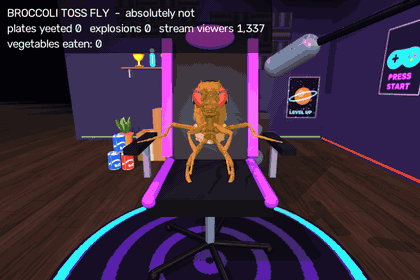

A reaction-meme format at fly scale: someone is handed a plate of broccoli, looks at
it for a few seconds, then casually flicks the whole plate backward over their
shoulder without looking, and everything behind them explodes. No real people,
channels or logos: the flies are "the host fly" and "the viewer fly", the stream
layout is generic ("LIVE", "CHAT", "FOLLOW GOAL").

**Scene.** A fly-scale streamer's room (the fly is ~2.5 mm long; the seat is 2.1 mm
up, the desk 3.3 mm): dark wooden floor and a round neon rug, an acoustic-foam back
wall, a side wall with a (decorative) doorway, posters with generic art ("GG" over a
synthwave sunset, "LEVEL UP", "PRESS START"), RGB LED strips (emissive, hue cycling),
a ring light, a mic on an arm, a gaming desk with a glowing keyboard and two
monitors, a big stream TV on the side wall, a shelf with trophies and books, a
kitchenette (mini fridge, counter, microwave, a stack of plates) and a gaming chair.
The monitors show a generated stream layout (a game view, a webcam box with a cartoon
fly, a red LIVE badge, a chat column); the chat blocks are thin emissive bars that
scroll up over the chat column (six times faster after a blast) and the LIVE dot
blinks. Lights are moody purple / blue spots plus the monitor glow; the key light
casts shadows (`shadows=False` turns that off). All meshes and textures are made in
code, nothing is written to disk.

**The viewer fly (posed, kinematic: engineered, labelled).** A second NeuroMechFly
body (FlyGym's mesh model, `LEGS_ONLY` joints plus a 3-DoF neck, the passive tarsal
joints removed) is attached to a mocap mount on the seat with no free joint, pitched
50° nose-up as if leaning back. It has no actuators and no contacts, and every body is
gravity compensated; the job writes its 45 joint angles every 1 ms (and zeroes their
velocities). Its poses are joint-space keyframes solved once by damped least-squares
IK on a scratch `MjData` (rest: hind legs over the seat edge, mid legs on the
armrests; take; hold; windup; flick), blended with smoothstep. It is not a second
simulated walker, so it adds no contact physics. It wears a gaming headset (visual
geoms on its head). Its gaze is levelled at the monitors with a head pitch; it only
ever looks down at the plate during the ponder.

**The host fly** is the normal simulated fly (real walking physics, CPG controller,
fall detection). It walks the straight line from the kitchen spot to its spot beside
the chair (pure pursuit on the line), so it arrives facing the viewer: at this scale
the hybrid controller's "turn on the spot" is really arc walking with a ~2 mm radius
(measured: `turn_right` moved the fly ~2–3 mm while turning 90°), so the job plans
the facing into the path instead of turning at the end. The way back is a clockwise
loop under the desk edge that ends at the kitchen heading along the delivery line
again. The plate rides on the host's back (**kinematic carry**: the plate and florets
are placed on the thorax pose every 1 ms, no contacts) and appears there at the
kitchen.

**Sequence** (state machine in `update`, every 1 ms; one cycle is ~15 s):

1. `deliver`: host walks in with the plate; `face`: a 0.25 s stop (`freeze`); if it
   is more than 45° off it gets a few short turn bursts;
2. `present` (0.5 s) + `handover` (1.1 s): the plate lifts off the host's back and
   moves to the viewer's front "hands" (**kinematic handover**, labelled) while the
   viewer reaches for it;
3. `ponder`, **0.75–1 s** (uniform, seeded): the plate stays still in front of its head,
   the head tilts down at it and rocks (pitch +18°, roll ±14°), a mid leg taps the
   armrest, a hind leg swings; `hmm...`. The head swings back to the monitors 0.35 s
   before the end;
4. `flick` (0.17 s): hold → a tiny anticipation (`windup_s` 0.12 s, eased: the plate
   dips toward the chest and cocks a little, the torso turns 4° to its left and leans
   in, the head dips) → the **snap** (`throw_s` 0.05 s, u^2.2: velocity ~0 then a
   spike at the release): the right front leg whips up and back over the right
   shoulder (the picture's left, as in the meme), the torso twists 26° to its right
   (the viewer's mocap mount), leans back 8° into the chair and rolls the right
   shoulder up, the head jerks up and counter-turns (it never looks), the left front
   leg lets go. The plate hangs from the right front "hand", banks edge-first toward
   the throw and swings out beyond the hand; its face never turns to the webcam (no
   slow flip). At the release the plate and its 4 florets become free bodies with a
   **launch velocity set by the job (engineered, labelled)**: aimed to reach
   `target_xy` (-6.6, -5.0) ± 0.9 mm (the can pyramid) in `flight_s` = 50 ms, a fast
   flat throw (~210 mm/s; translation dominates), spinning 60 rad/s about its own
   axis; the florets get ±25 mm/s scatter. The leg does not exert this velocity.
   **Follow-through / recoil (engineered, labelled):** from the release damped
   springs (`_Springs`, stepped every 1 ms) take over: the arm overshoots and swings
   back to rest, the torso / lean / roll / head wobble back in 2–4 decaying swings,
   the hind legs kick, and the **chair recoils** (the chair is a mocap body, nudged
   back 0.1–0.2 mm and yawed, the viewer rides on it);
5. `flight`: real physics, but short: the blast goes off at the plate's first contact
   with anything but its own florets or at the `flight_s` timer, whichever comes
   first (47 ms in the seeded runs): at 30 fps that is 1–2 frames from release to
   boom, at the GIF's 15 fps one;
6. `boom` (2.6 s): **cartoon blast (engineered, labelled)**, near-instant: a white-hot
   core that is big at once and collapses in 30 ms; 80 lumpy fire ellipsoids (random
   axes and orientations, a billowy noise cube-map texture, each with its own
   direction, 0–35 ms onset, 12–30 ms growth, cooling white → yellow → orange → red →
   soot, rise, wobble and burn-out) that burst out to full size in a few tens of ms
   and fill the background on the picture's left and above; 24 darker smoke
   ellipsoids that roll up later; 40 spark streaks (capsules along their velocity),
   56 embers and a dust ring (all emissive primitives on a mocap body, animated
   vectorised); a point light at the blast and a warm **rim spot** from behind the
   viewer's right shoulder onto its back / side, the chair and the rug, both
   flickering with the fire; the viewer's materials glow for an instant. The key
   light's shadow is off while the room burns (MuJoCo's shadow map blacked out the
   emissive puffs). **One shockwave velocity kick** (an impulse) to every breakable
   prop within 9 mm: Δv = 230 mm/s × (2 mm / max(r, 2 mm))^0.6 × U(0.8, 1.2) along
   the outward direction with an upward bias, plus a random spin. From then on the
   props fly, tumble and collide with real contacts. The pool of 14 debris chips and
   the florets is launched from the blast centre (120–300 mm/s) and rains down with
   real physics. The plate itself is shattered (parked). The blast also shoves the
   viewer and the chair forward (a kick to the recoil springs);
7. `aftermath` (2.4 s): the viewer keeps watching the monitors, unbothered, the host
   stands there, the stream viewers go up (+80 + 12 % × U(0.6, 1.4)), chat scrolls
   fast;
8. `rebuild` (1.4 s, **kinematic, counted**): every prop lifts, glides and slerps
   back onto its spot; debris and florets go back to the pool behind the back wall.
   Meanwhile the host walks back to the kitchen (`walk_off`), gets the next plate
   (`fetch`, 0.6 s), and 1. again.

**Props.** 13 breakable free bodies behind the chair (3 cardboard "FRAGILE" boxes
stacked, a 3-can pyramid, a floor lamp, a speaker, a PC tower with RGB fans, a potted
plant, two trophies and an action figure on the shelf), 0.01–0.09 mg, friction 0.6,
contact time constant 1 ms (softer than FlyGym's 0.2 ms for fast hits); they never
touch the fly. While intact they are **parked kinematically**: contacts off, gravity
compensated, at rest on their spots, so the solver has no resting contacts to hold
(this took the step time from 0.5 ms to 0.19 ms: 134 → 14 contacts). They, the plate
and the florets go live (contacts + gravity) at the release; the debris goes live at
the blast. The camera is a "webcam" on the (shallow) desk under the monitors with a
wide 64° view. While the host walks it is wider and higher (azimuth 180°, elevation
-13°, 5 mm); from the handover to the end of the aftermath it glides (0.6 s) into the
meme's framing: chest-high (elevation -10°, 4.3 mm, look-at 3.45 mm up), the chair
centred with its whole back in view, slightly off-axis from the picture's left
(azimuth 172°) so the plate visibly flies back past the viewer. The blast (scaled ×3)
fills the background on the picture's left and above, but every puff is clamped to
stay behind the chair back, so the viewer stays in front of it, unbothered, and
glances off to the side afterwards, like the meme edits.

**Edit effects (a video edit, not physics; labelled `EDIT FX (not physics)` in the
HUD during the beat).** Matched against the meme edit frame by frame (a 10 fps clip:
hold, a one-frame anticipation, the arm up with the plate leaving the frame, then one
white "impact frame" with speed lines and a dark silhouette, two overexposed,
punched-in frames, then saturated fire behind the unbothered person, zoomed in ~1.4×
for the rest):

* **hit-stop / slow motion** (`time_scale`, presentation time): 0.07 s at ×0.02 (a
  near-freeze: 2 frames at 30 fps), then 0.4 s at ×0.3, ramping back to ×1 over
  0.25 s (~0.36 s of presentation time added per blast; recordings and the GIF show
  it, the physics sequence is unchanged);
* **impact flash** (counted in frames, so it never lingers): frame 1 is an "impact
  frame" (a high-contrast negative with a warm white burst out of the blast, streaked
  by the zoom blur), frames 2–4 are overexposed by ×3.4 / ×2 / ×1.3 plus a white /
  yellow lift strongest toward the blast (the viewer overexposed too), then the
  normal image; a chromatic fringe (R / B pulled apart 4 → 1 px) on frames 2–4;
* **zoom blur** out of the blast (5 taps, 8 % → 0 in ~0.2 s), **bloom** (bright pass,
  blurred at 1/4 and 1/8 size, added back warm: the glow engulfs the silhouette at
  the blast, a weaker halo while the room burns), a brief exposure lift and a warm
  grade that fades with the fire;
* **camera kick, damped shake and punch-in** (one `warpAffine`): a 3 %-of-width kick
  at the impact, the opposite smaller swing next, 7 / 5.5 Hz oscillations decaying
  with τ = 0.14 s (2–4 visible swings) plus a ±1.6° roll; the zoom punches to ×1.25
  and settles at ×1.14 while the room burns, then eases back as it rebuilds;
* **ghosting** at the hit (the previous output blended in at 45 / 30 / 15 %) and a
  **motion smear** on the throw's fastest frames (the snap and the flight: what moved
  since the last frame gets a directional blur along the throw, blended with the
  previous frame).

`post_process` costs 7–9 ms per 600×400 frame during the blast (numpy / OpenCV, measured
in the render loop), less on the smear and zoom-ease frames, nothing otherwise (identity). `edit_fx: false` turns all of it
off (no post-process, no hit-stop).

**Brain (`--brain`, off by default).** During the ponder the job sends a bitter taste
pulse every 0.5 s (0.4 s at 150 Hz: `StimulusEvent("taste", tastes=["bitter"])`, the
Shiu et al. labellar bitter GRN set LB1a–e, labelled `BROCCOLI: BITTER (stand-in:
LB1 bitter GRNs)`). **Stand-in:** the scene has one connectome brain and it belongs
to the simulated host fly; the job feeds it the viewer's broccoli so the brain window
shows the bitter pathway. Bitter drives no behaviour DN in the model (docs/TASTE.md),
so nothing moves because of it. Checked with the real FlyWire brain (138,639 neurons,
window off, 7.5 s): 8 bitter pulses in the ponder; brain states in the ponder averaged
335 spikes per window against 0 before it, and every descending group stayed at 0 Hz.
The HUD adds `bitter pulses N (stand-in ...)`.

**Counters / HUD.** Plates yeeted (the work counter), explosions, stream viewers (from
1,337, up after every blast, the last gain in brackets), `vegetables eaten: 0`
(always), room rebuilds, props launched, plus a message line (`the host fly: 'made you
broccoli'`, `hmm...`, `*flick*`, `KA-BOOM! (cartoon blast) chat goes wild: +N
viewers`, `rebuilding the room`) and the label line `(viewer: posed kinematic fly;
plate launch + blast: cartoon, see docs)`, plus `EDIT FX (not physics): hit-stop,
slow-mo x0.3, flash, bloom, shake, punch-in` during the impact's edit beat.

**Verified** (headless, 2026-09-27, `run_job.py --job broccoli_toss --headless
--max-seconds 150`): **10 plates yeeted, 10 explosions, 10 room rebuilds**, 130 props
launched, stream viewers 1,337 → 5,782, vegetables eaten 0, flights 55–64 ms, 0
flight timeouts, 0 plates lost, 4 back-away unsticks, **0 falls, 0 auto-recoveries,
0 instabilities, RTF 0.31**. (An earlier version of the walk loop orbited its end
point and needed one `stuck` recovery in 150 s; the path follower now lets the carrot
run on past the end.) `run_sim.py --job broccoli_toss --headless --max-seconds 4`
runs too. Frames checked by eye (job renderer): the host walking in with the plate
on its back, the handover, the ponder close-up, the plate on the right front leg over
the shoulder, the plate in the air over the chair, the fireball and dust ring with
props flying, the aftermath with the viewer still facing the monitors, the rebuilt
room. After the snap / edit rework (2026-09-27): `run_job.py --job broccoli_toss
--headless --max-seconds 20`: 2 plates yeeted, 2 explosions, 26 props launched,
flights 44–47 ms, 0 falls, 0 auto-recoveries, **0 instabilities**, RTF 0.26;
`run_sim.py --job broccoli_toss --headless --max-seconds 5` runs, and its `--record`
MP4 has the post-process and the slow motion in it. The throw → boom segment was
rendered at 30 fps (and 15 fps for the GIF) and checked frame by frame against the
meme clip: at 30 fps 5 frames of flick (4 of anticipation, 1 smeared snap), 2 of
flight, 2 hit-stop frames (the impact frame + an overexposed one), 2 more flash
frames, ~12 slow-motion frames while the fireball fills the background; at 15 fps
release → impact frame is one frame, as in the clip. Tests:
`tests/test_jobs_broccoli_toss.py` (10 tests, ~35 s: scene / viewer without free
joint, actuators or contacts; the full phase order and a 0.75–1 s ponder; the launch
goes backward and lands behind the chair, fast and flat, and the blast follows within
`flight_s`; the plate never turns face-on to the webcam, the torso twists and the
chair recoils, both back at rest after the cycle; the hit-stop / slow-mo schedule and
the presentation-clock lag of one blast; the post-process is identity when idle and
the impact frame is bright; the blast moves props and the rebuild puts them back;
counters and HUD; bitter pulses with a fake brain; a reset mid-cycle; the
`PresentationClock` step accounting).

**Limitations.** The viewer is posed, not simulated (no dynamics, it can't be
knocked over), the carry, handover, launch velocity, follow-through / recoil
springs, blast, debris launch and rebuild are engineered (above); the flash,
hit-stop, slow motion, shake, punch-in, blur and ghosting are edit effects. The
viewer is a fly, so the "arm" is a thin front leg: the snap reads mostly through the
plate, the smear and the torso twist. The blast's screen centre for the zoom blur /
flash is a fixed point of the webcam framing (`blast_screen`), not projected. In a
live window the hit-stop is honoured by waiting (the job runs at RTF ~0.3 anyway).
The host's arrival heading is within ~5–25° of the viewer, not exact. Blast-launched
props sometimes fly out toward the camera (invisible walls keep them in the room).
The chat on the monitors is geometry over a static texture (no text).

### taste_tester

`fly_simulator/jobs/taste_tester.py` (scene, stance, decision, machines),
`fly_simulator/jobs/taste_tester_assets.py` (procedural meshes / textures), tests in
`tests/test_jobs_taste_tester.py`. HUD (TAB): `TASTE TESTER FLY - quality control, one
drop at a time, forever`.

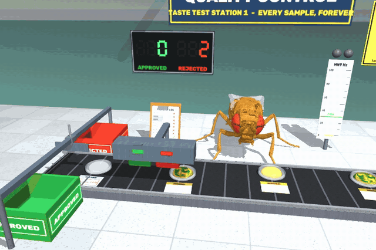

"The fly tastes food samples on a conveyor belt forever, and the real FlyWire brain
decides: approve or reject." Flies taste with their legs first, and sugar on the tarsi
triggers the proboscis extension response (PER): the job is a PER assay on a production
line.

**Scene** (all visual except the floor, so no machine can trip the fly). A lab: speckled
vinyl tiles, a mint wall with a `QUALITY CONTROL / TASTE TEST STATION 1` sign, a tally
board (two 3-digit 7-segment displays, APPROVED green / REJECTED red, emissive segments
switched by material), a generic `TASTE WITH YOUR FEET` poster, a QC-log clipboard, the
**MN9 meter** (a scale 0-100 Hz with the 30 Hz PASS line and a bar that shows the brain's
live MN9 rate, green above the threshold) with two decision lamps, cool key / fill spots
(the key casts shadows, `shadows: false` turns them off) and ceiling tubes. An **indexing
conveyor** runs along -y in front of the fly: a rubber belt (1.5 mm wide, top 0.24 mm),
steel rails and legs, striped rollers that turn and 22 cleats that travel with the belt
(mocap), a `SAMPLES IN` hood with a strip curtain upstream. Stations every 2 mm: 0 (under
the hood), 1-2 (queue), 3 (in front of the fly), 4 (the stamper), 5 (the belt end, with
the diverter and the two bins). **Samples** are a fixed pool of 12 mocap bodies: a glass
dish, a drop (golden syrup = sugar, dark green = bitter, marbled gold / green = mixed,
clear = water; material swapped per sample) and a sample card (the type band, ruled
lines; after the stamper an inked, tilted APPROVED / REJECTED stamp: 12 card materials).

**The fly.** It spawns facing the belt (thorax 0.61 mm, front tarsi 0.17 mm short of the
belt) and holds a stance action, `TasterStance` (all tarsi planted and adhering, like
`freeze`, registered as stationary). The job moves one leg inside it: the left front
leg's 7 joint targets come from damped least-squares IK on a scratch `MjData` (the
dead_hang `LegIK`), interpolated in joint space; the leg is position-controlled like any
action, nothing is teleported, its adhesion is off while it is lifted. Full body is always
on (proboscis joints).

**Cycle** (~3.3 s, every 1 ms in `update`):

1. `move` (1.1 s, eased): the belt indexes one station; the end sample is swept into its
   bin, a new one appears under the hood.
2. `lift` / `reach` (0.3 + 0.3 s): the leg lifts over the rail and touches the drop.
   **Touch** is a geometric test (tarsus5 within the drop radius + 0.12 mm and at most
   0.12 mm above its top; the drop is visual); no contact within 0.3 s would count as a
   miss (0 in every run below).
3. `taste`: on touch the job sends `StimulusEvent("taste", "left", duration 0.5 s)` with
   `tastes` = the sample's sugar / bitter and their rates (the sample's
   "concentration"): **stand-in, labelled**: the brain model has no tarsal taste
   neurons, so these are Shiu et al.'s labellar sugar (LB3) and bitter (LB1) GRN sets,
   as for the taste patches (docs/TASTE.md). Water sends nothing (no water GRNs in the
   stand-in sets). Rates: sugar 50-200 Hz, bitter 100-200 Hz, mixed sugar 100-200 +
   bitter 50-200 Hz (seeded; types 40 / 25 / 20 / 15 %).
4. **Decision.** With `--brain`: the mean MN9 rate over the brain states (0.1 s windows,
   matched by `BrainState.sim_time`) that end in (t0 + 0.1, t0 + 0.6] s, against
   `approve_mn9_hz` = 30 Hz (the taste patches' feeding threshold). The job waits for
   those windows (at most `brain_wait_s` = 4 s; a timeout is counted and decided on what
   arrived, 0 in every run). Without a brain a **scripted rule** decides (sugar without
   bitter passes), labelled `[scripted]` / `decision: SCRIPTED (no brain)` in the HUD.
5. `respond`: APPROVED: the green lamp, the proboscis held extended for 0.9 s (with a
   brain the proboscis follows MN9 all the time, τ 0.1 s, fully out at 60 Hz, so the PER
   starts during the taste); REJECTED: the red lamp, the leg drops behind the dish's rim
   and pushes it 0.3 mm away (the dish follows the push phase kinematically:
   engineered).
6. `retract` (0.35 s) + 0.15 s pause, then `move`.

**Machines (kinematic, labelled).** At station 4 a compact stamper slides its carriage so
the chosen stamp (green / red ink pad) is over the card, plunges, and the card's material
becomes the stamped one. At station 5 an overhead diverter (a paddle on a carriage on a
beam across the belt end) drops behind the dish and sweeps it off the belt, approved to
the green bin on the far side, rejected to the red bin on the fly's side, where it drops
into one of 6 slots. When no spare is left, the oldest binned sample is **recycled**
(washed and refilled with a new random sample, reappearing under the hood: a hidden
teleport, counted in `recycled`). Keys (run_job.py): **5 / 6 / 7 / 8** make the next
sample sugar / bitter / mixed / water.

**Counters / HUD** (TAB, off by default): samples tasted (the work counter), approved,
rejected, **accuracy** against the label (only pure sugar should pass; sugar, bitter and
water are scored, mixed is reported apart as `mixed passed k/n`), passed per type with the
mean MN9 per type, the decision source line, the live MN9 and the proboscis, the last
decision (`#13 MIXED (sugar 180 + bitter 90 Hz) -> MN9 57 Hz (peak 80) -> APPROVED
[brain]`, also printed to the terminal) and the label line `(taste input: labellar GRN
stand-in; belt / stamper / diverter / recycling: kinematic machines)`. Constant memory:
counters, fixed pools and deques (80 brain windows, 6 recent decisions); the brain's
`stim_log` is trimmed (> 400 → 200).

**Verified** (headless, 2026-09-27, Apple M1):

* without a brain, `run_job.py --job taste_tester --headless --max-seconds 120`: **36
  samples** tasted (3.3 s each), 16 approved / 20 rejected (scripted), 36 stamped, 28
  recycled, 0 touch misses, **0 falls, 0 auto-recoveries, 0 instabilities**, RTF 0.57;
  the thorax was at (0.62, 0.04) mm after 5 s and after 22 s (spawn settle: (0.61, 0.02)).
  `run_sim.py --job taste_tester
  --headless --max-seconds 5` runs too (2 samples).
* with the **real FlyWire brain** (v783, 138,639 neurons, window off),
  `run_job.py --job taste_tester --brain --headless --no-brain-window --max-seconds 60`:
  18 samples, 16 taste stimuli, 0 brain timeouts, 0 falls, RTF 0.57. The random samples
  (mean MN9 over the pulse, peak in brackets):

  | type | n | MN9 mean (range) | approved |
  |---|---|---|---|
  | sugar (105-180 Hz) | 6 | 66 Hz (53-75; peaks 65-80) | 6 / 6 |
  | bitter (110-125 Hz) | 3 | 0 Hz | 0 / 3 |
  | water (no input) | 2 | 0 Hz | 0 / 2 |
  | mixed | 7 | 16 Hz (0-57) | 1 / 7: sugar 180 + bitter 90 Hz gave 57 Hz and passed; 115 + 180 gave 0, 175 + 195 gave 4, 125 + 100 gave 19, 140 + 120 gave 15, 180 + 150 gave 14, 105 + 150 gave 1 |

  Accuracy 100 % on sugar / bitter / water. A directed probe (a script that set the
  next sample's type and rates each cycle; same job, real brain): sugar 50 Hz → MN9 10 Hz
  (peak 35), **REJECTED** (a dilute syrup fails: the brain's call); 67 → 30, APPROVED at
  the threshold; 85 → 51; 100 → 49; 200 → 76; mixed 200 + 67 → 56 APPROVED, 200 + 133 → 28
  REJECTED, 133 + 67 → 40 APPROVED, 100 + 100 → 7 REJECTED; bitter 200 → 0; water → 0. This
  matches the offline dose / mixture probe in docs/TASTE.md (sugar 50 / 67 / 100 / 200 Hz →
  11 / 36 / 54 / 76 Hz; equal sugar + bitter → 3-9 Hz; 200 + 67 → 60). The job is
  deterministic with the default seed (two 60 s runs gave the same 18 decisions and rates).
* Frames checked by eye (job renderer and the `run_sim.py --record` MP4, 720×480): the leg
  on a sugar drop with the MN9 bar at ~72 Hz (green) and the proboscis extended onto it;
  the leg pushing a mixed dish away with the red lamp on; the red and the green stamp
  coming down on cards, stamped cards on the belt; the diverter and the green / red bins
  with their labels; the HUD with TAB (screenshot).

Tests: `tests/test_jobs_taste_tester.py` (9 tests, ~45 s): registry / config; every job
geom is visual, the pool is fixed, the proboscis actuators exist, the stance is
stationary; the scripted fallback (sugar approved, bitter rejected, the leg reached the
drop); a fake brain that publishes 0.1 s states with sim times (sugar → MN9 60 →
APPROVED and the proboscis out, bitter → 0 → REJECTED, sugar + bitter → 5 → REJECTED; the
stimulus sets, rates, side, duration and stand-in label); water sends nothing and the
stimulus log stays bounded; 20 index moves recycle the fixed pool (no sample on two
stations, bins within their slots); the stamper stamps the card and the tally shows the
count; a reset mid-taste is voided and the job continues; keys queue the next sample.

**Limitations.** Leg taste is a labelled stand-in (labellar GRN sets, one side); the
"touch" is a geometric test on a visual drop, and the rates encode concentration, not a
physical dose. The decision threshold (30 Hz on the mean MN9 over the pulse) and the PER
hold on approval are our rules on the brain's output; the push-away, stamper, diverter,
belt and recycling are engineered kinematic machines. MN9 is the only readout used: the
model gives no avoidance for bitter (docs/TASTE.md), so a rejection is "no PER", not an
aversive response. The belt stations are fixed; the leg reaches from wherever the fly
stands (IK in world coordinates), but a fly that drifted far would miss (never seen). The
window mode (`LiveViewer`) was not opened in this session.

### pizza_chef

`fly_simulator/jobs/pizza_chef.py` (scene, stance, sequence, pools),
`fly_simulator/jobs/pizza_chef_assets.py` (procedural meshes / textures), tests in
`tests/test_jobs_pizza_chef.py`. HUD (TAB): `PIZZA CHEF FLY - the fly makes pizza forever`.

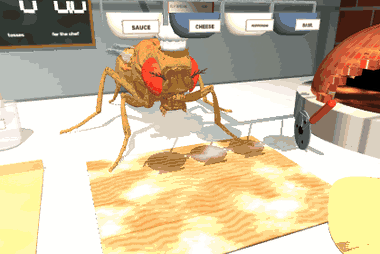

**Scene.** A fly-scale pizzeria on a white marble counter (the floor plane's material): a
floury wooden prep board in front of the fly (flour dust and little footprints in its
texture), a wood-fired brick oven on a stone plinth (an open dome shell with an arched
mouth, so the logs, 14 flickering emissive embers, 6 flames and the pizza inside are
visible; a flue that smokes, a warm spot light out of the mouth and a point light at the
fire, both flickering, brighter while baking; a woodpile), four ingredient bowls (SAUCE,
CHEESE, PEPPERONI, BASIL, labelled) hanging from a wall-mounted rail over the board, a pizza
peel, a cutter wheel, a takeaway box ("HOT & FRESH ... THANK YOU", generic print), a TIPS
jar with a pool of 24 coins, a flour sack, tomatoes, a menu, a neon "PIZZA" sign, and the
chalkboard "FLY PIZZERIA - wood fired - open forever" with three 7-segment chalk counters
(pizzas SERVED, PERFECT tosses, TIPS in dollars.dimes). The fly wears the kebab chef's
toque (visual, massless). All meshes and textures are made in code; everything except the
free bodies and their colliders is visual. The pizza is 1.5 mm across (the fly is ~2.5 mm
long).

**The fly** holds a stance action, `ChefStance` (all tarsi planted and adhering, like
`freeze`, registered as stationary). The job drives both front legs inside it with joint
targets from damped least-squares IK on a scratch `MjData` (the dead_hang `LegIK`),
interpolated in joint space; the legs are position-controlled like any action, nothing is
teleported, a lifted leg's adhesion is off. While the pizza bakes it grooms with the real
recorded NeuroMechFly grooming clip (`ChefGroom`, a `CarveStroke` without a knife). Full
body is on (proboscis joints).

**One pizza** (~30 s sim, state machine in `update`, every 1 ms):

1. `dough_in`: a dough ball plops onto the board (flour puff).
2. `knead`: 10 presses, left / right front leg alternately, each 0.42 s (lift over the
   dough, press down onto its top surface at 0.3 × its radius, release). The press lands
   within 0.04 mm of the dough's top (measured). Each press **flattens the dough one
   stage**: 7 dough meshes from a lumpy ball (r 0.30, h 0.32 mm) to a flat disc (r 0.62,
   h 0.06), shown one at a time. The dough is visual; the flattening is triggered by the
   press, not computed from a contact force.
3. `toss_prep` / `toss_air` / `toss_land`: the legs slide under the near edge and fling
   up; the dough becomes a **free body** (a 0.08 mg disc) with a **launch velocity set by
   the job (engineered, labelled)**: vertical for `toss_height` 3.5 mm (262 mm/s), a random
   lateral error (sd 0.13 mm at landing), 30 rad/s of spin about its axis and a small
   tumble. From there it is real rigid-body physics: it flies ~55 ms, lands on the board's
   collider and settles. Landing within 0.25 mm of the centre and within 20° of flat is a
   **PERFECT TOSS**; otherwise it is slid back to the centre (kinematic, "re-centred") or,
   off the board, scooped back (counted). The toss stretches it to the final base (r 0.75,
   raised crust rim). 35 % of pizzas get a second, show-off toss.
4. `sauce`: the sauce bowl tips, a sauce stream (a stretched capsule) spirals out from the
   centre and the sauce spreads (4 discs, then the sauce layer).
5. `taste`: the left front leg dips into the sauce at the edge. With `--brain` the job sends
   `StimulusEvent("taste", "left", duration 0.5 s)` with `tastes=["sugar"]` at 150 Hz,
   labelled `SAUCE TASTE (tarsal dip; stand-in: labellar LB3 sugar GRNs)` (**stand-in**: the
   model has no tarsal taste neurons; tomato sauce is sweet, so the sugar set, as the taste
   patches use, docs/TASTE.md), and the proboscis follows the brain's MN9 (fully out at
   60 Hz, τ 0.1 s). The HUD reports the MN9 peak (`'mmm, perfetto'` at ≥ 30 Hz). Without a
   brain a labelled scripted proboscis dab (`[scripted: no brain]`).
6. `pour`: the cheese, pepperoni and basil bowls tip and shake in turn and pour their share
   of a **fixed pool of 50 free bodies** (36 cheese shreds: capsules; 9 pepperoni slices
   and 5 basil leaves: hidden cylinder / box colliders under visual meshes; 1-2 µg). Each
   piece leaves the bowl lip with a velocity **aimed by the job** at a random spot on the
   pizza, then falls under gravity and lands with real contacts (condim 6, rolling friction)
   on a pizza-top collider. Once landed and at rest (or 0.15 s after landing) it rides on
   the pizza (**kinematic carry**: contacts off, gravity compensated, its pose relative to
   the pizza stored, and the slice it lies on).
7. `peel_in` … `peel_home`: **the peel (kinematic, labelled)** slides under the pizza, carries
   it up to the hearth, turns toward the mouth and pushes it inside, withdraws. `bake`
   (5 s): the base turns from raw dough into the baked crust texture (golden, browner rim,
   leopard char spots), a melted-cheese layer fades in while the shreds melt away, the
   pepperoni and basil darken, the embers and lights glow brighter, the flue smokes more;
   the chef grooms. The peel fetches it back to the board; steam rises from it.
8. `slice`: **a cutter wheel (kinematic)** rolls across four times (0°, 45°, 90°, 135°,
   the wheel turning with the distance rolled). The base, the sauce and the cheese are each
   8 wedge meshes with one planar texture mapping, so the whole pizza looks seamless until
   cut; after each cut the slices on either side part by 0.012 mm, then all spread 0.035
   mm. The toppings move with their slice.
9. `serve`: the pizza slides into the open box, the lid (with the front flap) closes, the
   box slides off to the pick-up and the pool pieces are recycled (parked); coins arc into
   the tip jar (the jar is emptied, i.e. banked, when its 24 coins are used); the chalkboard
   counts; a new open box slides in, and the next dough ball arrives.

**Contacts.** The free bodies (toss dough, toppings) have `contype 0`, `conaffinity` = bit 64
(the job's) | TERRAIN: they touch the board / pizza-top colliders (static boxes, `contype`
64, the pizza-top one switched on only while pouring) and the counter, never the fly and
not each other. Parked pieces have contacts off and gravity compensation. Found while
building it: with a contact `solref` time constant of 3-4 ms the fast pieces (150-260 mm/s)
sank ~v · τ ≈ 0.5-1 mm into the soft contact, deeper than a 0.1 mm collider, and fell
through; the colliders are now 0.6 mm thick boxes and the contacts 0.5 ms. Capsule shreds
kept rolling at ~7 mm/s with condim 3; condim 6 with rolling friction stops them.

**Edit effects (labelled on screen `SLOW MOTION x0.10 (edit, not physics)`).** At fly
scale gravity is fast: the toss is ~55 ms in the air and a topping falls 1.5 mm in ~17 ms,
one frame or less. So the toss flight runs at ×0.1 and the pours at ×0.3
(`EternalJob.time_scale`: fewer physics steps per displayed frame, the step sequence
unchanged), easing back to ×1. `slowmo: false` turns it off. The camera cuts between a
close-up of the board (kneading, tasting), a low-angle shot for the toss (from two presses
before it, so the camera has settled when the dough flies), the board with the bowls
(sauce, pours), a wide shot with the oven, the slicing and the serve; `close_ups: false`
keeps one wide shot.

**Counters / HUD** (TAB, off by default): pizzas served (the work counter), dough tosses,
perfect tosses, off-the-board tosses, slices, tips (fly cents: 25 per pizza + 25 if every
toss was perfect + up to 25 for the topping coverage), kneads, toppings dropped / on the
pizza / missed, bakes, the last message, the taste line (MN9 peak) and the label line
`(toss launch set by the job, flight real physics; peel / cutter / box / bowls kinematic;
slow motion: edit)`. Constant memory: fixed pools (50 toppings, 36 puffs, 24 coins),
counters only; the brain's `stim_log` is trimmed.

**Verified** (headless, 2026-09-27, Apple M1):

* `run_job.py --job pizza_chef --headless --max-seconds 150`: **5 pizzas served**, 56
  kneads, **8 tosses, 6 perfect** (landings 0.04-0.20 mm from the centre; the others 0.29
  and 0.40 mm, re-centred), 0 off the board, 0 lost, **250 / 250 toppings on the pizza**, 0
  missed, 40 slices, 5 bakes, tips $3.25, **0 falls, 0 auto-recoveries, 0 instabilities,
  RTF 0.45**. ~30 s sim per pizza.
* with the **real FlyWire brain** (v783, 138,639 neurons, window off), `run_job.py --job
  pizza_chef --brain --headless --no-brain-window --max-seconds 12`: the sauce taste at 9.5 s
  (one stimulus) drove **MN9 to a peak of 80 Hz** (`'mmm, perfetto'`), 0 falls, RTF 0.46.
* `run_sim.py --job pizza_chef --headless --max-seconds 6` runs (one perfect toss, 0 falls).
* Frames checked by eye (job renderer, 640×426): the dough ball and the kneading close-up
  (the legs on the dough, flour puffs), the dough flying above the fly's head in the toss
  shot, the sauce stream and sauce, cheese shreds, pepperoni and basil on the sauce, the
  peel carrying the pizza toward the oven, the pizza on the hearth seen through the mouth
  with the fire behind it, the baked pizza coming out with steam, the cutter wheel on a cut
  line and the parted slices, the pizza sliding into the box, the closed box and the
  chalkboard counting.

Tests: `tests/test_jobs_pizza_chef.py` (6 tests, ~65 s): registry / config and the dough
stages flattening; no job geom can touch the fly, only the colliders and free bodies
collide, the fixed pools, the fly's mass, stationary actions; one fast-config pizza in the
exact state order (stage 0 → flat, a ballistic toss above 80 % of `toss_height` that lands
PERFECT, the slow motion at ×0.1, every topping poured, ≥ 80 % on the pizza and all
recycled afterwards, the pizza on the hearth inside the dome and the crust texture after
baking, 8 parted slices, served, tips and the chalkboard digit); the slow-motion label and
the identity post-process; a fake brain's MN9 60 Hz on the sauce taste (the stimulus set,
side, duration, stand-in label; the proboscis follows); a reset mid-cycle voids the pizza,
parks the pools and the job continues.

**Limitations.** The kneading flattens the dough by stages triggered by the presses (the
dough is visual, no soft-body physics); the toss launch velocity, the toppings' aim, the
re-centring, the peel, the cutter, the box, the bowls and the coins are engineered /
kinematic (above); the toppings ride on the pizza kinematically once landed; the baking is a
colour / texture schedule. The fling makes the fly lunge (thorax 1.0 → 0.7 mm, ~12° pitch for
~0.3 s; `run_sim.py` reports it as DESTABILIZED), never a fall in the runs above. The cutter
is not held by the fly. The slow motion is a presentation edit. The window mode
(`LiveViewer`) was not opened in this session.

### trampoline

`fly_simulator/jobs/trampoline.py` (scene, `BounceJump`, bounce logic),
`fly_simulator/jobs/trampoline_assets.py` (procedural meshes / textures), tests in
`tests/test_jobs_trampoline.py`. HUD (TAB): `TRAMPOLINE FLY - the fly bounces on a trampoline
forever`.

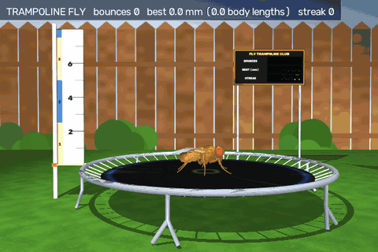

**Scene** (all visual except the mat collider). A backyard: a lawn texture on the floor, a wooden
board fence with a sky and shrubs behind it, a round trampoline (mat radius 6 mm, a steel frame
ring at 6.9 mm on six bent W legs, the mat top 2 mm above the lawn: a 4 m backyard trampoline at
the fly's 2.5 mm = 1.75 m scale is ~6 mm across), a woven black mat with a blue stitched ring and a
yellow centre mark, 48 silver springs from the frame to the mat's edge, a height ruler on a pole
beside the trampoline in the fly's plane (0 = the mat at rest, 1 mm ticks, labels every 2 mm,
yellow / blue bands every body length, a red marker at the last bounce and a gold one at the best),
and a scoreboard "FLY TRAMPOLINE CLUB" with 7-segment BOUNCES / BEST (mm, xx.x) / STREAK. No safety
net (it would hide the fly from the side camera). The camera is a fixed side view (azimuth 90°,
elevation -1°, 18 mm) with the ruler on the left and the scoreboard on the right.

**The mat (physics).** A body on a vertical slide joint (damping 0.02 µN per mm/s, 0.15 mg, its own
weight trimmed out with `gravcomp`) held up by **48 MuJoCo tendon springs** (spatial tendons,
stiffness 10 µN/mm each, pre-stretched 0.04 mm over the 0.9 mm gap). They are also the springs you
see: their vertical force is tension × sin(angle), so the mat stiffens as it sinks, like a real
trampoline. Measured (static, fly standing): the fly's weight sinks it 0.25 mm; +1 / 2 / 5 / 10 /
20 body weights on top: 0.37 / 0.44 / 0.61 / 0.80 / 1.10 mm. While bouncing it is pressed down up
to 1.0 mm. The fly touches a hidden square box collider (half 5.3 mm) on the mat body through
**explicit contact pairs with FlyGym's own ground parameters** (`add_ground_pairs`: the 55 fly
geoms, solref 0.2 ms, friction 1, margin 1 µm), and the visible disc rides on the same body.
Lessons (measured): (1) with the generic prop contact (`contact_kwargs`) or the plane's soft
geom parameters, the tarsal adhesion (40 µN per leg) pulled the legs into the contact and drove
the light spring-mounted mat into a sustained jitter that skated the standing fly around; with the
ground's pairs it stands as still as on the floor; (2) walking on the springy mat excites it and
bounces the fly about, so the fly never walks: it stands in `MatStance` (standing pose, all tarsi
adhering, registered stationary) before its first jump; (3) the collider must be wider than the
fly's reach: a fly whose hind legs stepped off the edge of a smaller (4.3 mm) collider was thrown
off sideways.

**The bounce: the real Jump action.** `BounceJump` is the `Jump` action (crouch → mid-leg TTM
stroke → ballistic flight → landing, docs/ACTIONS.md). After a 0.3 s stance the first jump is the
default long mode (2.8 mm). Then, after every touchdown on the mat, the next jump is a short-mode
jump (6 ms leg set-up, 15 ms stroke) fired `fire_delay_ms` after the first foot touches: 4, 3, 2, 1
ms for the first four rebounds, then 0.5 ms. At 0-1 ms the stroke starts as the mat reaches the
bottom of its compression (~5-7 ms after touchdown), so the springs' stored energy and the leg push
add up; fired later (3-5 ms) the stroke comes during the rebound and the bounce is lower and less
stable (measured steady heights: 0-1 ms 4.1 mm, 3 ms 2.9 mm with crashes, 5 ms 2.5 mm, on an older,
stiffer mat). So the height is pumped up over ~6-8 bounces, e.g. 2.8 → 3.3 → 3.8 → 3.8 → 4.6 → 4.4 → 4.7
→ 4.9 → 5.0 mm, and saturates at ~5 mm (2 body lengths). **The same schedule on a rigid mat**
(`rigid_mat: true`, a fixed body: "the frame"): 3.1 mm average (best 3.4) against 5.2 mm (best 6.5)
on the springy mat, 10 s each, no timing noise. Height = the thorax's rise above its standing
height on the resting mat (about the feet's clearance; the ruler markers show it).

**Engineered, labelled** (the wings have no aerodynamics in the walking model; HUD line
`airborne attitude + steering aid: engineered wing emulation`), both only between take-off and
touchdown, both inside `BounceJump`:

* an **attitude stabiliser** (wings / halteres emulation): a torque on the thorax toward a target
  up vector and damping the body rates, critically damped at 15 Hz, capped at 2 µN·mm (a pure
  torque, no force). Without it the rebound jumps tumble within 1-3 bounces (take-off pitch rates
  of 30-50 rad/s from a moving surface). The target up vector leans by 0.05 rad per mm of offset
  from the centre, away from it (at most 0.25 rad): "foot placement", found by measurement (with
  the lean toward the centre, or none, the fly drifted backward ~0.5 mm per bounce and fell off
  every ~20-40 bounces; with this sign one 30 s run had 0 falls off in 364 bounces);
* a **horizontal "wing steering" force**, ≤ 0.15 body weights, servoing the horizontal velocity
  to 8/s × (centre − position). Horizontal only: it never adds lift or height.

**Timing noise and tricks (our behaviour model, labelled).** Every rebound delay gets N(0, 0.6 ms)
of jitter, and 3 % are **missteps** (+4 ms: the mat has already rebounded). With probability 0.12
per bounce in a window (streak ≥ 5, last height 3.6-4.7 mm) the fly tries a **backflip** with real
dynamics: the Jump's documented boost ×1.8 (stroke kp and force range), the mid coxae trimmed to
−30° (the default is +12°: an asymmetric push that pitches it nose-up), the attitude stabiliser
off, fired 3 ms after touchdown. It counts as landed if the fly passed through upside down (tilt ≥
140°) and touched down on its feet (tilt ≤ 50°); the bounce after a landed flip is a gentle one
(6 ms). From the highest bounces most flips crashed, hence the window. A touchdown tilted more than
50° (or a body part on the mat) is a **crash landing**, touching the lawn is a **fall off the
trampoline**; both end the streak, and after 1.2 / 1.0 s the job calls `recover` (explicit, counted
reset onto the mat).

**Slow motion (edit, labelled `SLOW MOTION x0.20 (edit, not physics)`).** A bounce lasts ~0.1 s, 1-3
frames at real time, so the job's `time_scale` runs ×0.2 while bouncing (the physics step sequence
is unchanged) and ×1 while it stands, lies or waits for a reset. `slowmo: 1` turns it off.

**Brain tie-in: not done** (checked why): the brain link publishes 0.1 s states and a
brain-triggered jump fires ~0.12 s after a looming stimulus (docs/ACTIONS.md), longer than a whole
bounce (~70 ms in the air + ~20 ms on the mat), and a mat filling the lower visual field has no
looming edge for `LoomingVision` (its angular size is already ~180°). So the brain cannot time the
bounce; the job times it. `--brain` runs, but the brain does not drive anything here.

**Counters / HUD** (TAB, off by default): bounces (the work counter), BEST height in mm and body
lengths (2.5 mm), last and average height, STREAK (best), crash landings, wobbly landings (touchdown
tilt > 10°), falls off the trampoline, BACKFLIPS landed / tried, missteps, the mat's deflection
(max), the next rebound delay, the label line, and a banner (NEW BEST, BACKFLIP ATTEMPT!, BACKFLIP
LANDED!, CRASH LANDING!, OFF THE TRAMPOLINE!). Constant memory: counters and two mocap markers.

**Verified** (headless, 2026-09-27, Apple M1, default config):

* `run_job.py --job trampoline --headless --max-seconds 150`: **1496 bounces**, best **6.46 mm (2.58
  body lengths)**, average 4.88 mm, best streak **237**, 35 wobbly landings, **9 crash landings, 15
  falls off**, **8 / 18 backflips landed**, 40 missteps, 24 auto-recoveries (15 `fell_off`, 9
  `crash_landing`), 0 instabilities, **RTF 0.56**; the mat was pressed down up to 1.01 mm; the
  steering force (0.15 BW) and the torque (2 µN·mm) both reach their caps.
* `run_sim.py --job trampoline --headless --max-seconds 4` runs (47 bounces, full body with wings).
* Frames checked by eye (job renderer, 720×480 and the GIF's 600×400 frames): the standing fly on
  the mat, the mat pressed below the frame ring with the springs sloping (compression), the fly at
  the apex beside the ruler with the red / gold markers, a landing, a backflip (upside down above
  the mat, then on its feet), a fall off onto the lawn and the respawn, the scoreboard close-up
  (1234 / 5.7 / 89).

Tests: `tests/test_jobs_trampoline.py` (10 tests, ~30 s): registry / config; the slide joint, the
48 tendon springs, the collider's 55 ground-parameter pairs, every other job geom visual; the mat is
springy (a standing fly sinks it 0.1-0.4 mm, 5 body weights press it > 0.2 mm further, it springs
back up at > 20 mm/s and settles back); bouncing pumps the height with the real Jump (steady
bounces > first jump + 0.6 mm, best > 4 mm, the aids within their caps); the same bounces on the
rigid mat are > 0.6 mm lower; counters, scoreboard digits, ruler markers and HUD; the slow-motion
edit and its label; a forced backflip attempt spins the fly past 90° with the stabiliser off and
the boost on; a crash landing and a fall off the trampoline are counted and explicitly reset, no
applied force is left over, and the bouncing resumes.

**Limitations.** The mat is a rigid disc on a slide joint (it sinks as a whole and cannot tilt; no
fabric dip under the feet), the collider is a square (its corners reach 7.5 mm, over the springs),
and the springs are straight tendons, not coils. The attitude stabiliser, the lean and the
horizontal steering are engineered stand-ins for wings; without them the bouncing does not last.
The rebound schedule, the timing noise, the missteps and the trick choice are ours; the trick itself
uses the Jump's documented boost. The brain does not time the bounce (above). The window mode
(`LiveViewer`) was not opened in this session.

### delivery_pilot

`fly_simulator/jobs/delivery_pilot.py` (scene, guidance, counters), tests in
`tests/test_jobs_delivery_pilot.py`. HUD (TAB): `DELIVERY PILOT - the fly delivers packages by air
forever`.

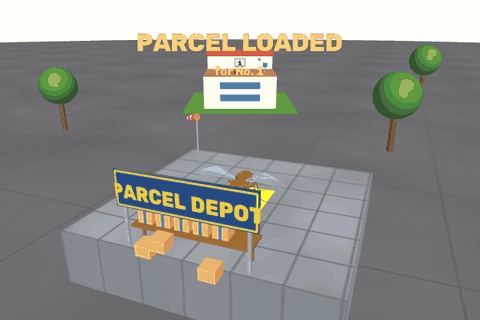

**The first flying job.** `needs_flight = True` (a new `EternalJob` class flag): `configure_app`
switches `cfg.flight` on (`base.enable_flight`: dt 5e-5 s, `render_every_steps` doubled, no
full-body joints), so the Session builds the flight fly of docs/FLIGHT.md (stroke-plane wing hinges,
fluid ellipsoids, air) with its `FlightMode`. `check_feature_config` still refuses `--flight --job`
for every other job; for a `needs_flight` job `--job NAME` alone turns flight on (and `--flight`
is allowed). Every other job is unchanged (`needs_flight` defaults to False, the walking model and
timestep stay canonical; a test checks this). **No external force acts on the fly**: all lift,
thrust and steering come from the beating wings in MuJoCo's fluid model.

**Scene** (fly scale). A sorting depot at the origin (flat roof 14 × 14 mm, 3 mm high, yellow loading
mark, a shelf with the parcel pool, a "PARCEL DEPOT" sign, a windsock) and four houses 42–45 mm away
(roof terraces 11 × 11 mm at 4.0 / 5.0 / 5.5 / 6.5 mm, a pitched attic with the house number on the
far side, a doormat on the depot side, a mailbox with a flag, a porch lamp, a lawn), trees, an
asphalt street. Walls, roof terraces and attics collide (static props); everything else is
decoration. The fly spawns on the depot roof.

**Loop** (`phase`: load → takeoff → climb → cruise → approach → landing → landed → drop → takeoff ...).
On the depot roof a parcel slides from the shelf under the fly (0.6 s). **Take-off** is FlightMode's
real one: a long-mode `Jump`, wings on at the end of the leg stroke, `HoverController` hover. **Climb**
to the cruise altitude (COM 12 mm above the street) while turning toward the address (3 rad/s);
forward flight starts once the fly is 2.5 mm above every roof and within 20° of the bearing.
**Cruise**: velocity control along the bearing to the doormat (the position set point follows the
fly, velocity-loop damping 3, like FlightMode's escape flight), speed 120 mm/s with a trapezoid
profile (400 mm/s² up, 250 mm/s² down), descending to 2.5 mm above the roof within 10 mm.
**Approach** (1.5 mm out): the position loop on the landing point (gains raised from ω 5 to 7 rad/s,
integral 30) plus a slow set-point integrator that leans the set point into the wind (only within
2 mm, ≤ 4 mm). Within 1.2 mm, slower than 20 mm/s and at height (or after 2 s) → **FlightMode's
landing** (descend 15 mm/s, adhesion at the first leg contact, 0.2 s pitch-down, wings off). At
touchdown the horizontal integrators are cleared: before that fix, a wound-up integrator dragged
the stuck fly sideways during the pitch-down and flipped it (2 falls in 150 s). **Landed**: on the
target roof → the parcel slides onto the doormat (DELIVERED, `*ding-dong*`, mailbox flag up, porch lamp
on), then take-off back to the depot; addresses cycle 1–4. The parcel previously left at that
address is "taken in" (back to the shelf pool, out of view).

**Failures, counted**: a landing that ends off the target roof (street, another roof) is a *missed
landing* → the fly takes off again from where it stands after 0.6 s upright (retry). A FlightMode crash
(body contact / tilt > 120° in the air) or a touchdown that ends upside down (> 60°) is a *crash
landing*; a fly that stays down 2.5 s gets the base class's explicit, counted reset onto the depot
roof (the parcel returns to the shelf, the order stays open and its clock keeps running). No
delivery for 90 s → `recover("stuck")`.

**Engineered, labelled**: the **parcel is carried kinematically** (a mocap body 1.7 mm under the COM on
a drawn string, set down on the roof under the fly when it stands; visual, no mass, no contacts): it
does not load the flight controller (HUD line `real flapping-wing flight; parcel carried
kinematically (no mass)`). The **guidance** (speed profile, approach gains, the lean integrator, when
to land) is our code, not the brain. The **wind is physical**: MuJoCo's medium velocity
`model.opt.wind`, a slow breeze of 6–25 mm/s whose direction wanders (period ~23 s), acting on the
wings and bodies through the fluid model; the windsock shows it. The DELIVERED / PARCEL LOADED /
MISSED / CRASH captions are a screen overlay (`post_process`), not part of the scene.

**Camera** (job mode): behind and above the fly (22 mm, elevation −20°), the azimuth following the
flight heading (smoothed, 1.2 s) and, on the ground, the next address, so the town ahead is in view.
The near clipping plane is moved from FlyGym's 5e-4 mm to 0.3 mm in `on_attach` (depth precision for
a 100 mm scene: at 5e-4 the far walls z-fought). Shadows are off (the town-wide shadow map was
coarse).

**Counters / HUD** (TAB, off by default): parcels delivered (the work counter), route and distance,
phase, flight time, distance flown (COM path while the wings are on), on-time % (a delivery is on
time within 5 s + distance / 40 mm/s of the pickup, ~6 s for these addresses; normal deliveries
take 2.1–3.6 s, so only retries and resets make one late), missed landings, crash landings,
take-offs, wind speed, FlightMode's line (state, wingbeat Hz, altitude, speed).

**Verified** (headless, 2026-09-27, Apple M1, default config, wind on):

* `run_job.py --job delivery_pilot --headless --max-seconds 150`: **23 parcels delivered** (6 / 6 / 6 / 5
  per house), **100 % on time**, 46 take-offs, 45 landings, **0 missed landings, 0 crash landings, 0
  falls, 0 recoveries**, 0 instabilities, flight time 106 s, **2.34 m flown**, **RTF 0.36**. A
  delivery takes 2.1–3.6 s from pickup (~1.2–1.9 s in the air, the rest ground work), a full round
  trip ~6.5 s. An earlier version (before the integrator fix above) had 22 deliveries, 2 flips at
  touchdown → 2 counted recoveries in the same 150 s.
* `run_sim.py --job delivery_pilot --headless --max-seconds 3` builds the flight fly through the app
  (`body flight (flapping wings, air)`, dt 5e-5) and delivers #1 at 2.1 s; `--flight --job sisyphus`
  is still refused.
* Frames checked by eye (job renderer, 600×400 and 640×400): the parcel sliding onto the fly at the
  depot, the fly in flight with the parcel hanging under it, the landing on house 1's terrace, the
  parcel on the doormat with DELIVERED, the take-off, the return and the landing on the depot's
  loading mark.

Tests: `tests/test_jobs_delivery_pilot.py` (7 tests, ~20 s): registry / `needs_flight` (and no
other job has it; sisyphus keeps the walking timestep); the app allows `--flight` only with a flying
job; the scene on the `FlightSimulation` (dt 5e-5, air, colliding roofs / walls / attics, visual
decoration and mocap parcels, the walkable surface); one real delivery hop (the phase sequence, one
FlightMode take-off and landing, cruise altitude reached, the parcel hanging 1.7 mm straight under the
COM while cruising, dropped on the doormat, counters); HUD / caption / camera; a missed landing with
the retry take-off, then an explicit recovery (parcel back on the shelf, the order kept); the wind
is the medium velocity.

**Limitations.** The parcel has no mass (a real payload would need the controller's mass and inertia
terms and the lift trim updated). The guidance is engineered and flies straight lines at a fixed
cruise altitude, and the landing is FlightMode's scripted sequence (docs/FLIGHT.md). The take-off
jump goes along the fly's heading, which after a house landing points toward the attic: the wings
start at the end of the leg stroke so it has cleared it every time, but it is not checked. In the
150 s run no landing failed, so the missed-landing and crash paths are exercised by the tests only.
With `run_sim.py` the app keys still work: L / the arrows act on the same FlightMode and can fight the
job. The window mode (`LiveViewer`) was not opened in this session.

### fry_cook

`fly_simulator/jobs/fry_cook.py` (scene, stance, machines, pools),
`fly_simulator/jobs/fry_cook_assets.py` (procedural meshes / textures), tests in
`tests/test_jobs_fry_cook.py`. HUD (TAB): `FRY COOK FLY - the fly works the fry station forever`.

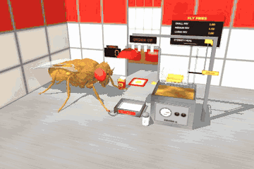

"The fly works a fast-food fry station forever, putting fries in the bag."

**Scene** (a generic fast-food look: "FLY FRIES" and the badge, a cartoon fly on a yellow disc
holding three fries, are our own; red / yellow colours, no real brand, logo or mascot). A
fly-scale kitchen on a brushed stainless counter (the floor plane's material): a stainless fryer
with a front panel (dial, knobs, `FRYER 1`) and translucent hot oil (its emission shimmers; a pool
of 36 bubbles rises and pops, more while cooking; steam), a wire basket on an overhead `AUTO-LIFT`
gantry (post, rail, trolley, a hanger rod stretched at run time), the heated holding bin
(`HOT & READY`, a perforated plate) under a red heat lamp (three glowing bulbs and a warm point
light), a salt shaker (glass, the salt inside shows the level, a steel cap, `SALT`), a nested stack
of red fry cartons, a serving tray with a printed liner, a brass service bell, the tiled back wall
(white with a red row) with the pass-through window (steel frame, an `ORDER UP` light box that
blinks on a ding, a ticket rail with four order tickets, a soft-focus dining room behind), an
`ORDERS` counter (three 7-segment digits) and a backlit menu board (`SMALL FRY 1.00 ...
ETERNITY MEAL ?`). Lights: a key spot with shadows (`shadows: false` turns the shadow map off), a
directional cool fill (no spot light without shadows: on macOS such a spot blacks out pixels
behind its plane), the heat lamp, the headlight. `znear` 0.05.

**Fries** are a fixed pool of 48 free bodies: a hidden capsule collider (r 0.024 mm, 0.43 mm long,
1 µg, condim 3, a little angular damping so a spilled fry rolls and stops) under a rounded-square
fry mesh (4 variants) with a potato texture tinted from raw (pale) to golden while it cooks.
Contacts: fries `contype` 128, `conaffinity` 128 | 64 | TERRAIN: they touch each other, the job's
hidden colliders (`contype` 64: the bin, the basket, the carton being filled) and the counter;
never the fly. The colliders are thick boxes and the contacts 0.5 ms (the pizza_chef lesson), and
the carton's wall colliders stop at the rim height (higher, a fry lying across the carton bridged
the invisible walls and slid off). Found while building it: MuJoCo filters collisions with a
per-body `contype` / `conaffinity` aggregate computed at compile time, so a free body compiled with
all-zero bits never collides even if its geom bits are switched on later; the fries are compiled
with their live bits and switched off at run time. A fry is parked (under the floor, contacts off,
gravity compensated), rides kinematically (in the basket while cooking, in the scoop, in a carton
that slides, on the leg while sneaked), or is live. Live fries at rest in the bin or the carton
**sleep** after 0.3 s (contacts off, held in place) and are woken when the basket tips over the bin
or the scoop tips over the carton, so a pile forms with real contacts but a resting pile costs
nothing (with condim 6 and no sleeping the physics RTF was 0.13-0.22; now 0.36-0.42).

**Machines (kinematic, labelled).** The fryer cycle: `load` (raw fries into the basket from an
unseen freezer: a hidden recycle of the pool, in two layers of rows, never overlapping) → `lower`
(a splash of bubbles) → `cook` (`cook_s` 6 s, the fries turn golden) → `lift` → `drip` (oil drips)
→ `hold` until the bin has fewer than `low_mark` (8) fries → `swing` over the bin → `tip` (118°):
here the fries become **live bodies inside the basket** (its floor and walls are colliders on the
mocap body) and slide out over its lip and fall into the bin with real contacts → `untip` →
`return` → `load`. A run starts with a cooked batch in the raised basket. After each dump the **salt
shaker** flies over the bin, turns over and shakes (salt grains), its level drops by 7 % and it is
refilled when nearly empty (counted); the shake gives the fries in the bin a saltiness (random,
~1). The **carton** slides from the fill spot onto the tray, the **bell** dings (plunger, a ring),
`ORDER UP` blinks, the ORDERS digits count, the **tray** slides through the window and comes back
empty (the carton and its fries go back to the pools). Three pooled cartons (filling, on the tray,
on the stack); the static stack below never changes.

**The fly** holds a stance action, `CookStance` (pizza_chef's `ChefStance`: all tarsi planted and
adhering, registered as stationary). The job drives both front legs with joint targets from damped
least-squares IK on a scratch `MjData` (the dead_hang `LegIK`), interpolated in joint space; the legs
are position-controlled like any action, a lifted leg's adhesion is off. The thorax stays at
(0.62, 0.01, 1.00) mm through the runs. The **fry scoop** (a steel bowl on a red handle, a mocap
prop) is placed at the right front tarsus every millisecond; the job sets its yaw and pitch, and
the leg's IK target is the grip that puts the bowl where the job wants it. One order:

1. `grab`: the left front leg reaches over the top carton of the stack and pulls it to the fill spot
   (the carton follows the same path, kinematic); a target of 6-8 fries.
2. `scoop_wait` → `scoop_reach` (over the densest spot of resting fries in the bin) → `scoop_dip`
   → `scoop_drag` (the bowl drags toward the fly, tipping up): **the pick-up is a labelled kinematic
   transfer**: up to 5 resting fries within 0.22 mm of the bowl blend over 0.12 s into slots in the
   bowl and ride in it → `scoop_lift` → `scoop_carry` over the carton → `scoop_tip` (the scoop
   tips to 100°; past 75° the fries are released one by one, hanging about vertical, and **drop into
   the carton with real physics**, landing, leaning and settling) → `scoop_back`. On 15 % of the
   carries one fry slips off on the way (`spill_p`) and falls / rolls on the counter; fries that miss
   the carton count as spills too. Repeat until the carton has its fries (at most 5 scoops).
3. `serve`: the carton's fries freeze to it (kinematic carry), the carton slides onto the tray,
   *ding*, ORDER UP; the fly takes the next carton meanwhile.
4. Between scoops, a spilled fry that has come to rest within reach of the left front leg is
   **sneaked** with probability `sneak_p` (0.6): the leg reaches it, picks it up (kinematic), brings
   it in front of the mouth, and it is nibbled away (`sneak_*` states). Resting spills out of reach
   stay on the counter until the pool needs them (recycled oldest first, counted).

**Taste (with `--brain`, off by default).** On a sneak the job sends
`StimulusEvent("taste", "left", duration 0.5 s)` labelled `FRY TASTE (stand-in: LB3 sugar GRNs =
low salt / starch; LB1 bitter GRNs when over-salted)`: **stand-in** sets (docs/TASTE.md: the model has
no salt-specific or tarsal input). In flies low salt is appetitive and activates sweet GRNs, high salt
recruits bitter GRNs (Jaeger et al. 2018, *eLife*), so the labellar sugar set is driven at 150 Hz and,
if the fry's saltiness is above `oversalt` (1.3), the bitter set too (160 Hz × (salt − 1) / 0.6,
at most 200 Hz). The proboscis follows the brain's MN9 (fully out at 60 Hz, τ 0.1 s), the HUD and
the terminal report the MN9 peak (`'mmm, salty'` at ≥ 30 Hz). Without a brain a labelled scripted
proboscis dab (`[scripted: no brain]`).

**Edit effects (labelled on screen).** Slow motion while the basket dumps (×0.3) and while the fries
drop into the carton (×0.5), `SLOW MOTION x0.30 (edit, not physics)`; a `DING!  ORDER UP #n` caption
for 1.6 s (`captions: false` turns it off); `slowmo: false` turns the slow motion off. The camera
cuts (at most every 1.6 s, except to the dump) between a wide station shot, a scoop close-up, the
dump, the pass window and a sneak close-up (`close_ups: false`: the wide shot only).

**Counters / HUD** (TAB, off by default): orders served (the work counter), cartons filled, fries per
carton (mean and last), spilled, sneaked, batches fried (fries into the bin), fries in the bin, scoops,
salt level and refills, the fryer and station states, the last message, the taste line, the MN9 /
proboscis line and the label line `(fries: real physics in the basket / bin / carton; scoop pick-up,
basket lift, shaker, carton + tray slides: kinematic; slow motion: edit)`. Constant memory: fixed
pools (48 fries, 3 cartons, 80 particles, 14 steam puffs), counters only; the brain's `stim_log` is
trimmed.

**Verified** (headless, 2026-09-27, Apple M1, one process at a time):

* `run_job.py --job fry_cook --headless --max-seconds 150`: **16 orders served**, 16 cartons, **7.44
  fries per carton** (119 in cartons), 11 batches (139 fries into the bin), 42 scoops picking 136
  fries, **9 spilled**, 1 sneaked, 1 spill recycled, 0 fries lost, 10 shakes (salt 100 → 30 %),
  **0 falls, 0 auto-recoveries, 0 instabilities, RTF 0.38**: ~9.4 s per order on average.
* with the **real FlyWire brain** (v783, 138,639 neurons, window off), `run_job.py --job fry_cook
  --brain --headless --no-brain-window --max-seconds 30 --job-config '{"spill_p": 0.6, "sneak_p":
  1.0}'`: 2 sneaked fries (salt ×1.1, ×1.2: the sugar set only), **MN9 peaks 90 and 80 Hz**
  (`'mmm, salty'`), the proboscis out; 1 order, 0 falls, RTF 0.39.
* `run_sim.py --job fry_cook --headless --max-seconds 5` runs (0 falls).
* Frames checked by eye (job renderer, 640×426): the basket tipped over the bin with the fries
  pouring out (slow-motion label), the scoop dragging through the fries in the bin, fries riding in
  the scoop over the carton, the scoop tipped over the carton with fries standing in it, the full
  carton on the tray at the window, the DING / ORDER UP caption with the ORDERS digits, the shaker
  upside down over the bin, the HUD with TAB; and in the GIF recording (420×280) the sneak close-up (the spilled fry picked up by the left front leg, held at the mouth, nibbled away).

Tests: `tests/test_jobs_fry_cook.py` (5 tests, ~56 s): registry / config and the taste stand-in
(sugar only; over-salted adds bitter); no job geom can touch the fly, only fry capsules and the
bin / carton / basket colliders collide, the fixed pools, the fly's mass, the stationary stance, the
proboscis actuators, znear; one fast-config order (the fryer's swing → tip → untip → return → load,
≥ 8 fries into the bin, grab → the scoop states in order → serve → grab, the tray home → slide → ding
→ out → back, ≥ 2 fries settled in the carton, 0 lost, the pool size constant every step, no contact
between a fry and the fly, the ORDERS digit, the HUD); a sneaked, over-salted spill with a fake
brain (one taste stimulus with the sugar and bitter sets, the stand-in label, the duration, the
proboscis follows MN9, the fry eaten = parked); a reset mid-carry voids the order, parks the fries,
frees the fill spot and the job gets back to tipping a scoop.

**Limitations.** The pick-up is a kinematic transfer (fries within reach of the bowl are moved into
it), not a physical scoop; the scoop, the basket lift, the shaker, the carton and tray slides, the
bell and the freezer are engineered / kinematic; fries in a sliding carton ride on it
kinematically; the sneak is a kinematic pick-up by the leg and the "eating" a fade. Sleeping fries
do not collide until woken, so a fry spilled onto a resting pile can sink into it. A fry now and then
pops out of the carton on release (it is counted as a spill). The taste is a stand-in (labellar
sugar / bitter GRN sets for low / high salt); the saltiness is our number. The cartons hold 6-8
fries because the fries are cartoon-sized (0.43 mm, a sixth of the fly). The window mode
(`LiveViewer`) was not opened in this session.

### snow_shovel

`fly_simulator/jobs/snow_shovel.py` (scene, snow, shovel, clumps, bank),
`fly_simulator/jobs/snow_shovel_assets.py` (procedural meshes / textures), tests in
`tests/test_jobs_snow_mini.py`. HUD (TAB): `SNOW SHOVEL FLY - the fly shovels snow forever`.

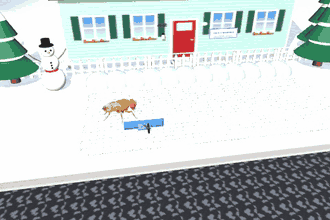

**Scene** (all visual except the shovel's brace and the clumps). A driveway (22 × 9 mm, wet concrete) in
front of a little house (lap siding, shuttered windows, a red door, a snowy shingle roof, a sign "THE FLY
RESIDENCE / PLEASE SHOVEL YOUR WALK"), a porch lantern with a warm point light, a picket fence with snow on
the rail, a snowman on the lawn (coal eyes and buttons, carrot nose, twig arms, scarf, top hat), snowy pines,
a mailbox with a snow cap, the street with slush and a curb on the camera side, an overcast winter sky with a
treeline. The floor plane carries a snow texture. Lights: a cool key spot with shadows (`shadows: false`
turns the shadow map off), a directional fill, the porch light. `znear` 0.05.

**Snow.** The snow cover is a fixed pool of 792 flattened snow domes (visual ellipsoids, 0.5 mm grid, no
contacts: the fly walks through the snow, its feet sink in), each with its own depth (0 .. 0.2 mm × a fixed
drift pattern). It snows everywhere at `snow_rate` 0.0012 mm/s × the weather (lulls and storms, 0.35 .. 1.65,
period 97 s), so a scraped lane whitens again within ~3 minutes. The snowfall you see is a pool of 110
kinematic flakes (mocap hexagons, visual) that flutter down and are recycled to the sky when they land; how
many are in the air follows the weather. A "day of winter" is 60 s of sim (`day_s`).

**Shovel.** Like the mowing job's mower: planar joints (slide x, slide y, a yaw hinge) at a fixed height, so it
can't tip or be lost; slide damping 0.3 µN per mm/s × (1 + load / 3 mm³, at most × 2): heavier with snow on
the blade. The only colliding part is a round brace (R 0.8 mm, 0.2 mg) behind the blade that the fly pushes
with head / thorax / abdomen at friction 0.05 (`slippery_body_contact`, legs excluded). The curved blue blade
(3 mm wide, a steel edge), the wooden shaft and the D-grip over the fly's head are visual. The job turns the
yaw hinge toward the push direction (rate limited, like the mower).

**Behaviour.** Seven lanes across the driveway toward the bank (+y), 3 mm apart. `PushPilot` pushes the shovel
up a lane (pure-pursuit goal 2.5 mm ahead on the lane line) with the blade down: every snow dome under the
blade's footprint (0.2-1.35 mm ahead of the brace, ±1.5 mm) is scraped to 0 and its volume (0.6 × area × depth)
goes into the load, a snow heap on the blade that grows with it. At the driveway edge the load is **dumped**:
up to 6 pooled clumps (0.6 mm³ of snow each; cartoon clumps, R 0.26 mm, 3 µg) are thrown off the blade onto
the bank with a velocity set by the job (**engineered**), then fly, tumble and settle with real contacts
(condim 6, rolling friction; they touch each other and the ground, never the fly or the shovel). A clump at
rest for 0.3 s (or 4 s after the throw) **sleeps** (contacts off, gravity compensated, held); sleepers near a
new dump are woken so the new clumps land on them. The pool of 30 is compiled with its live contact bits and
switched off at run time (the fry_cook lesson); when it runs out, the oldest clumps are packed into the bank
(recycled, counted). Then the fly walks round the shovel and pushes it back to the next lane's start with the
**blade up** (no scraping on the return, labelled), turns it round at the start (the mower's U-turn) and does
the next lane; after the last lane it starts again from the first ("DRIVEWAY DONE ... and it's snowing
again", a 1.5 s groom).

**Bank.** 12 visual segments of plowed snow (a grey-blue gritty texture) along the lawn edge between the
driveway and the fence. Each dump adds its volume to the nearest segments; a segment's height is
0.2 + 0.8 √V mm (capped at 2.6 mm), and the bank settles / sublimates with τ 1500 s, so it stays bounded
however long the job runs.

**Counters / HUD** (TAB, off by default): path cleared in metres (the work counter: snow-covered area
scraped / the 3 mm blade width), clumps shoveled, snow moved (mm³), bank height (mm and at human scale,
× 1.75 m / 2.5 mm), day of winter, lane and mode, lanes, passes, the share of the driveway that is clear, the
snowfall intensity, and the label line `(dump throw set by the job, clumps real physics; blade up on the way
back)`. Captions (a screen overlay, `post_process`): `DAY n OF WINTER (still snowing)`, `DRIVEWAY DONE`.
Constant memory: fixed pools (792 domes, 110 flakes, 30 clumps, 12 bank segments), counters only.

**Verified** (headless, 2026-09-27, Apple M1, one process at a time, default config):

* `run_job.py --job snow_shovel --headless --max-seconds 120`: **0.0513 m of path cleared** (154 mm²),
  **27 clumps shoveled**, 16.3 mm³ of snow, **bank 1.79 mm** (~1.25 m at human scale), **day 2 of winter**,
  8 lanes, 1 full pass, 8 dumps, 0 clumps lost, 27.7 % of the driveway clear at the end, 21 pushes, 10
  back-away unsticks, **0 falls, 0 auto-recoveries, 0 instabilities, RTF 0.48** (~15 s per lane incl. the
  return). An earlier run with twice the snowfall (0.0022 mm/s) had the driveway 1.5 % clear after 120 s: the
  cleared lanes were white again before the pass was done.
* `run_sim.py --job snow_shovel --headless --max-seconds 5` runs (0 falls).
* Frames checked by eye (job renderer, 640×426 and the GIF's 480×320 frames): the fly behind the shovel, the
  scraped lane showing the wet concrete, the bank lumps along the fence, the house, snowman, pines and the
  flakes; lanes whitening again over ~30 s.

Tests (`tests/test_jobs_snow_mini.py`, with mini_golf: 8 tests, ~150 s): the snow domes / flakes are visual
and the clumps never touch the fly, the fixed pools and znear; scraping empties the domes under the blade and
fills the load, the snowfall re-covers them, a dump throws clumps and raises the bank, more dumps than the pool
recycle the oldest; 14 s of the real loop (the shovel pushed > 2 mm, a lane done, clumps, counters, HUD); a
reset mid-cycle keeps the shovel where it was and the job continues.

**Limitations.** The snow is visual (no resistance except the load-dependent slide damping; the fly's feet go
through it), the scraping is a geometric footprint test, the dump's throw velocity is set by the job, the
return trip is "blade up" by rule, and the bank is a visual volume counter (fresh clumps sit on the ground
at its foot; the bank has no collider). White clumps on the white lawn are hard to see from the job camera.
The window mode (`LiveViewer`) was not opened in this session.

### mini_golf

`fly_simulator/jobs/mini_golf.py` (course, ball, aim model, routing, scorecard),
`fly_simulator/jobs/mini_golf_assets.py` (procedural meshes / textures), tests in
`tests/test_jobs_snow_mini.py`. HUD (TAB): `MINI GOLF FLY - the fly plays mini golf forever`.

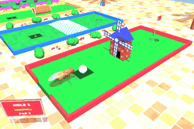

**Course** (bright arcade colours; "FLY GOLF - 4 HOLES OF ETERNITY" and the hole signs are our own). Four
parallel lanes along +x, 26 × 11 mm, one every 17 mm in y: **1 WINDMILL** (par 3), **2 THE RAMP** (par 2),
**3 THE TUNNEL** (par 3), **4 BUMPERS** (par 2). Each is green felt with glossy coloured rails, a tee mat, a
cup with a numbered flag, a sign, and an opening in the back rail (the fly's entrance). Around them: colourful
pavers, flower beds and shrubs between the lanes, cartoon palms, a neon sign, a sky backdrop with a toy castle.
Lights: a sun spot with shadows (`shadows: false` turns it off) and a directional fill. `znear` 0.05.

**The ball and the cup (real physics).** The ball is a free sphere (R 0.6 mm, 0.05 mg, white with dimples).
The felt is made of ball-only boxes (contype bit 64, priority 2, condim 6, rolling friction 0.012 mm) whose
tops are at z = 0 and which leave an octagonal hole at the cup (4 rectangles round a square + 4 45° corner
boxes); under it a cup floor 1.4 mm down and a white liner. **The fly walks on FlyGym's own ground plane**,
flush with the felt top and hidden (render group 3); the ball's contact bits never meet the plane's, so the cup
is a hole for the ball while the fly's feet stand on the plane (over the cup too: engineered, labelled). The
course draws its own ground. A ball that runs over the cup slowly enough drops in and stays. Measured on the
felt: a rolling ball decelerates at **138 mm/s²** (80 → 38.6 mm/s in 0.3 s), so a 70 mm/s putt rolls ~18 mm;
the aim model uses 135. Rails and obstacles are ball-only, bouncy (contact time constant 3 ms, damping ratio
0.08; measured rebounds at 40 mm/s: 0.32 at (2 ms, 0.1), 0.8 at (4 ms, 0.05); the default was not measured
separately). A ball that leaves the course falls onto a hidden catch floor.

**Obstacles.** *Windmill*: a barn-red mill across the lane (ball-only walls with a 1.6 mm door through the
middle, the ball can also go round the sides) whose four sails turn at 15 rpm in front of the door (a mocap
body with ball-only colliders: **kinematic, labelled**; a sail pointing down blocks the door). *Ramp*: a hump
across the lane, 7° up, a 1 mm flat top 0.3 mm high, 7° down: a real static slope for **both** the fly and the
ball (`ground_height` follows it). *Tunnel*: a striped pipe along the lane (ball-only side walls 0.82 mm from
the centre line). *Bumpers*: three round rubber posts.

**One stroke.** The **aim model** (`plan_shot`, a documented skill model, not the fly's brain) picks a target:
the cup if the straight line is clear, else a gate (just past the mill door / the tunnel exit) if its line is
clear, else the lay-up point with the shortest clear route; and a speed √(2 a d) for the distance d (+ 0.8 mm
past the cup), or more to climb the ramp (+ 1.25 × (10/7) g h). `PushPilot` (the mowing loop) walks the fly
round the ball to its back relative to the aim line, turns it to face the ball, and walks it into the ball
(speed 0.45). **At the first real contact of the head / thorax with the ball the job sets the ball's velocity
(and the matching rolling spin) to the planned putt plus the skill errors: the PUTT impulse, engineered and
labelled.** Errors at the default skill 0.5: aim N(0, 1° + 6° × (1 − skill)), speed × (1 + N(0, 0.05 +
0.25 × (1 − skill))). At the windmill the fly waits at the ball (freeze) until the aim model predicts the
sails will be clear of the door when the ball arrives (`mill_waits`). The fly then stands (`freeze`, so
standing is not read as stuck) and the ball rolls with real physics until it stops (< 0.6 mm/s for 0.3 s),
drops into the cup, or leaves the course. While the ball waits on its lie its free joint is heavily damped
(1e-3 µN·s/mm), so a bump of the walking fly only nudges it; the damping is off for the putt.

**House rules (engineered, labelled, counted).** A ball resting within 0.9 mm of a rail or an obstacle, or
inside the mill / the tunnel, is moved to a playable spot, no penalty (real mini golf's one putter-head from the
wall), and never within 2 mm of the fly; if the fly has no room behind the ball on the planned line (inside
the lane and outside the obstacles), the ball is moved along the line until it has (`drops`). Out of bounds =
+1 stroke, replayed from where it was hit. A hole ends after 6 strokes (picked up).

**Between holes.** The fly walks to the cup, the ball rises out of it onto the fly's back (**kinematic
carry**, 1.9 mm above the thorax, contacts and gravity off), the fly walks out of the lane through its entry
gap, along the walkway behind the lanes, into the next lane to the tee, and the ball is set down on the tee in
front of it. The fly's routing keeps its thorax out of capsules round the solid-looking props (the mill, the
pipe, the posts) and inside the rails.

**Presentation.** Slow motion ×0.35 while the ball rolls faster than 15 mm/s, labelled `SLOW MOTION x0.35
(edit, not physics)` (`slowmo: 1` turns it off); captions (a screen overlay): `HOLE 1: HOLE IN ONE!`,
`BIRDIE!`, `PAR`, `OUT OF BOUNDS (+1)`, the next hole's name and par. Job camera: azimuth 50°, elevation −33°,
23 mm, aimed at 0.45 ball + 0.2 fly + 0.35 lane centre (the fly while it is on the walkway).

**Counters / HUD** (TAB, off by default): holes played (the work counter), the hole / stroke / phase, the
scorecard (`1:1/3  2:2/2  3:-/3  4:-/2   round 3 (-2)`), rounds, last / best round, total vs par,
holes-in-one, eagles, birdies, pars, bogeys, out of bounds, drops, the last stroke (`stroke 1: at the cup, 69
mm/s (plan 70), aim err +0.5 deg`), and the label line `(putt speed/aim: skill model + engineered impulse at
the real head touch; sails / ball carry: kinematic)`. Constant memory: counters and a 4-entry card.

**Lessons found while building it (apply to any job with explicit contact pairs):**

* **A negative pair margin does not switch a `<pair>` off.** With `pair_margin = -10` a penetrating ball /
  abdomen pair produced a contact with dist −10.6 (as if 10 mm deep) and launched the fly upside down (2-3
  falls per 2 minutes until found). Setting `pair_gap` large does stop the force, but the contacts are still
  *detected*, and the fall detector's contact classifier counts them as body contacts (5 `stuck_on_body` falls
  in 120 s). So the pairs stay on: a ball the fly must not touch is kept away from it instead (the carry
  height, the no-drop-near-the-fly rule).
* A kinematic prop carried just over the thorax (1.45 mm) pressed the fly down (thorax height 0.75 mm) and it
  walked on the spot until the fall detector called `no_progress`; 1.9 mm is clear.
* A chain of avoid circles (the pipe) with a sticky side per circle made the fly oscillate between two of
  them; one capsule per prop fixed it. Waypoints clamped just outside a lane must still count as that lane, or
  the router sends the fly out through the entry gap.
* A ball launched without spin loses ~2/7 of its energy to sliding before it rolls; the putt sets the rolling
  spin too.

**Verified** (headless, 2026-09-27, Apple M1, one process at a time):

* `run_job.py --job mini_golf --headless --max-seconds 120` (default config, seed 0): **7 holes, 1 full round
  (10 strokes, par 10)**, card of round 2 so far 1 / 2 / 2 (−3), 17 putts, **2 holes-in-one**, 1 birdie, 3
  pars, 0 bogeys, 0 out of bounds, 5 drops, 1 windmill wait, 5 back-away unsticks, **0 falls, 0
  auto-recoveries, 0 instabilities, RTF 0.48**. Seed 1 (120 s, before the cup was narrowed from 1.0 to 0.9 mm
  and the skill lowered from 0.55): 6 holes, round of 8, 3 holes-in-one, 0 falls.
* `run_sim.py --job mini_golf --headless --max-seconds 5` runs (1 hole, 0 falls).
* Frames checked by eye (job renderer, 640×426 and the GIF's 480×320 frames): the fly behind the ball on the
  tee, the ball rolling through the mill door under the turning sails in slow motion, HOLE IN ONE, the ball on
  the fly's back on the walkway, the ramp putt, the tunnel and bumper holes, the flags and signs.

Tests (`tests/test_jobs_snow_mini.py`): the ball's contact bits never meet the (hidden) floor plane, the ramp
is walkable and the rails ball-only, `ground_height` on the ramp; the aim model (straight at the cup from tee 1,
the ramp needs more speed, a clear line past the bumpers); a ball rolled at the cup drops in and is scored;
45 s of the real loop (putts, a hole played, the scorecard in the HUD) and a reset mid-hole (the job
continues, the ball stays finite and on the course).

**Limitations.** The putt's speed and direction are the aim model's (the fly's head touch only triggers it:
a walking push rolls the light ball a few mm and can't be sized), the sails, the carry and the tee placement
are kinematic, the house-rule drops move the ball, and the cup is only a hole for the ball (the fly walks on
the hidden plane over it). The fly's legs can overlap a rail visually (the rails are ball-only). The skill
model is generous: holes-in-one on hole 1 are common, because the tee, the mill door and the cup are on one
line. The window mode (`LiveViewer`) was not opened in this session.


### jump_rope

`fly_simulator/jobs/jump_rope.py` (scene, rope, timing, trips), `fly_simulator/jobs/jump_rope_assets.py`
(procedural meshes / textures), tests in `tests/test_jobs_rope_dj.py`. HUD (TAB): `JUMP ROPE FLY - the fly
skips rope forever`.

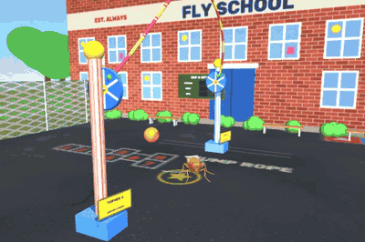

**Scene** (all visual except the rope). A bright schoolyard: painted asphalt (a hopscotch, a four-square
court, "JUMP ROPE" and a yellow star on the fly's spot; the fly stands on FlyGym's own plane, hidden, the
painted slab is flush with it), a brick school ("FLY SCHOOL / RECESS: FOREVER", our own), a chalkboard
"SKIP-O-METER" with 7-segment STREAK / BEST / RPM, benches, shrubs, a chain-link fence, a basketball hoop, a sky
with trees. Two candy-striped **turner posts** ("TURNER A / B - DRIVEN CRANK") carry crank wheels 16 mm apart
(along y). Lights: a sun spot with shadows (`shadows: false` makes it directional) and a directional fill.
`znear` 0.05.

**The rope (driven, kinematic, labelled; real contacts).** 40 capsules (R 0.09 mm) on mocap bodies laid along a
loop turning about the crank axis: radius 7 mm in the middle, 0.7 mm (the cranks) at the ends, the middle
trailing the cranks by 0.28 rad, its bottom 0.04 mm above the ground. The phase runs `dphi/dt = -w (1 + 0.65
cos phi)`: faster through the bottom (a swinging rope gains speed as it falls). A driven curve rather than a
simulated cable, because at fly scale a rope turned at 1-2 turns/s would just hang (w^2 R ~ 0.1-0.2 g). The
capsules collide with the fly (contact kind "fly", contact time constant 4 ms, softer than FlyGym's 0.2 ms).

**The skip: the real `Jump`.** Short mode (6 ms set-up, 15 ms TTM stroke), from the trampoline's `BounceJump`
with its engineered, labelled airborne aids (attitude stabiliser, <= 0.3 BW horizontal "wing steering", the lean
toward the spot; horizontal only, never lift). Measured on the floor: the tarsi are above 0.25 mm from ~21 to
~58 ms after the trigger, and the footprint spans ~3 mm, centred ~1.4 mm behind the thorax (the rope axis sits
there, `axis_x`). The job predicts from the rope's phase (closed-form time to reach the footprint's centre) and
fires `lead_s` = 36 ms before it, plus the fly's timing error (our behaviour model): N(0, 3 ms × period0 /
period) and 3 % missteps of ±22 ms. The rope period starts at 0.8 s (75 rpm) and shortens by 12 ms per skip in
the streak (down to 0.45 s, 133 rpm). The short-mode stroke pushes the fly back ~0.5 mm per jump, so between
turns it shuffles back onto its spot (real walking, `Steering`); if it is more than 2.2 mm off, the turners
pause the rope at the top (`pauses`). First versions: aiming the rope at the thorax, or with the axis under the
thorax, the rope caught the hind tarsi (3 mm behind the thorax) as it rose behind the fly: 0 skips in 12 s.

**Trips (real contact, counted).** Any rope-fly contact during a turn is a trip: the streak ends, the turners
finish the turn and park the rope at the top, the fly stumbles or is knocked over (then the base class's
explicit reset after 2.5 s down, counted as `knocked_down`), walks back onto its spot, stands 0.8 s, and the rope
starts again at 75 rpm (a counted recovery; `stumbles` = trips it stayed on its feet after). A skip is counted
when the rope is 0.4 rad past the footprint with no contact that turn.

**Slow motion (edit, labelled `SLOW MOTION x0.30 (edit, not physics)`)** while the rope is near the bottom
(the jump is ~50 ms in the air); `slowmo: 1` turns it off. Captions: `10 IN A ROW!`, `TRIPPED! (streak n)`,
`WAIT UP!`.

**Counters / HUD** (TAB, off by default): skips (the work counter), streak and best, rope rpm, trips (stumbled /
knocked down), recoveries, pauses, missteps, the last timing error, and the label line `(real Jump action; rope +
cranks: driven kinematic curve with real contacts; airborne attitude + steering aid: engineered wing emulation)`.

**Verified** (headless, 2026-09-28, Apple M1, one process at a time): `run_job.py --job jump_rope --headless
--max-seconds 120`: **108 skips** in 131 turns, best streak **26**, 23 trips (all stumbles: the fly stayed on its
feet every time), 23 recoveries, 0 pauses, 6 missteps, the rope up to 112 rpm, **0 falls, 0 auto-recoveries, 0
instabilities, RTF 0.40**. `run_sim.py --job jump_rope --headless --max-seconds 5` runs. Frames checked by eye
(job renderer, 480×320, and the GIF frames): the rope over the top, coming down in front, the fly in the air with
the rope under its feet, the rope rising behind it, the streak caption, the crank wheels turning, the
chalkboard.

**Limitations.** The rope's shape is driven, not a simulated cable (above), so a caught rope does not wrap or
drag; the timing is the job's (the brain does not see the rope), the timing noise is ours, and the Jump's
airborne aids are engineered. The trips in the runs above never knocked the fly over (the soft 4 ms rope contact
and the Jump's landing stance absorb them), so the `knocked_down` path is only exercised by a reset in the
tests. No double dutch. The window mode (`LiveViewer`) was not opened in this session.

### dj

`fly_simulator/jobs/dj.py` (scene, stance, schedule, show), `fly_simulator/jobs/dj_assets.py` (procedural
meshes / textures), tests in `tests/test_jobs_rope_dj.py`. HUD (TAB): `DJ FLY - the fly DJs forever`.

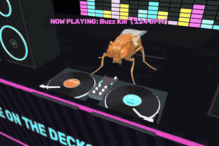

**Scene.** A club: the fly stands on a stage (FlyGym's plane, hidden, under a black carpet slab) at two
turntables and a mixer; behind it an LED wall ("FLY FM / NIGHT SHIFT FOREVER", our own) with a 16-bar visualizer,
a 7-segment BPM readout and a 10-cell HYPE meter (emissive cells switched by material); speaker stacks either
side whose cones pulse on the beat (mocap) and whose rings flash; a neon booth front; below the stage a dance
floor of 144 light tiles that change colour per beat; a crowd of 28 cartoon fly silhouettes (upright bodies,
red eyes, wings, arms up; mocap, visual, labelled) bobbing with the hype; a mirror-ball (turning mocap) with
three coloured point lights orbiting it; a key spot with shadows (`shadows: false`: directional). No audio.

**Turntables (physics).** Each record is a disc (0.9 mm, 0.1 mg) on a hinge joint, driven at 33 1/3 rpm by a
velocity actuator (kv 0.02 µN·mm·s/rad) whose torque is limited to 0.5 µN·mm: the slip mat. The record and the
platter under it collide with the fly (kind "fly"; the platter keeps a leg from sliding under the record: an
early version's resting tarsi were under the record rims and braked both records to a stop, so the decks now
sit clear of the standing footprint).

**The fly** holds `DJStance` (all tarsi planted and adhering, like `freeze`, stationary). The job drives both
front legs with joint targets from damped least-squares IK on a scratch `MjData` (the dead_hang `LegIK`),
keyframes solved once from the settled pose and interpolated in joint space (a "lift" keyframe first, so the leg
clears the platter). The mid / hind femur-tibia targets bob with the beat in the groove and the drop.

**One track** (32 beats, the BPM per track 120-128, the beat clock is sim time):

* beats 0-8 groove; 8-16 **scratch**: the leg of the playing deck presses on the record with its tarsal
  adhesion on and drags it back and forth along the groove (0.3 mm, half a beat each way). The record moves only
  through that contact and friction (the motor can't hold it: slip mat). **A scratch is counted from the
  record**: every backward excursion of >= 0.2 rad against the play direction (hysteresis on the record's angle),
  so a stroke that slips doesn't count. Measured: 7 scratches per scratch section (7 back strokes), the record
  driven up to ~15 rad/s backward. (Counted on the angular velocity instead, the contact chatter gave ~60 per
  section.)
* 16-24 build-up (the floor fills up, the camera cuts wide);
* beat 24 **THE DROP**: the other front leg goes up, the tiles strobe, the lights flash, the crowd jumps;
* 28-31 **the mix**: that leg reaches the crossfader knob and slides it to the other deck. **Kinematic,
  labelled:** the knob follows the tarsus while the tarsus is on it (a geometric test); if the leg misses, the
  fade is completed by the job (`auto_fades`). Then the other deck plays and its leg scratches.

**Counters / HUD** (TAB): tracks mixed (the work counter), the track, BPM, beat and section, scratches, drops,
crowd hype (0-100 %: +2 per scratch, +30 per drop, decaying with τ 25 s; it scales the crowd's bobbing and the
speaker pulse), fader moves, auto fades, and the label line `(records: hinge + motor, scratched by real leg
contact; crossfader knob follows the tarsus: kinematic; crowd / lights / speakers: show props)`. Captions: `NOW
PLAYING: <track> (<bpm> BPM)`, `THE DROP!`, `SCRATCH x10!`. Camera cuts: close on the decks, wide over the
crowd for the end of the build-up, a medium shot for the drop (`close_ups: false`: the wide shot only).

**Verified** (headless, 2026-09-28, Apple M1, one process at a time): `run_job.py --job dj --headless --max-seconds 120`: **7 tracks mixed**, **56 scratches** (7-8 per scratch section), 7 drops, 7 fader moves by the leg, **0 auto fades**, the record driven up to 15.5 rad/s backward, IK residual 1 µm, crowd hype 59 %, **0 falls, 0 auto-recoveries, 0 instabilities, RTF 0.55**. `run_sim.py --job dj
--headless --max-seconds 5` runs. Frames checked by eye (job renderer, 480×320, and the GIF frames): the right
front leg on the red record and the left on the blue one mid-scratch, the leg on the crossfader, the wide shot
with the crowd and the floor, the drop shot with THE DROP! and the leg raised, the NOW PLAYING caption.

**Limitations.** The scratch pattern is scripted (the job plays it on the beat; the brain does not), the
crossfader is kinematic once touched, the crowd, the floor, the lights and the speakers are show props, and
there is no sound. The record's friction grip comes from the tarsal adhesion (40 µN), far more than a real
fly's leg would need for a 0.1 mg disc. The window mode (`LiveViewer`) was not opened in this session.


### dishwasher

`fly_simulator/jobs/dishwasher.py` (scene, stance, `LegDriver`, pools), `fly_simulator/jobs/dishwasher_assets.py`
(procedural meshes / textures), tests in `tests/test_jobs_dish_barista.py`. HUD (TAB): `DISHWASHER FLY - the fly
washes dishes forever`.

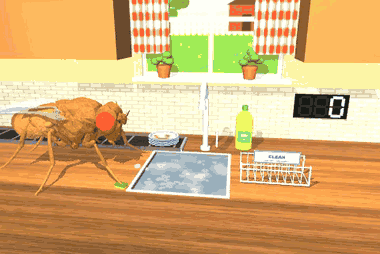

**Scene** (visual except the plate pad). A warm home kitchen: an oiled butcher-block counter (FlyGym's plane hidden
under it, the sink cut out), a stainless sink full of soapy water with foam islands, a gooseneck faucet with a lever,
cream subway tiles, a window over the sink onto a garden (gingham curtains, herbs on the sill), wooden upper cabinets,
a bottle of "SUDSY" dish soap (our own), a dish towel, a white wire dish rack with a `CLEAN` sign, a black rubber
conveyor with moving cleats and a `DIRTY DISHES` sign, and a 7-segment `WASHED` counter on the wall. Lights: a warm key
spot with shadows (`shadows: false`: directional), cool window daylight (directional), a warm point glow. `znear` 0.05.

**The fly** holds `DishStance` (the DJ's stance: all tarsi planted and adhering, stationary). `LegDriver` (shared with
the barista) moves the front legs: damped least-squares IK on a scratch `MjData` (the dead_hang `LegIK`, solutions
cached) for a tarsus5 target, eased in joint space.

**One plate** (a pool of 16 mocap plates; the stack holds 6, the rack 8):

1. **Fetch (kinematic carry, labelled).** The left front leg reaches over the stack, lowers to the top plate's near
   rim, and the plate follows the tarsus (fixed offset) up, across and down onto the wash spot in the water.
2. **Scrub (real contact).** The sponge (a mocap prop: yellow foam, green scourer) rides on the right front tarsus. A
   hidden fly-only cylinder collider (`dish/pad`, mocap) is placed under the plate only while scrubbing; its top is the
   plate's face plus the sponge's thickness, so the tarsus touches it where the sponge meets the plate. The leg presses
   (IK target 0.018 mm into the collider) and scrubs circles (8 keyframes, 75 ms each, a new phase per circle). **The
   grime comes off only while the tarsus is in contact** (the contact force between `dish/pad` and the right leg's
   geoms is > 0): by `scrub_per_mm` (0.22) × the plate's toughness (random 0.35-1, baked-on food) × the mm the tarsus
   moved. The plate's texture steps through 8 stages in which the food smears (3 patterns: tomato sauce, gravy, egg
   yolk, plus herb flecks and crumbs) break up along a noise field and vanish; suds build up on it. Foam bubbles spawn at
   the sponge while it scrubs. It stops when the grime is < 3 % or after 4.5 s (then the rest stays: `grime removed`).
3. **Rinse, rack, cart, conveyor (kinematic, labelled).** The plate carrier slides the plate under the faucet (tilted
   toward the camera); the water runs (a column, drops and splashes: visual particles with a slowed "cartoon" gravity,
   900 mm/s², bounded pools of 24 + 24), the suds rinse off; then it goes into the next rack slot, standing. Meanwhile
   the fly fetches the next plate. A full rack (8) is carted off to the right and comes back empty; an empty stack is
   replaced by a new dirty stack of 6 that rides in on the conveyor.

**Sponge wear**: the mm scrubbed in contact / `sponge_life_mm` (45); at 100 % a new sponge (counted); the sponge's
tint darkens in 4 steps.

**Counters / HUD** (TAB): plates washed (the work counter), grime removed (% of the washed plates' initial grime),
strokes (circles), mm scrubbed in contact, this plate's grime, sponge wear and sponges used, rack fill, rack loads,
stack and stacks, and the label line `(scrub: the sponge leg's real contact with the plate; fetch carry, plate carrier,
rack cart, conveyor: kinematic; water / bubbles: visual particles)`. Captions: `PLATE #n CLEAN (x% grime off)`, `RACK
FULL - CARTED OFF`, `A NEW STACK OF DIRTY DISHES`, `NEW SPONGE`. Camera cuts: wide, a scrub close-up, the rinse;
`close_ups: false`: the wide shot only. A reset (the fly fell) puts a plate in the hand onto the wash spot and scrubbing
resumes; the carrier, the cart and the conveyor carry on.

**Verified** (headless, 2026-09-28, Apple M1, one process at a time): `run_job.py --job dishwasher --headless
--max-seconds 120`: **14 plates washed**, **95.9 % grime removed**, 95 strokes, 102 mm scrubbed with 52.9 s of
sponge-plate contact (peak 1.4 µN), 3 sponges, 1 rack load, 3 stacks, IK residual 1 µm, **0 falls, 0 auto-recoveries,
0 instabilities, RTF 0.48**. `run_sim.py --job dishwasher --headless --max-seconds 5` runs (0 falls). Frames checked by
eye (job renderer, 480×320, and the GIF frames): the fly lifting the top plate off the stack, the sponge on the plate
with the smears breaking up and the foam, the clean plate under the faucet's stream, the plates standing in the rack,
the rack carted off with the caption, the new stack on the conveyor.

**Limitations.** The fetch, the rinse / rack placement, the cart and the conveyor are kinematic; the plate itself does
not move under the sponge (it is a mocap body; only the contact is real), and the grime model (per mm in contact) is
ours. The water and bubbles are visual particles (no fluid). One grime level per plate (the texture fades as a whole,
not where the sponge went). The window mode (`LiveViewer`) was not opened in this session.

### barista

`fly_simulator/jobs/barista.py` (scene, stance, machines, pools), `fly_simulator/jobs/barista_assets.py` (procedural
meshes / textures), tests in `tests/test_jobs_dish_barista.py`. HUD (TAB): `BARISTA FLY - the fly makes coffee
forever`.

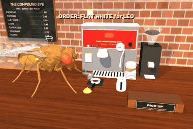

**Scene** (visual except the job colliders below). A small café, "THE COMPOUND EYE" (our own name; no real brand): a
walnut counter, a red-and-steel espresso machine (our own badge: a compound-eye honeycomb), its group head, a steam
wand, READY / BREW / STEAM lamps and a pressure gauge whose needle follows the shot, a drip tray with a grate, a stack
of paper cups, a black grinder with a glass bean hopper, a tamping mat, a steel button pad (SHOT, STEAM), a brass
service bell, a milk jug, a glass pastry case (croissants, muffins, cookies), a chalkboard menu, a ticket rail over the
machine, pendant lamps, a brick wall, and a `PICK UP` counter. Lights: a warm key spot with shadows (`shadows: false`:
directional), a directional fill, three warm point lights. `znear` 0.05.

**The fly** holds `BaristaStance` (all tarsi planted and adhering, stationary); `LegDriver` (the dishwasher's) drives
the front legs. **One drink** (~24 s, the state machine in `update`, every 1 ms):

1. `wait_order` → `cup_in`: the first ticket leaves the rail (it is clipped to the machine), a paper cup with the
   customer's name on its kraft sleeve (16 generic first names; each regular always orders the same drink: latte, flat
   white, cappuccino or cortado) slides from the stack under the group head.
2. `pf_to_grinder` → `grind` → `pf_back`: the portafilter slides to the grinder's fork, grounds fall from the chute
   and the heap grows, it slides back to the tamping mat.
3. **Tamp (real contact)**: the tamper (a mocap prop: steel base, wooden knob) rides on the left front tarsus. The
   puck's hidden fly-only collider (`cafe/puck`, placed only while tamping) sits at the grounds' top plus the tamper's
   thickness. Each press goes 0.04 mm into it and **counts only if the leg's contact force reaches `tamp_force`**
   (0.3 µN); the heap flattens by a third per counted press (3 presses; a light press is retried).
4. `pf_lock`: the portafilter slides up into the group head and twists (kinematic).
5. **SHOT and STEAM (real contact)**: the left front leg presses each button: the brew starts only when the leg's
   contact with the button's collider is detected (a press that ends without contact is counted, `auto_presses`, and
   the job presses it). Found while building it: the tarsus5 body's origin is ~0.07 mm behind the claws, so the press
   target is offset, and the two buttons sit side by side across the leg (they were in line along it and the leg pressed
   the wrong one).
6. `shot` (3 s): two dark streams (capsules) run from the spouts into the cup, drops fall (visual), the level rises,
   the surface goes through 5 crema stages (near-black to hazelnut with tiger flecks), BREW lamp, the needle to 9 bar.
7. `jug_to_wand` → `steam` (2.4 s): the jug slides under the wand (kinematic), steam puffs (a visual pool of 24), the
   foam rises, STEAM lamp. `jug_to_pour`: the jug slides next to the cup.
8. **Pour**: the right front leg grips the jug's handle; the jug follows the tarsus and the job tilts it; the leg is
   sent along the pour path (forward, down, the rosetta's side-to-side wiggle) **plus this pour's unsteadiness (our
   model: a random amplitude 0-0.05 mm per drink)**. A white milk stream runs from the spout, the level rises and the
   **latte art** (heart, tulip or rosetta) is drawn progressively: 8 texture stages on the surface disc. **The score
   comes from the real leg**: the RMS distance of the tarsus from the ideal path (score = 100 - 1400 × (RMS - 6 µm),
   40-100); above 25 µm the wobbly version of the art is drawn (-5 points).
9. `pour_back` → `jug_home`, then the right front leg **rings the bell** (real contact with the plunger's collider),
   `DING! <NAME>, YOUR <DRINK>!`, and the cup slides to the pickup counter (3 places; the oldest cup is collected). The
   portafilter goes back to the mat, knocked out. Next order.

**Orders**: arrive at random (exponential, mean 26 s), at most 6 tickets on the rail (more are walk-outs); 2 are
waiting at the start. **Spills (real physics)**: with `spill_p` (0.3) per drink, during the shot or the pour, a drop
escapes over the rim: a free body (a 0.03 mm sphere, contacts with the counter, the drip tray's collider and other
drops, never the fly; compiled with its live bits, parked with contacts off and gravity compensated), it falls,
lands, and leaves a puddle (a visual pool of 4, fading over 25 s).

**Counters / HUD** (TAB): drinks served (the work counter), the drink in progress and the phase, orders in the queue
and walk-outs, shots pulled, latte-art score (last and mean), tamps, presses (and auto presses), spills, the label line
`(tamps / buttons / bell: real leg contact; slides, streams, steam, latte art texture: kinematic / visual; spilled
drops: real physics)`. Captions: `ORDER: <DRINK> for <NAME>`, `LATTE ART: <PATTERN> n/100`, `DING! ...`, `OOPS - A
DRIP!`. Camera cuts: wide, the tamp, the shot, the steam, the pour from above (`close_ups: false`: the wide shot only).
A reset redoes the interrupted leg move (a tamp, a button, the pour, the bell); the timed prop steps resume.

**Verified** (headless, 2026-09-28, Apple M1, one process at a time): `run_job.py --job barista --headless
--max-seconds 120`: **5 drinks served**, 5 shots, 15 tamps (all by contact, peak 16 µN), 15 button / bell presses by
contact, **0 auto presses**, latte art mean **71.6** (last 75), 7 orders (1 in the queue at the end, 0 walk-outs), 1
spill, IK residual 1 µm, **0 falls, 0 auto-recoveries, 0 instabilities, RTF 0.52**. `run_sim.py --job barista
--headless --max-seconds 5` runs (0 falls). Frames checked by eye (job renderer, 480×320, and the GIF frames): the
order caption with the tickets on the rail, the grounds falling into the portafilter at the grinder, the tamp
close-up, the two dark streams into the named cup, the steam wand in the jug, the leg holding the tilted jug over the
cup with the art forming, the `LATTE ART` and `DING!` captions, the cup with its art on the pickup counter.

**Limitations.** The liquid, the streams, the steam and the latte art are kinematic / visual (no fluid; the art is a
drawn texture, chosen by pattern and by the measured steadiness). The portafilter, cup and jug slides are kinematic,
the jug follows the tarsus while poured (no grip forces), the pour's unsteadiness is our random model (the leg's
tracking of it is real), the shot and steam are compressed in time. The window mode (`LiveViewer`) was not opened in
this session.

## Verification

The test file is `tests/test_jobs.py`: synthetic tests of the registry, steering and
recording helpers, plus short sisyphus and wheel runs covering contacts, pushing,
explicit recovery, NaN recovery, a lost boulder and the wheel spinning. `tests/test_jobs_lawn.py`
(9 tests, ~13 s) covers mowing and raking: contact bits, the grass pool (cut, stripe
colour, regrowth), row completion and the serpentine, the mower being pushed, the
mower surviving an explicit reset, rake carrying, pile counting, gusts, the constant
leaf pool, and the rake following the thorax. `tests/test_jobs_dead_hang.py` (9 tests, ~75 s)
covers dead_hang: registry, no weld constraints, the bar colliding with the fly (condim 4) and
the trap lobes being visual, the mid-leg brace pose reaching the bar, the compiled znear, a 6 s
hang at full grip (the adhesion actuators give 40 µN × strength, no applied forces), fatigue
and a re-grip, a twitch moving the trap, GF → flinch (never a jump) with a fake brain state, a
slip of each front leg at 90 % grip (the other hand holds, the mid legs touch the bar, the
slipped leg re-grabs on the first try) and a re-grip at 72 %, grip 0 → the tarsi slide off →
CHOMP → an explicit respawn with the trap reopening, and fast fatigue (0.12/s, no re-grips)
draining the grip until the fly falls (after > 4 s, with < 45 % grip left).
Results of the long headless runs are below.

**Visual overhaul of sisyphus / hamster_wheel / mowing / raking (2026-09-27, Apple M1, one
process at a time).** 60 s headless runs before and after, default seeds: the counters are
identical to the last digit (sisyphus 9 summits, 0.162 m; wheel 19.837 revolutions; mowing
10 rows, 1 lawn, 446 mm², 1 unstick; raking 17 leaves raked), 0 falls, 0 auto-recoveries,
0 instabilities in all eight runs. Physics RTF (rendering excluded) is unchanged: 0.466 / 0.43 /
0.497 / 0.561 before, 0.46 / 0.432 / 0.492 / 0.559 after. A 960×640 job-camera frame costs
more to render (median of 18 frames): sisyphus 5.6 → 11.5 ms, wheel 6.0 → 11.7 ms, mowing
11.8 → 13.3 ms (shadows off), raking 6.9 → 12.8 ms. That is about the same as the newer
jobs (trampoline ~16 ms), and the shadow pass is most of it (`shadows: false` saves ~6–11
ms). So in the live window (up to 30 frames per wall second) RTF drops by an estimated 0.03–0.1 (e.g. raking ~0.45 → ~0.34).
The jobs now also set znear to 0.01 mm. The fly's MuJoCo globals are merged in after
`extension` and leave it at 0.5 µm, and at that value the stripe tiles z-fought with the soil.

**Spot lights without shadows (audit, 2026-09-28).** On macOS OpenGL a MuJoCo spot light with
`castshadow=False` turns every pixel behind the light's plane black, whatever the other lights and the ambient
say (reproduced in a two-box scene: the box behind the light's plane vanished, the floor went to 0). MjSpec's
`add_light` defaults to a spot *with* shadows, and no light came from FlyGym or the app; the unshadowed spots
were all in the jobs. Rendered from the job camera plus two other angles (±110-140° azimuth, elevations −12°
and −55°), as-is vs every such spot shadowed: **affected** (black regions): kebab (the burner tiles and the
heater box black from the default camera; 52 % of the frame black from the side), dead_hang (the floor and
the wall bottom), bowling (the approach and the ball return; this was the "approach renders black with
`shadows: false`" in its limitations), broccoli_toss (parts of the room), taste_tester (the floor behind the
fill from the side), pizza_chef, mowing (its sun had no shadows by default: a black band at the horizon), trampoline,
sisyphus and hamster_wheel (a black band at a low angle); raking showed nothing but had one too. Fixes: every
fill / rim spot without shadows is now a directional light along the same direction (sisyphus, hamster_wheel,
raking, mowing, taste_tester, pizza_chef, trampoline, kebab rim, dead_hang rim and trap glow, bowling deck
and lane, broccoli_toss rim and backroom); local glows became point lights with attenuation (kebab heat light,
pizza_chef oven light, broccoli_toss monitor glow, ring light and blast rim); every key light whose shadow a
`shadows: false` config turns off now becomes directional instead (`geometry.spot_or_directional`, all jobs),
and broccoli_toss's key light turns directional (not an unshadowed spot) while the room burns. After the fix no
job model has an unshadowed spot; the re-rendered views have no black regions (bowling with `shadows: false`
too) and otherwise look as before (bowling's deck light was dimmed from 0.75 to 0.55 because a directional
light also reaches the approach). `scenes/temple_standoff.py` (a scripted scene, not a job; not touched here) casts shadows from its spots by default, but its `shadows=False` option would give unshadowed spots.

**znear fix in the framework (2026-09-27).** That merge order also silently undid the
`spec.visual.map.znear = 0.05` in the newer jobs' `extension`s (kebab, trampoline,
broccoli_toss, dead_hang, pizza_chef, taste_tester all rendered at 5e-4). znear / zfar are now
`EternalJob` class attributes, applied to the compiled model in `attach` before `on_attach`;
every job that set it (in `extension` or `on_attach`) was migrated: 0.05 for those six, 0.01
for sisyphus / hamster_wheel / mowing / raking (unchanged), 0.3 / 400 for delivery_pilot
(unchanged), and bowling (which set nothing) now uses 0.05. Checked with one 640×426
job-camera frame per job at 0.6 s sim, before / after, default seeds: sisyphus and
delivery_pilot are pixel-identical; kebab, trampoline, dead_hang, pizza_chef, taste_tester,
broccoli_toss and bowling lose their shadow acne / z-fighting speckle (kebab's skewer and the
trampoline frame were covered in dark blotches, the trampoline scoreboard digits were
unreadable, bowling had black speckles on the fly, ball and lane); nothing got worse
(no near-plane clipping at the job cameras' distances). Tests:
`test_job_znear_zfar_applied_after_compile`, and the sisyphus / dead_hang tests check the
compiled value.

Measured on 2026-09-26 on the development machine (Apple M1), with other simulations running at
the same time:

| run | sim time | result | falls / auto-recoveries | RTF |
|---|---|---|---|---|
| `sisyphus` headless + 640×426 rolling MP4 (60 s segments, keep 1) + timelapse every 5 s | 300 s | **45 summits** (~6.7 s per cycle), 0.80 m pushed, 48 pushes started, 6 back-away unsticks, 0 boulders lost, 0 instabilities | 5 / 5 (all falls reset explicitly after 2.5 s) | 0.43 |
| `hamster_wheel` headless + 480×320 MP4 + timelapse every 10 s | 300 s | **99.4 revolutions**, 4.37 m, top speed 14.7 mm/s (~0.33 rev/s) | 0 / 0 | 0.41 |
| `--rotate` smoke test (both jobs, rebuilding the Session) | 2.5 s | the job switched as expected | 0 | – |
| `kebab` headless + 640×426 MP4 (20 s segments, keep 1) + timelapse every 3 s | 200 s | **1006 shavings**, 16 kebabs, 3.5 mg served, ~300 shavings/min steady (peak 382), ~88 of 199 chunks regrowing at any time, 0 repositions, 0 shavings lost, 0 instabilities | 0 / 0 | 0.26 |
| `kebab --brain` (full body, real FlyWire brain) | 12 s | 72 shavings; 3 food pulses, MN9 40–60 Hz on each, proboscis driven; 0 falls | 0 / 0 | 0.27 |
| `kebab --brain`, event-driven reactions (touch per cut, taste on landings, satiety) | 180 s | 832 shavings, 832 touch pulses, 35 taste pulses (MN9 55–80 Hz after each when hungry), 3 sated bouts | 0 / 0 | 0.24 |
| `kebab --brain --stress`, 3 startle pokes at 20–24 s | 60 s | arousal 0.12 → 0.74, carve ×1.06 → ×1.37 → ×1.21 at 60 s | 0 / 0 | 0.10 |
| `mowing` headless + 640×432 timelapse every 3 s (job renderer) | 185 s | **30 rows, 5 lawns**, 1251 mm² (0.00125 m²) mowed, 6627 blades cut, 30 pushes started, 1 back-away unstick, 0 instabilities | 0 / 0 | 0.47 |
| `dead_hang` headless + 640×426 event screenshots, shadows on | 180 s | **7 falls: 5 chomps, 2 missed the trap** (survival rate 29 %), best streak 39.3 s, 167 s on the bar, 5 re-grips, 3 slips (2 legs physically slid off), 8 re-grabs, 55 re-grab misses, 8 twitches, 0 instabilities | 7 explicit respawns (5 chomped, 2 missed_trap) | 0.31 with the screenshots (0.44–0.53 in earlier runs without rendering, shadows off) |
| `dead_hang` before the one-arm rework, headless, shadows off, seeds 0 / 1 (2026-09-27) | 2 × 180 s | seed 0 as above; seed 1: 9 falls (7 chomps), **all 16 on one arm with the holding hand at 64–90 % grip**; re-grips 5 + 6 ok / 11 + 11 missed (a missed re-grip becomes a slip), re-grabs 8 + 4 ok / 44 + 15 attempts refused (bar out of reach; the job's `regrab_fails` counter, 55 / 26, also counts the missed re-grips); mean completed hang 20.0 / 17.4 s | – | 0.50 |
| `dead_hang` after the rework, same runs | 2 × 180 s | **4 falls (all chomped), all tired**: grip of the hand(s) still on the bar 0.17–0.32 (seed 0: both hands at 31–32 % right after a re-grab, one arm at 17 %; seed 1: one arm at 30 % and 24 %); re-grips 11 + 12, all back on the bar; re-grabs 4 + 4 ok, 1 miss, 0 refused; 11 slips; mean completed hang 82.0 / 79.3 s (best 89.6 / 81.5 s); 0 instabilities | 4 explicit respawns | 0.40–0.44 |
| `raking` headless + 640×432 timelapse every 3 s | 185 s | **46 leaves raked**, 2 piles completed, 2 gusts survived (47 leaves blown about, 14 out of the yard and back to the tree), 38 leaves fallen from the tree, 0 instabilities | 0 / 0 | 0.55 |
| `broccoli_toss` headless | 150 s | **10 plates yeeted, 10 explosions**, 10 rebuilds, 130 props launched, viewers 1,337 → 5,782, vegetables eaten 0, 0 flight timeouts, 4 back-away unsticks, 0 instabilities | 0 / 0 | 0.31 |

I checked the timelapse frames by eye (rendered by the job renderer only). The
sisyphus shot shows the trough, the boulder, the flag and the summit counter
climbing. The wheel shot shows the fly at the bottom of a spinning yellow / orange
wheel, visible through the translucent near lip.

Disk use: a 60 s segment at 640×426 and 15 fps is ~10 MB (quality 8), and a 60-frame
timelapse is ~0.9 MB. Keep `--keep` small.

The kebab frames (job renderer and timelapse) show the fly in its chef hat at the
spit, knife raised or in the meat, a carved band of pink regrowing chunks, the
shavings piling up on the tray, and the counters climbing.

## Limitations

* dead_hang: the one-arm stability comes partly from engineered help: the mid-leg brace
  carries a little adhesion (10 µN, about one body weight, a design choice), slips and
  re-grips shed their adhesion over 0.15–0.2 s instead of instantly, reaches follow the
  spawn poses (IK-corrected), and the efference copy is perfect. Tired falls often
  come right after a re-grab (the fresh tarsus is a point contact, not the draped
  grip of the spawn), so the two-arm / one-arm label of a fall is not very meaningful.
  One arm fails at a strength of about 0.3 and two arms at about 0.15; these thresholds
  come from the contact model (friction 1, condim 4, adhesion gain 40), not from fly
  data. With the real brain and `--habituation`, repeated twitches do not habituate
  the flinch (see above). The trap lobes are visual and the catch pad is invisible
  (see above).

* mowing: the mower is on planar joints at a fixed height and turned kinematically
  toward its push direction (the fly pushes only its translation). The stripes wobble
  a little, because the pure-pursuit push is not perfectly straight. The serpentine
  mows the last row twice (once each way) at the turnaround.
* raking: the rake and leaves are kinematic (mocap, visual only). The rake moves
  leaves by a geometric test, not by contact forces, so the fly can't trip over
  either. Leaves pushed against the yard edge line up there until the fly fetches
  them.

* kebab: the knife passes through the meat (visual geoms; the cut is a geometric
  test, not a contact force). Only the band the recorded stroke reaches (about
  z 0.5–2 mm, on the fly's side of the spit) ever gets carved. The top stays whole,
  and the rotation brings fresh meat round. The stroke is the grooming clip replayed
  open loop. It does not aim at the meat.
* The window mode (`LiveViewer`, single-threaded loop) is the app's viewer code and
  was not opened in this session. Headless mode, recording and `--rotate` are verified.
* The sisyphus loop is closed-loop steering, not learned. About one fall per minute
  (usually during orbiting / turning on the spot next to the boulder or wall) is
  recovered by an explicit reset. Sometimes the fly loses the boulder halfway and it
  rolls back (Sisyphean, and counted as nothing). The boulder is light (0.3 mg,
  pumice) because heavier props make the fly rear up and flip.
* The fly respawns at the origin after a reset (FlyGym keyframe). Jobs that need
  another respawn point can write it into the keyframe, as `fly_simulator/course` does.
* `RunMetrics` keeps one float per fall (`falls`, `recovery_times`). This grows very
  slowly and is the only per-event list; the job's own counters are O(1).
* The main app runs jobs too: `run_sim.py --job NAME [--job-config JSON]` (all app keys
  and flags available; the whip is turned off because the idle whip lies across the
  job scenes, so hit keys shove). `scripts/run_job.py` remains the standalone runner.
