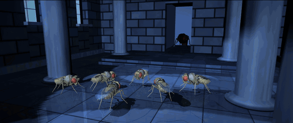

# Scenes

A scene is a **scripted short film** rendered offscreen to an MP4. It has a fixed
timeline of shots, hard cuts and synthesized audio. It is not an eternal job: nothing
runs forever and nothing is simulated. Every body is posed kinematically, so a scene is
a pure function of scene time and renders the same way every time.

```bash
# full quality: 1920x1080, 24 fps, 2.39:1 letterbox, audio (about 2 min on a laptop)
.venv/bin/python scripts/render_scene.py --scene temple_standoff --out runs/scenes/temple_standoff.mp4

# a quick preview with PNG stills (every 6th frame)
.venv/bin/python scripts/render_scene.py --scene temple_standoff --out /tmp/ts.mp4 \
    --width 480 --height 270 --png-dir /tmp/ts_frames --png-every 6

# one stretch only (the hold and the ignition)
.venv/bin/python scripts/render_scene.py --scene temple_standoff --out /tmp/cut.mp4 --t0 8.5 --t1 12.6
```

Options: `--fps`, `--no-audio`, `--no-letterbox`, `--no-shadows` (faster), `--grain 0`,
`--crf`. No window is opened. Frames are piped to `ffmpeg` (libx264), which also muxes
the WAV into the MP4.



## `temple_standoff`

A 13 s scene played completely straight. The joke is that it is flies, filmed with total
gravitas. Violence is only implied: nothing swings and nothing hits.

| time (s) | shot | beat |
|---|---|---|
| 0.0-2.0 | `establishing_wide` | the hall: little flies gathered, columns, window light, the dais, the back doorway (a figure waits in the lit corridor) |
| 2.0-4.0 | `tall_fly_enters` | medium-wide, low: the tall fly walks through the doorway onto the dais, slow and controlled |
| 4.0-5.5 | `little_flies_notice` | from the dais: the little flies' heads snap round, then their bodies shuffle-turn toward the camera (staggered) |
| 5.5-7.0 | `height_contrast` | a low side view: the lead little fly steps forward and looks up at the tall fly on the dais |
| 7.0-8.5 | `lead_close_up` | the lead's face: a slow head tilt, antenna flicks, then stillness |
| 8.5-10.5 | `tall_fly_low_angle` | the hold. The tall fly, from below, almost motionless for 2 s |
| 10.5-11.3 | `handle_ignition` | the right front leg brings the handle forward (10.55-10.97). At **11.0** the blade ignites over 0.09 s (2-3 frames) and relights the room |
| 11.3-12.55 | `recoil` | past the blade: the little flies jerk back almost together (11.30-11.34), nose up, wings flick. The lead freezes, then recoils at 11.66 |
| 12.55-13.0 | `black` | a cut to black and silence |

The timeline is `SHOTS` / `T_*` in `fly_simulator/scenes/temple_standoff.py`. Every
camera is fixed for its shot (eye, target, field of view). There are no camera moves.

### Original characters and set

All designs are original to this project. There are no franchise, film or character
references, and no footage was used.

* **The little flies** (6): 0.62-0.68x NeuroMechFly copies with a "juvenile" build: the
  head scaled 1.16x relative to the body, a rounder abdomen (1.12x wider), pale
  cream-tan chitin with fewer bristle dots, lighter eyes. Each wears a slightly
  oversized cream linen **tunic** over the thorax and a woven **sash** across it. The
  **lead little fly** has a rust sash, stands at the front of the group and is the one
  that steps forward.
* **The tall fly**: a 1.5x copy with a slightly smaller head (0.95x), near-black glossy
  chitin, deep red eyes and smoky wings folded under a heavy dark brown **hooded
  cloak**. The cloak has a long cape over the back, wings and abdomen that falls into a
  short train behind it, a shorter shoulder mantle, a raised collar, and a deep hood
  whose brow frames the face from above and sits behind the eyes at the sides. The head,
  eyes and legs stay visible. It holds a small ridged metal **handle** on its right
  front leg.
* **The energy blade**: a generic glowing rod with a white core inside two blue glow
  layers.
* **The hall**: slab-stone floor with a slight reflection, ashlar walls, two rows of
  fluted columns, four tall arched windows with real openings on one side, a raised
  dais with a step, and a back doorway into a corridor lit at its far end.

### What is engineered

Everything in a scene is engineered. It is a film, not a simulation.

* **Posed bodies.** Each fly is a NeuroMechFly on a mocap mount, the same technique as
  the viewer fly in `jobs/broccoli_toss.py`. It has leg, neck, wing and antenna joints
  but no actuators, contacts or physics steps. Each frame writes its joint angles and
  calls `mj_forward`.
* **Walking.** FlyGym's recorded single-leg steps (`PreprogrammedSteps`) drive a tripod
  gait. The step phase advances at a constant rate while the step size scales with body
  speed, and the speed matches the measured stride. The stance feet barely slide, and
  the legs settle into the stand pose as the fly stops. The tall fly walks on five legs
  because the sixth holds the handle.
* **The handle leg.** Two IK poses (damped least squares, as in broccoli_toss), held
  low and presented forward, blended in joint space. The handle and blade sit on a
  mocap body placed at the right front tarsus each frame.
* **Sizes.** Each fly is built from its own NeuroMechFly spec. At build time every
  body offset and mesh scale is multiplied: by the overall scale, and also by the head
  or abdomen factor on those subtrees. Stance heights are measured from the lowest
  foot vertex.
* **Attire.** Visual-only meshes, shrink-wrapped onto the body. `mj_ray` casts rays
  inward at the thorax, abdomen and wing geoms (for the hood, the head and eye geoms)
  of an unposed probe fly. The hits are pushed outward by an offset and shaped with
  folds, flare, a falling train and rounded hems. The surface grid is turned into a thin
  closed shell and attached to the `c_thorax` or `c_head` body, so it follows the pose.
  The fabrics are procedural textures: a twill weave with worn, frayed edges for the
  cloak and a plain weave for the linen. The tunics stop in front of the wing hinges,
  so the little flies' wings can flick. The cloak's side hems stop above the coxae, and
  its train narrows to stay clear of the hind legs.
* **Lighting.** Cool daylight comes from spot lights set in the window heads, and
  columns and flies cast shadows onto the floor. The corridor has a point light, the
  room has a dim directional fill, and a per-shot key light is re-placed at every cut
  (a film-set light). All the lighting is subdued until the ignition.
  * *Engineering note:* every spot light casts shadows. On macOS's OpenGL, a spot light
    without shadows turns every fragment behind its plane black (NaN); one with shadows
    does not.
* **The ignition.** The blade grows over 0.09 s. Its **MuJoCo point light** is dark
  until t = 11.0, then comes on at full strength with a brief flare. It is the
  brightest light in the scene, and it relights the tall fly (the cloak catches the
  blue), the floor (with reflections), the columns and the little flies. The glow
  flickers slightly.
* **Post-process (screen space).** A bloom (a blue-tinted bright pass once the blade is
  lit), an exposure lift at the ignition (+55 %, decaying in about 0.16 s), light
  streaks from the window glass (found with a segmentation pass and smeared along the
  daylight's on-screen direction), a cool grade, a vignette, film grain and the 2.39:1
  letterbox.

### Synthesized audio

`synth_audio` in the scene module makes all the sound from numpy noise and sines. It
records nothing and samples nothing.

* a quiet room tone: low filtered rumble plus faint high air, thinning during the hold;
* the tall fly's soft steps (one tick per tripod touchdown, from the gait phase), the
  lead's small careful steps, and a stir of tiny feet at the notice;
* short buzzy wing flutters at the recoil;
* the ignition: a snap, a pitched-down whoomp, a decaying hiss, then a low hum
  (86 Hz and harmonics, a detuned second voice for beating, slight vibrato);
* hard silence at the cut to black (a 6 ms fade, so there is no click).

### Limitations

* The flies are not simulated. Feet can slide slightly (the shuffle turns and the
  recoil jerk translate the whole body), and nothing checks leg-to-leg contact between
  flies.
* The garments are rigid shells on one body segment each. They do not deform, and
  because the tall fly's neck barely moves, the hood and collar never separate.
* The window light streaks are a screen-space effect, not volumetric light.
* The GIF is a 12 fps, grain-free render. The MP4 is the reference.

Files: `fly_simulator/scenes/temple_standoff.py` (the scene, the renderer, the audio),
`fly_simulator/scenes/temple_standoff_assets.py` (meshes, textures, the garment
shrink-wrap), `scripts/render_scene.py`, `tests/test_scenes.py`.
