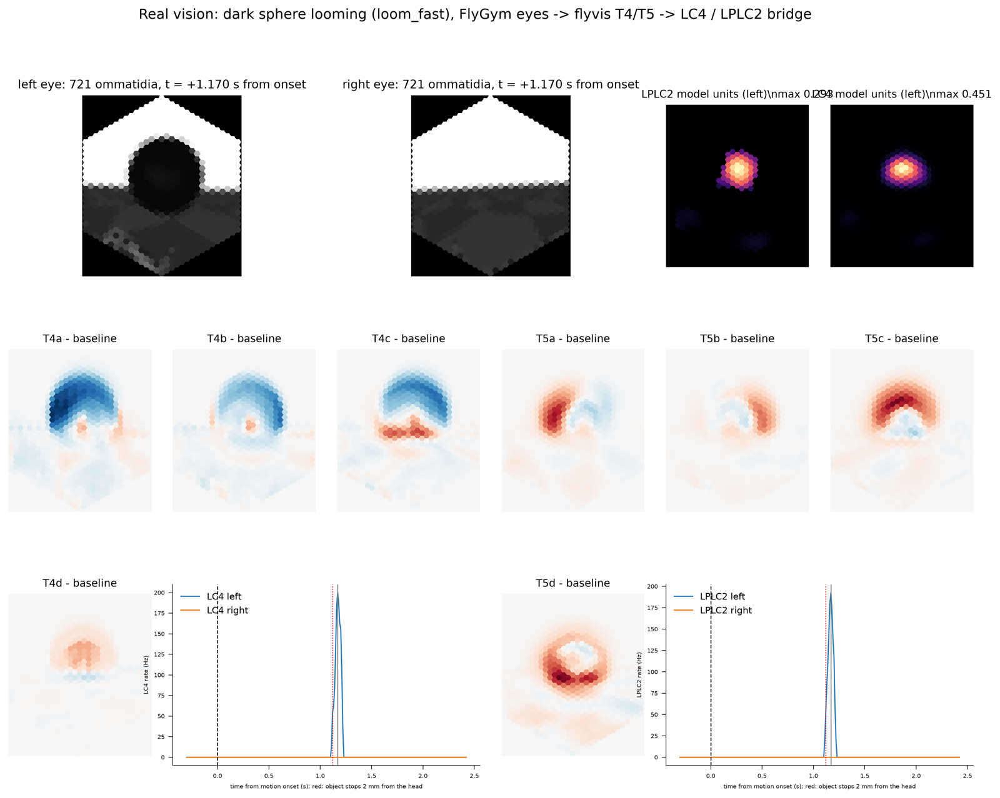

# Vision

The connectome brain gets visual input in one of two ways. You pick one; they never
both drive the brain:

* **Geometric sense** (`perpetualfly/vision/looming.py`; `--whip-vision`, and the
  swatter's paddle source, docs/SWATTER.md §2). For each registered object and each
  eye, it computes the object's angular size θ and expansion rate dθ/dt from the
  object's geometry. A response function turns these into LC4 / LPLC2 rates. It is
  exact and cheap, but it is *told* what the objects are. It cannot see anything
  that was not registered.
* **Real vision** (`--real-vision`, roadmap B8, this document). The fly looks at the
  rendered world through FlyGym's compound eyes. flyvis, a connectome-constrained
  model of the optic lobe, processes what the eyes sample, and a bridge model reads
  LC4 / LPLC2 activity from flyvis's T4 / T5 motion detectors. Nothing is
  registered: any object the eyes can see (the swatter, the whip, a looming sphere,
  terrain) is a possible stimulus.

## Real vision

```
MuJoCo scene ──> FlyGym eye cameras (l/r, 157°, fisheye) ──> 721 ommatidia / eye
      (perpetualfly/vision/eyes.py, every 10 ms of sim time)
  ──> flyvis network, 45 669 neurons / eye, one Euler step per frame
      (perpetualfly/vision/flyvis_net.py)
  ──> T4a-d (ON) / T5a-d (OFF) activity per column
  ──> bridge: LPLC2 / LC4 model units (perpetualfly/vision/bridge.py)
  ──> StimulusEvent("loom", side, lc4_hz, lplc2_hz) ──> FlyWire LC4 / LPLC2 of that
      side ──> giant fibre (DNp01) ──> jump (--brain-actions)
```



*The figure (made with `scripts/demo_real_vision.py --figure`): a dark sphere looms
at the fly from 60° to its left. Top row: both eyes' 721-ommatidium images at the
peak of the LPLC2 response, 1.17 s after motion onset. The sphere fills ~60° of the
left eye. Next to them are the LPLC2 and LC4 model-unit maps of that eye. Middle and
bottom rows: T4 / T5 activity minus baseline for each direction subtype. The OFF
detectors T5a / b / c / d light up on the left / right / top / bottom rim of the
dark disc. In other words, each subtype responds on the part of the rim moving in
its preferred direction, which is the outward-motion signature that LPLC2's four
dendritic arms read. The traces show the LC4 / LPLC2 rates sent to the brain.*

### 1. Compound eyes (`eyes.py`)

* `make_eyes_fly_factory()` is a `fly_factory` for `Simulation`. It builds the fly
  the simulation would build anyway (the standard locomotion fly, or the full-body
  fly with `fly.extra_joints`), then calls FlyGym's `fly.add_vision()`. That adds
  one camera per eye on two massless child bodies. The walking dynamics are
  unchanged, but the compiled model is different, so **eyes are off by default**
  and existing trajectories and tests stay bit-identical.
* `CompoundEyes` is a post-step hook. Every `1/rate_hz` of sim time (default
  100 Hz) it calls `Simulation.get_ommatidia_readouts` and produces a `(2, 721)`
  luminance array (the channel of each ommatidium's type, i.e. `readouts.max(-1)`).
* FlyGym hides geom group 1 from the eye cameras, but only because its optional eye
  markers live there. Our props (swatter, whip, looming sphere) are group-1 visual
  geoms, so the eye renderer is switched to show group 1
  (`EyesConfig.see_group1`).
* The fly's own head, eyes, antennae and front coxae are hidden from its eyes by
  FlyGym. The sky renders at luminance 1.0 and the checker ground at about
  0.15–0.3.
* Field of view (FlyGym's camera rig): each eye looks at azimuth ±63°, elevation
  0°, and covers about 138° horizontally × 157° vertically. The left eye therefore
  covers azimuth −6° … 132°: a small frontal overlap, and a **blind sector behind
  ~130°**. The real fly sees further back. Image +column is anterior for the left
  eye and posterior for the right eye.
* **Cost: 20–26 ms of wall time per sample** (both eyes: render, fisheye
  correction, hex binning), measured over whole runs. At 100 Hz that is
  ~2.0–2.6 s of wall time per simulated second.

### 2. flyvis, stepped frame by frame (`flyvis_net.py`)

flyvis 1.2 (Lappalainen et al. 2024, Nature 634:1132) has fixed connectivity taken
from the optic-lobe connectome (65 cell types, 721 columns per eye) and trained
single-cell and synapse parameters. We use the pretrained ensemble member
`flow/0000/000`. `Network.simulate` integrates a whole movie per call and costs
about 1 s of overhead each time. `StepwiseFlyvis` instead ports the idea of FlyGym
v1's `RealTimeVisionNetwork`: keep the network state, and on each ommatidia frame
call the network's own Euler step (`Network._next_state`) with `dt = 1/rate_hz`.
Both eyes run as one batch of 2. At start or reset, the state is warmed up by a
0.5 s contrast fade-in of the first frame.

`RetinaMapper` is ported from FlyGym v1. The two libraries use the same
721-ommatidium hex lattice with different orderings. A linear map between the
extreme ommatidia of the two lattices gives the permutation. This was checked: all
six hex neighbours map to consistent FlyGym offsets, and the permutation is a
bijection.

**Cost: 6.1–7.2 ms per step for both eyes** (CPU, 2 torch threads). Loading the
model takes ~6–9 s. The first init writes a 100 MB connectome cache into
`flyvis/data`.

Install: `.venv/bin/python -m pip install -e ".[vision]"` (flyvis plus ~230 MB of
dependencies; torch was already present), then
`.venv/bin/flyvis download-pretrained --skip_large_files` (~10 MB).

### 3. Bridge: T4 / T5 → LC4 / LPLC2 (`bridge.py`)

flyvis stops at T4 / T5, which are upstream of the looming detectors. The bridge is
a **designed model**: it is not taken from the connectome and not trained.

* **Motion vector per column**: each T4 / T5 cell's rectified increment over its own
  slow running mean (τ = 0.3 s), times its subtype's preferred direction, summed
  over the four subtypes. The preferred directions were measured on this flyvis
  model with moving ON / OFF edges, in eye-image coordinates: a → −col, b → +col,
  c → up, d → down. T4d is weakly tuned in this model; T5d is fine. The eye's mean
  vector (coherent self-motion) is subtracted.
* **LPLC2** follows Klapoetke et al. 2017. Each unit has four arms of 30° from its
  centre, each a 90° wedge. An arm's drive is `relu(mean outward − mean inward
  motion)` along the arm, and the unit's response is the geometric mean of the four
  arm drives. So the unit needs expansion in all four directions; translation,
  contraction and wide-field flow don't drive it. Input is T4 + 1.5 × T5.
* **LC4** (von Reyn et al. 2017; dark looming, angular velocity) uses T5 only. It is
  the outward flux of OFF motion through a 30° disc around the unit centre, times
  radiality² (radial / total motion: 1 for pure expansion, ~0 for translation,
  negative for contraction).
* **Rates** take the per-eye maximum over units and pass it through a ramp:
  LPLC2 0.12 → 0.30 and LC4 0.24 → 0.45 map to 0 → 200 Hz. Anything under 10 Hz is
  dropped.
* **Events** use the geometric sense's semantics: 80 ms persistence, refreshed, and
  re-sent at once when the rate rises. Nothing is sent in the first 50 ms after a
  start or reset. Details include `bridge`, the raw activations and the receptive
  field of the best unit.
* **Cost of the bridge**: ~2 ms per frame. The whole pipeline (flyvis + bridge +
  events) takes **9.4–9.8 ms per frame**. Together with the eyes, real vision adds
  **~30 ms of wall time per 10 ms of sim time**.

Calibration on synthetic stimuli drawn directly on the lattice, at 100 Hz
(`scripts/demo_real_vision.py --calibrate`):

| stimulus | LPLC2 act. (Hz) | LC4 act. (Hz) |
|---|---|---|
| dark loom l/v 10 ms | 0.316 (200) | 0.563 (200) |
| dark loom l/v 40 ms | 0.337 (200) | 0.436 (187) |
| dark loom l/v 80 ms | 0.239 (132) | 0.292 (50) |
| bright loom l/v 40 ms | 0.159 (43) | 0.113 (0) |
| slow expansion 20°/s | 0.074 (0) | 0.094 (0) |
| receding disc 60° → 2° in 0.3 s | 0.098 (0) | 0.060 (0) |
| dark 20° disc translating 100°/s | 0.041 (0) | 0.086 (0) |
| dark 20° disc translating 400°/s | 0.082 (0) | 0.173 (0) |
| 20° grating drifting at 5 Hz | 0.066 (0) | 0.022 (0) |

On rendered scenes, walking gives at most LPLC2 0.025 and LC4 0.045 (flat and
"normal" terrain). A dark sphere looming at the fly gives LPLC2 0.29–0.31 and LC4
0.45–0.53. A sphere passing 6 mm to the side gives LC4 0.19. A sphere fading in at
3 mm (see the recede trial) gives LC4 0.18.

**Optional steering population** (`RealVisionAppConfig.steer`, off by default,
experimental): **LC10a**, driven by small-field (10°) OFF motion of any direction,
sent as `manual` events with `cell_type=LC10a`. Thresholds 0.45 / 0.8 were set on
rendered scenes (walking ≤ 0.42; sphere passing at 6 mm: 0.71).

**Eyes-only fallback** (`backend="dark_expansion"`, used automatically when flyvis
is missing): per eye, it takes the fraction of ommatidia much darker than their
running mean and its growth rate, and maps them to LC4 / LPLC2. Events are
labelled `bridge="dark_expansion"`. It is not a neural model, and it is unit-tested
only: flyvis installed fine here, so the fallback was never needed in closed loop.

### 4. App wiring

* `--real-vision` sets `AppConfig.real_vision` (`RealVisionAppConfig`: `enabled`,
  `eyes_only`, `rate_hz`, `backend`, `steer`, `vision` = `RealVisionConfig`
  overrides). It implies `--brain` and the low-latency pacing (window 0.02 s, sync
  wait 0.05 s), like the swatter does.
* **No double drive.** With `--real-vision`, the geometric sense is not installed:
  `--whip-vision` prints a note and the whip is seen by the eyes instead, and the
  swatter is installed with `vision=False`. The swatter's escape direction
  (`threat_fn`) and short-mode jumps are unchanged.
* `eyes_only` puts eyes on the fly and samples them (`Session.real_vision` is then
  the `CompoundEyes`), with no network and no brain.
* The summary (`summary.json` / `summary_extra`) has `real_vision`: eye samples, ms
  per sample, backend, number of events, ms per frame.
* Library use: build with `fly_factory=make_eyes_fly_factory()`, then
  `install_real_vision(session_or_sim, brain_link)`.

### 5. Test object: a looming dark sphere (`objects.py`)

`LoomingObject` is a world extension: a black sphere (r = 1 mm, visual only) on a
mocap body. `start(kind, azimuth_deg, elevation_deg, ...)` places it at a point
relative to the fly's head and heading and fades it in over 0.8 s, so that its
appearance is not itself a dark flash. After `appear_s` = 1.0 s it starts to move:

* `approach`: at speed r/(l/v), until it is 2 mm from the head (θ = 60°), at a fixed
  bearing to the moving fly (like a closed-loop VR looming stimulus). Without the
  fixed bearing, a walking fly walked out of the stimulus and out of FlyGym's
  field of view.
* `recede`: moves away from the fly.
* `pass`: a lateral pass parallel to the heading.

After the motion it holds, fades out and parks. `geometric_source()` gives the same
sphere to the geometric sense for comparisons; that sense sees it from motion onset
on.

### 6. Validation with the real brain (headless)

`scripts/demo_real_vision.py --sim` runs one Session with eyes, real vision and a
geometric `LoomingVision` on the same sphere and swatter, and picks which sense
talks to the brain for each trial. Settings: the real FlyWire brain (one worker
process), `--brain-steer --brain-actions`, window 0.02 s, sync 0.05 s, 0.6 s of
walking before each stimulus, flat terrain. Times are relative to motion onset
(object trials) or slam start (swats). "stop" is when the sphere reaches 2 mm; for
swats it is the plate landing. GF means the first 20 ms window with DNp01 above the
60 Hz jump threshold.

| trial | sense | loom events L/R | first loom | GF > thr | jump | stop / land | outcome |
|---|---|---|---|---|---|---|---|
| walk 2 s (flat) | real / geo | 0 / 0 | – | – | no | – | – |
| walk 2×2 s ("normal" terrain) | real / geo | 0 / 0 | – | – | no | – | – |
| loom l/v 40 ms, az 60° L | real | 6 / 0 | 1.110 | 1.140 | **1.145** | 1.12 | jump |
| | geo | 17 / 5 | 1.037 | 1.080 | **1.090** | | jump |
| loom l/v 10 ms, az 60° L | real | 5 / 1 | 0.310 | 0.340 | **0.350** | 0.28 | jump |
| | geo | 9 / 2 | 0.242 | 0.280 | **0.295** | | jump |
| loom l/v 80 ms, az 60° L | real | 16 / 8 | 2.200 | 2.280 | **2.285** | 2.24 | jump |
| | geo | 8 / 4 | 2.142 | 2.200 | **2.205** | | jump |
| loom l/v 40 ms, az 60° R | real | 6 / 10 | 1.130 | 1.160 | **1.165** | 1.12 | jump |
| | geo | 0 / 11 | 1.038 | 1.080 | **1.085** | | jump |
| loom l/v 40 ms, az 90° L | real | 5 / 0 | 1.110 | 1.140 | **1.145** | 1.12 | jump |
| | geo | 11 / 5 | 1.042 | 1.100 | **1.105** | | jump |
| slow approach 4 mm/s, 12 → 5 mm | real / geo | 0 / 0 | – | – | no | 1.75 | – |
| receding 3 mm → away, 25 mm/s | real / geo | 0 / 0 | – | – | no | – | – |
| lateral pass at 6 mm, 40 mm/s | real / geo | 0 / 0 | – | – | no | – | – |
| swatter L1, from behind | real | 3 / 5 | 0.480 | 0.500 | 0.510 | 0.479 | hit |
| | geo | 15 / 16 | 0.220 | 0.270 | 0.280 | 0.476 | hit |
| swatter L2, from behind | real | 4 / 3 | 0.350 | 0.370 | 0.375 | 0.344 | hit |
| | geo | 6 / 12 | 0.133 | 0.190 | 0.195 | 0.354 | dodged |
| swatter L3, from behind | real | 1 / 3 | 0.240 | 0.270 | 0.280 | 0.211 | hit |
| | geo | 11 / 11 | 0.108 | 0.130 | 0.135 | 0.210 | hit |
| swatter L4, from behind | real | 4 / 3 | 0.120 | 0.160 | 0.170 | 0.068 | hit |
| | geo | 8 / 11 | 0.036 | 0.060 | 0.065 | 0.068 | hit |
| swatter L2, from the left | real | 7 / 4 | 0.260 | 0.290 | 0.295 | 0.325 | hit |
| | geo | 16 / 15 | 0.238 | 0.270 | 0.285 | 0.327 | grazed |
| swatter L4, from the left | real | 3 / 3 | 0.090 | 0.120 | 0.135 | 0.068 | hit |
| | geo | 10 / 8 | 0.033 | 0.060 | 0.065 | 0.068 | hit |

Findings:

* **Looming triggers the giant fibre and a jump through real vision.** Every dark
  looming sphere (l/v 10 / 40 / 80 ms, left or right, 60° or 90°) produced loom
  events, drove GF to 150–225 Hz and fired a jump. The jump is **5–25 ms after the
  sphere stops at θ = 60°**, i.e. 15–55 ms before it would reach the eye.
* **Nothing else triggers it.** Walking (flat and "normal" terrain), a slow
  approach, a receding sphere and a lateral pass produced no loom events.
* **Latency, real vs geometric.** From motion to jump, real vision is **40–80 ms
  later** than the geometric sense. From the first loom event to GF above threshold
  is 30–80 ms for both senses (brain integration). The extra latency of real vision
  is on the visual side: 10 ms frames, the network's temporal filtering, and
  bridge thresholds set high enough to reject translation and walking flow. The
  first real loom
  event comes when θ is ~50–60° and dθ/dt is at its largest, which is at the late
  end of the 20–60° range where GF-driven take-offs start (von Reyn et al. 2017).
* **Where the latency is (latency work, measured later).** The brain → body part is
  now small: with the brain fast path (`BrainLinkConfig.fast_path`, default on;
  BRAIN.md "Latency"), GF crossing → jump trigger fell from a 14 ms median
  (9–35 ms) to 3 ms (0–5 ms) for real vision, and from 21 to 2 ms for the
  geometric sense. Loom sphere l/v 40 ms, real vision: jump at +1.150 → +1.140 s;
  geometric: +1.105 → +1.085 s. What remains of the real-vs-geometric gap is on
  the visual side (first loom event +1.110 vs +1.037 s). Loom → GF crossing is
  ~20–30 ms for real vision and 20–90 ms for geometric. Options evaluated without
  the brain (raw LPLC2 / LC4 activations over time):
  * **Eyes at 200 Hz: no gain.** The first loom event was unchanged for l/v 10 / 40 ms
    (+0.310 / +1.110 s) and 10 ms *later* for l/v 80 ms (+2.210 vs +2.200 s): the
    ~5 ms saved in sampling is lost to slightly lower peak activations at dt =
    5 ms (loom l/v 40 ms: LPLC2 0.27 vs 0.29). It also doubles the eye + flyvis
    cost. Not adopted.
  * **Lower bridge thresholds: would gain 10–80 ms, but not adopted.** LPLC2 ≥ 0.08
    comes 10–20 ms earlier than the current event for l/v 10 / 40 ms, 20 ms for
    l/v 80 ms, and 200 ms earlier (during the slam) for the swatter from the left.
    Rendered walking, a lateral pass, a slow approach and a receding sphere stay at
    ≤ 0.036. But the synthetic calibration's negative stimuli reach 0.074 (slow
    expansion), 0.082 (disc translating at 400°/s) and 0.098 (receding disc). A
    lower `lplc2_on` would break the documented rejection of those, so the
    defaults stay. It is available as an opt-in: `--bridge '{"lplc2_on": 0.08}'` in
    the demo, or `real_vision.vision.bridge`. It is not validated in closed loop.
  * flyvis's own temporal lag is part of the trained model (its time constants).
    Shrinking dt does not remove it (see the 200 Hz result).
* **Swatter: real vision is too late to dodge.** From behind, the paddle only enters
  FlyGym's eye field of view (no rear/dorsal-rear coverage beyond ~130° azimuth)
  near the end of the slam. Its plate is also semi-transparent (alpha 0.55), which
  lowers contrast. Real vision fired at or after landing and all swats hit, whereas
  the geometric sense (which assumes a 165° field) fired 0.13–0.26 s before landing
  at L1–L3. From the left the paddle is in view: the loom event came 65 ms before
  landing at L2, but the jump was still too late to avoid the plate. In an earlier
  run (same code, L3 from behind), real-vision loom events came while the paddle was
  *raised* and paused next to the fly, before the slam. A big object moving near the
  fly is a looming stimulus to the eyes; the geometric sense had been tuned to
  ignore that phase.
* **Lateral object → turn-DN asymmetry.** A sphere looming on one side gives a small
  contralateral turn-DN bias (DNa01/02 turn_L − turn_R averaged after onset:
  −1.2 … −2.2 Hz for left looms, +2.3 Hz for the right loom; the geometric sense
  gives similar values). That is the "turn away" the sensory screen found for
  LC4 / LPLC2. A sphere *passing* at 6 mm produced **no** turn-DN asymmetry through
  LC4 / LPLC2, because it is not looming. With the experimental LC10a steering
  population on (`--steer` in the demo), the same pass produced ipsilateral turn_L
  bursts up to 100 Hz (mean asymmetry +3.1 / +4.1 Hz in two passes), and walking
  alone produced none.

### 7. Limitations (honest list)

* The bridge is a hand-designed model of LC4 / LPLC2, not the connectome. flyvis
  ends at T4 / T5. The model follows published response properties (four-arm
  expansion detection, inward inhibition, OFF preference), and its thresholds were
  calibrated on a small set of synthetic and rendered stimuli. The FlyWire LC4 /
  LPLC2 cells are then driven at the bridge's rates: all LC4 (or LPLC2) neurons of
  one side at one rate, with no retinotopy.
* FlyGym's eye rig has no rear or dorsal-rear field (the blind sector starts at
  ~130° azimuth), so threats from behind are seen late. The ommatidia sample a
  rendered scene with a saturated white sky.
* Only flyvis ensemble member 000 was used. Its T4d is weakly direction-tuned.
* 100 Hz frames (dt = 10 ms) are coarse for very fast looms (l/v 10 ms is detected
  after the sphere stops). `rate_hz=200` is possible but was not calibrated, and it
  doubles the cost.
* Real vision costs ~30 ms of wall time per 10 ms of sim time, on top of physics
  and the brain. Interactive `--real-vision` runs well below real time.
* The LC10a steering population is experimental: two thresholds, one validation
  stimulus.
* The dark-expansion fallback is unit-tested only.

### Commands

```
.venv/bin/python -m pip install -e ".[vision]" && .venv/bin/flyvis download-pretrained --skip_large_files
.venv/bin/python scripts/demo_real_vision.py --calibrate                       # synthetic stimuli, no physics
.venv/bin/python scripts/demo_real_vision.py --sim --trials walk,loom_fast,swat2 --sense real,geometric
.venv/bin/python scripts/demo_real_vision.py --sim --steer --trials pass_left --sense real
.venv/bin/python scripts/demo_real_vision.py --figure docs/real_vision.png
.venv/bin/python scripts/run_sim.py --real-vision --swatter --brain-actions   # interactive (slow)
.venv/bin/python -m pytest tests/test_real_vision.py
```
